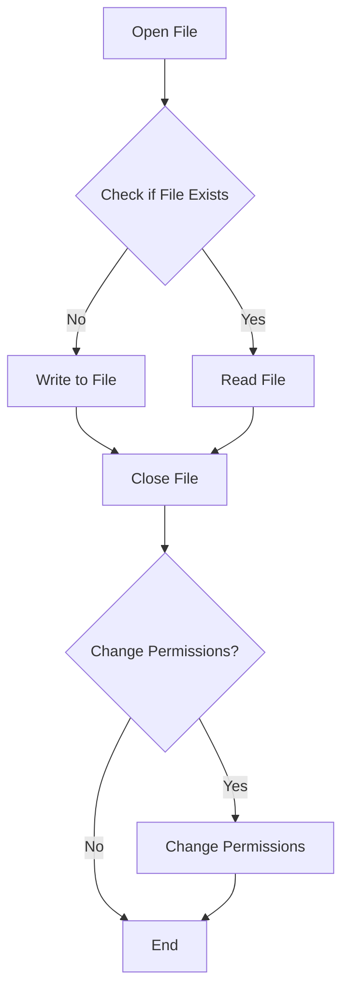

---
id: lesson-1
title: "Basic File Handling in PHP"
sidebar_label: Basic File Handling in PHP
sidebar_position: 1
description: "Learn Basic File Handling in PHP"
tags: [courses,beginner-level,php,Introduction]
---   
 

#### Reading and Writing Files

In PHP, you can read from and write to files using various built-in functions. Here's a basic example of reading and writing files:

#### File Handling




**Writing to a File:**

```php
<?php
$file = fopen("example.txt", "w") or die("Unable to open file!");
$txt = "Hello, World!\n";
fwrite($file, $txt);
$txt = "PHP is fun!\n";
fwrite($file, $txt);
fclose($file);
echo "Data written to file.";
?>
```

**Reading from a File:**

```php
<?php
$file = fopen("example.txt", "r") or die("Unable to open file!");
while(!feof($file)) {
    echo fgets($file) . "<br>";
}
fclose($file);
?>
```

### File Permissions

File permissions determine who can read, write, or execute a file. In PHP, you can change file permissions using the `chmod` function.

```php
<?php
$filename = "example.txt";
chmod($filename, 0755); // Read, write, execute for owner; read and execute for group and others
echo "File permissions changed.";
?>
```

### File Handling Functions

#### `fopen`
Opens a file or URL and returns a file pointer resource on success, or `false` on error.

#### `fread`
Reads up to `length` bytes from the file pointer referenced by `handle`.

#### `fwrite`
Writes the contents of `string` to the file stream referenced by `handle`.

#### `fclose`
Closes an open file pointer.

### Example 

```php
<?php
// File handling example
$filename = "example.txt";

// Writing to a file
$file = fopen($filename, "w") or die("Unable to open file!");
fwrite($file, "Hello, World!\n");
fwrite($file, "PHP is fun!\n");
fclose($file);
echo "Data written to file.<br>";

// Changing file permissions
chmod($filename, 0644); // Read and write for owner; read for group and others
echo "File permissions changed.<br>";

// Reading from the file
$file = fopen($filename, "r") or die("Unable to open file!");
while (!feof($file)) {
    echo fgets($file) . "<br>";
}
fclose($file);
?>
```
