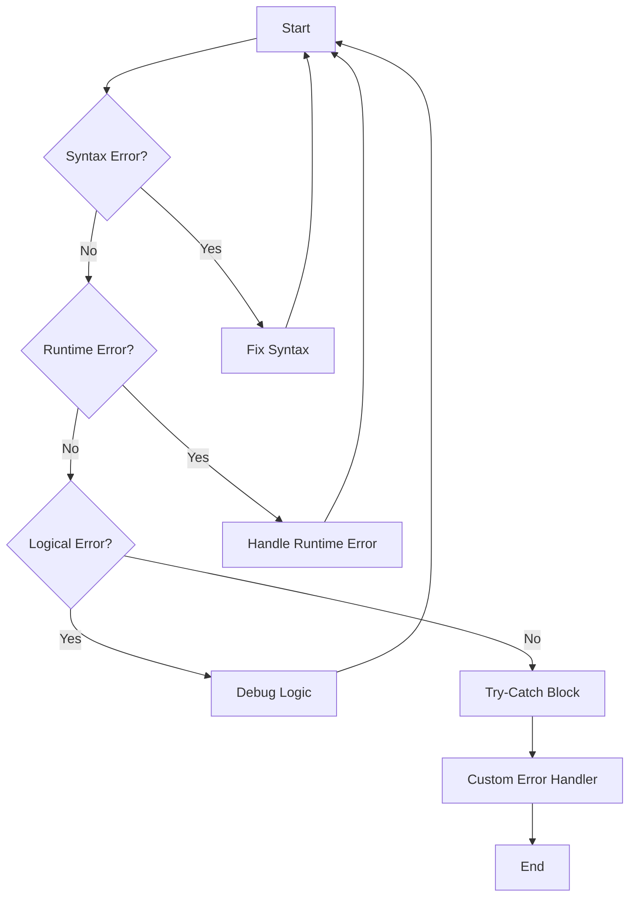

---
id: lesson-2
title: "Custom Error Handlers in PHP"
sidebar_label: Custom Error Handlers
sidebar_position: 2
description: "Learn Custom Error Handlers in PHP"
tags: [courses,intermediate-level,php,Introduction]
--- 
    

You can define a custom error handler function to handle errors in a specific way. Use `set_error_handler()` to set your custom error handler.

```php
<?php
function customError($errno, $errstr) {
    echo "Error: [$errno] $errstr";
}
Browser 
set_error_handler("customError");

echo($test); // This will trigger an error
?>
```

###  Exception Handling with try-catch Blocks

Exceptions provide a way to handle errors gracefully. You can throw an exception using the `throw` keyword and catch it with a `try-catch` block.

**Basic Exception Handling:**

```php
<?php
function divide($dividend, $divisor) {
    if ($divisor == 0) {
        throw new Exception("Division by zero");
    }
    return $dividend / $divisor;
}

try {
    echo divide(10, 2);
    echo divide(10, 0);
} catch (Exception $e) {
    echo "Caught exception: " . $e->getMessage();
}
?>
```

**Creating Custom Exceptions:**

```php
<?php
class CustomException extends Exception {
    public function errorMessage() {
        return "Error: [" . $this->getCode() . "] " . $this->getMessage();
    }
}

try {
    throw new CustomException("A custom error occurred", 100);
} catch (CustomException $e) {
    echo $e->errorMessage();
}
?>
```

### Output 

<BrowserWindow>
    <div>
        <p>Error: [2] Division by zero</p>
        <p>Caught exception: Division by zero</p>
        <p>Error: [100] A custom error occurred</p>
    </div>
</BrowserWindow>

### Flowchart 



:::tip
- Always validate user input to prevent runtime errors.
- Use `try-catch` blocks to handle exceptions and ensure your script can handle unexpected situations gracefully.
- Create custom error handlers to manage errors in a way that is specific to your application's needs.
- Regularly review and test your code to catch and resolve logical errors before they impact your users.
- Use logging to record error messages, making it easier to debug and maintain your application.
:::