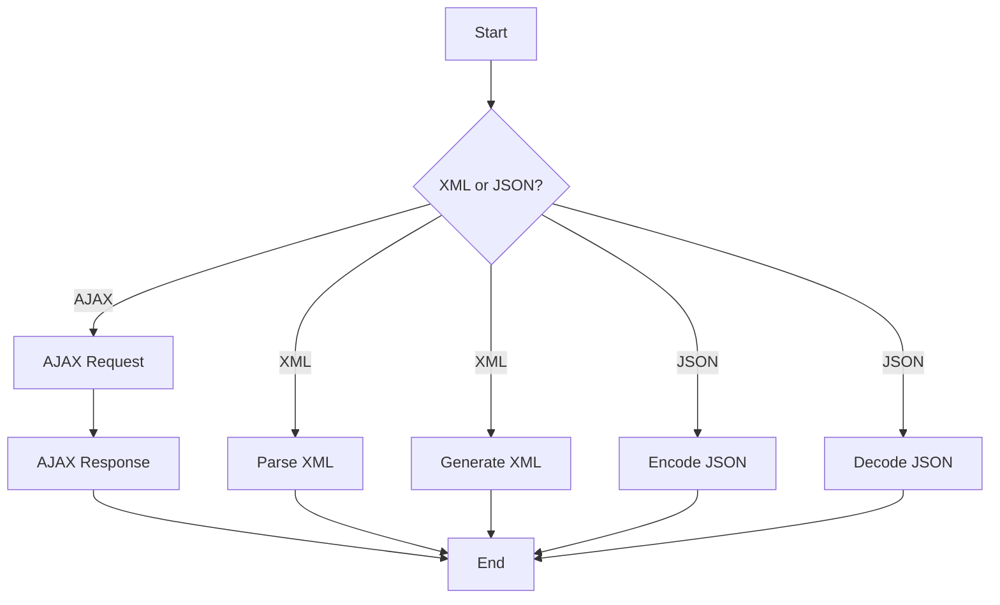

---
id: lesson-1
title: "Working with XML and JSON in PHP"
sidebar_label: XML
sidebar_position: 1
description: "Working with XML and JSON in PHP"
tags: [courses,intermediate-level,php,Introduction]
---  
  
 

### Flowchart for 


### 1. Parsing and Generating XML

**Parsing XML:**

PHP offers several ways to parse XML, with SimpleXML being one of the most straightforward.

```php
<?php
$xmlString = <<<XML
<note>
    <to>Tove</to>
    <from>Jani</from>
    <heading>Reminder</heading>
    <body>Don't forget me this weekend!</body>
</note>
XML;

$xml = simplexml_load_string($xmlString);

echo "To: " . $xml->to . "<br>";
echo "From: " . $xml->from . "<br>";
echo "Heading: " . $xml->heading . "<br>";
echo "Body: " . $xml->body . "<br>";
?>
```

**Generating XML:**

To generate XML, you can use the `DOMDocument` class.

```php
<?php
$doc = new DOMDocument('1.0', 'UTF-8');

$root = $doc->createElement('note');
$doc->appendChild($root);

$to = $doc->createElement('to', 'Tove');
$root->appendChild($to);

$from = $doc->createElement('from', 'Jani');
$root->appendChild($from);

$heading = $doc->createElement('heading', 'Reminder');
$root->appendChild($heading);

$body = $doc->createElement('body', 'Don\'t forget me this weekend!');
$root->appendChild($body);

echo $doc->saveXML();
?>
```

### Output 

<BrowserWindow>
    <div>
        <p>To: Tove</p>
        <p>From: Jani</p>
        <p>Heading: Reminder</p>
        <p>Body: Don't forget me this weekend!</p>
    </div>
</BrowserWindow>

### 2. Working with SimpleXML

SimpleXML makes XML parsing simple and easy.

**Loading and accessing XML data:**

```php
<?php
$xml = simplexml_load_file('note.xml');

echo "To: " . $xml->to . "<br>";
echo "From: " . $xml->from . "<br>";
echo "Heading: " . $xml->heading . "<br>";
echo "Body: " . $xml->body . "<br>";
?>
```

**Modifying XML data:**

```php
<?php
$xml = simplexml_load_file('note.xml');
$xml->body = 'Don\'t forget me this Friday!';
$xml->asXML('note_updated.xml');
?>
```
