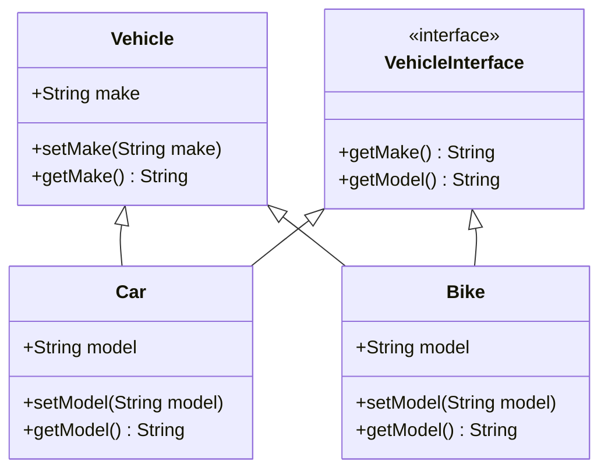

---
id: lesson-1
title: "Object-Oriented Programming (OOP) in PHP"
sidebar_label: Object-Oriented Programming (OOP)
sidebar_position: 1
description: "Learn Object-Oriented Programming (OOP) in PHP"
tags: [courses,intermediate-level,php,Introduction]
--- 
   

#### Topics Covered:
1. Introduction to OOP Concepts
2. Classes and Objects
3. Constructors and Destructors
4. Inheritance
5. Polymorphism and Interfaces

### Introduction to OOP Concepts

Object-Oriented Programming (OOP) is a programming paradigm that uses "objects" to design applications and computer programs. The main concepts of OOP include:

- **Encapsulation**: Wrapping data and methods into a single unit (class).
- **Abstraction**: Hiding the complex implementation details and showing only the necessary features of an object.
- **Inheritance**: Mechanism where one class acquires the properties (methods and fields) of another.
- **Polymorphism**: Ability to take many forms. It allows one interface to be used for a general class of actions.

### Classes and Objects

A class is a blueprint for objects. It defines properties and methods that an object can have. An object is an instance of a class.

**Defining a Class and Creating an Object:**

```php
<?php
class Car {
    public $make;
    public $model;

    public function setMake($make) {
        $this->make = $make;
    }

    public function getMake() {
        return $this->make;
    }

    public function setModel($model) {
        $this->model = $model;
    }

    public function getModel() {
        return $this->model;
    }
}

$car1 = new Car();
$car1->setMake("Toyota");
$car1->setModel("Corolla");
echo "Make: " . $car1->getMake() . ", Model: " . $car1->getModel();
?>
```

### Constructors and Destructors

A constructor is a special method that is automatically called when an object is instantiated. A destructor is a method that is called when the object is destroyed.

**Using Constructors and Destructors:**

```php
<?php
class Car {
    public $make;
    public $model;

    public function __construct($make, $model) {
        $this->make = $make;
        $this->model = $model;
    }

    public function __destruct() {
        echo "Destroying " . $this->make . " " . $this->model;
    }

    public function getMake() {
        return $this->make;
    }

    public function getModel() {
        return $this->model;
    }
}

$car1 = new Car("Toyota", "Corolla");
echo "Make: " . $car1->getMake() . ", Model: " . $car1->getModel();
?>
```

### Inheritance

Inheritance is a way to form new classes using classes that have already been defined. The new classes, known as derived classes, inherit attributes and behaviors of the existing classes, known as base classes.

**Implementing Inheritance:**

```php
<?php
class Vehicle {
    public $make;

    public function setMake($make) {
        $this->make = $make;
    }

    public function getMake() {
        return $this->make;
    }
}

class Car extends Vehicle {
    public $model;

    public function setModel($model) {
        $this->model = $model;
    }

    public function getModel() {
        return $this->model;
    }
}

$car1 = new Car();
$car1->setMake("Toyota");
$car1->setModel("Corolla");
echo "Make: " . $car1->getMake() . ", Model: " . $car1->getModel();
?>
```

### Polymorphism and Interfaces

Polymorphism allows objects of different classes to be treated as objects of a common super class. Interfaces allow you to specify what methods a class should implement without dictating how these methods should be implemented.

**Implementing Polymorphism and Interfaces:**

```php
<?php
interface Vehicle {
    public function getMake();
    public function getModel();
}

class Car implements Vehicle {
    public $make;
    public $model;

    public function __construct($make, $model) {
        $this->make = $make;
        $this->model = $model;
    }

    public function getMake() {
        return $this->make;
    }

    public function getModel() {
        return $this->model;
    }
}

class Bike implements Vehicle {
    public $make;
    public $model;

    public function __construct($make, $model) {
        $this->make = $make;
        $this->model = $model;
    }

    public function getMake() {
        return $this->make;
    }

    public function getModel() {
        return $this->model;
    }
}

$car1 = new Car("Toyota", "Corolla");
$bike1 = new Bike("Yamaha", "FZ");

echo "Car - Make: " . $car1->getMake() . ", Model: " . $car1->getModel() . "<br>";
echo "Bike - Make: " . $bike1->getMake() . ", Model: " . $bike1->getModel();
?>
```

### Browser Output Example

<BrowserWindow>
    <div>
        <p>Make: Toyota, Model: Corolla</p>
        <p>Destroying Toyota Corolla</p>
        <p>Car - Make: Toyota, Model: Corolla</p>
        <p>Bike - Make: Yamaha, Model: FZ</p>
    </div>
</BrowserWindow>

### Flowchart 



:::tip
- Always use constructors to initialize objects with default values.
- Use inheritance to avoid code duplication and improve code reusability.
- Apply encapsulation to protect object integrity by restricting direct access to its fields.
- Implement polymorphism to design more flexible and scalable code.
- Use interfaces to define common methods that multiple classes should implement, ensuring consistency across different implementations.
:::