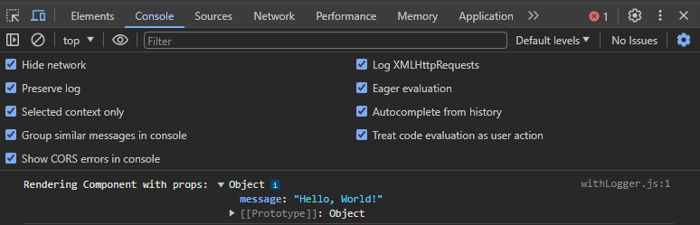

In React applications, reusability is a key factor in building maintainable and scalable components. Higher-Order Components (HOCs) are a design pattern that allows you to reuse component logic across multiple components. In this lesson, we will cover Higher-Order Components and how they can be used to create reusable component patterns.

## What are Higher-Order Components (HOCs)?

Higher-Order Components (HOCs) are functions that take a component and return a new component with additional props or functionality. They are a powerful pattern in React that enables you to share logic between components without repeating code. HOCs are a form of composition that allows you to enhance the capabilities of your components in a flexible and reusable way.

Here's an example of a Higher-Order Components:

<Tabs>
  <TabItem value="App.js" label="App.js">
    ```jsx
    import React from "react";
    import Component from "./Component";

    const App = () => {
      return <Component message="Hello, World!" />;
    };

    export default App;
    ```

  </TabItem>
  <TabItem value="withLogger.js" label="withLogger.js">
    ```jsx
    import React from "react";

    const withLogger = (WrappedComponent) => {
      return (props) => {
        console.log(`Rendering ${WrappedComponent.name} with props:`, props);
        return <WrappedComponent {...props} />;
      };
    };

    export default withLogger;
    ```

  </TabItem>
  <TabItem value="Component.js" label="Component.js">
    ```jsx
    import React from "react";
    import withLogger from "./withLogger";

    const Component = ({ message }) => {
      return <div>{message}</div>;
    };

    export default withLogger(Component);
    ```

  </TabItem>
  <TabItem value="BrowserWindow" label="BrowserWindow">
    <BrowserWindow minHeight={300}>
      <div>Hello, World!</div>
    </BrowserWindow>
  </TabItem>
</Tabs>

In this example, the `withLogger` function is a Higher-Order Component that takes a component as an argument and returns a new component that logs the props before rendering the original component. The `Component` component is enhanced with the logging functionality by wrapping it with the `withLogger` HOC. When the `Component` is rendered, the `withLogger` HOC logs the props to the console. This pattern allows you to add cross-cutting concerns like logging, authentication, or data fetching to your components without modifying their implementation.

## Creating Higher-Order Components

To create a Higher-Order Component in React, you can follow these steps:

1. First create react app using following command:

   ```bash
   npx create-react-app higher-order-components
   ```

2. Create a new file for your HOC, for example, `withLogger.js`.
3. Define a function that takes a component as an argument and returns a new component with additional props or functionality.

   ```jsx title="withLogger.js"
   import React from "react";

   const withLogger = (WrappedComponent) => {
     return (props) => {
       console.log(`Rendering ${WrappedComponent.name} with props:`, props);
       return <WrappedComponent {...props} />;
     };
   };

   export default withLogger;
   ```

4. Import the HOC in the component file where you want to enhance the component.

   ```jsx title="Component.js"
   import React from "react";
   import withLogger from "./withLogger";

   const Component = ({ message }) => {
     return <div>{message}</div>;
   };

   export default withLogger(Component);
   ```

5. Wrap the component with the HOC to enhance its functionality. And update the `App.js` file to render the enhanced component.

   ```jsx title="App.js"
   import React from "react";
   import Component from "./Component";

   const App = () => {
     return <Component message="Hello, World!" />;
   };

   export default App;
   ```

6. Run the application to see the enhanced component in action.

   ```bash
   npm start
   ```

7. open the browser on `http://localhost:3000/` to see the output.

   <BrowserWindow minHeight={200}>
     <div>Hello, World!</div>
   </BrowserWindow>

8. Now, inspect and navigate to the console to see the log message from the `withLogger` HOC.

   

By following these steps, you can create Higher-Order Components in React to enhance the capabilities of your components with additional props or functionality.

## Best Practices for Using Higher-Order Components

When using Higher-Order Components in your React applications, consider the following best practices:

- **Keep HOCs Simple**: Higher-Order Components should be simple and focused on a single concern. Avoid creating complex HOCs that mix multiple concerns, as this can make them harder to understand and maintain.
- **Use Composition**: Use composition to combine multiple HOCs and create more complex behaviors. By composing HOCs, you can build reusable and composable logic that can be shared across different components.
- **Avoid Mutating the Original Component**: Higher-Order Components should not mutate the original component. Instead, they should enhance the component by wrapping it with additional functionality or props.
- **Use Descriptive Names**: Use descriptive names for your HOCs to make it clear what functionality they provide. This can help other developers understand the purpose of the HOC and how to use it effectively.
- **Test HOCs Separately**: Test your Higher-Order Components separately from your components to ensure they work as expected. By testing HOCs in isolation, you can verify their behavior and ensure they enhance the components correctly.
- **Consider Using Hooks**: In modern React applications, you can use hooks like `useMemo` or `useCallback` to achieve similar functionality as HOCs. Consider using hooks instead of HOCs for simpler cases where possible.
- **Use HOCs Sparingly**: While HOCs are a powerful pattern, they can introduce complexity and make your code harder to reason about. Use HOCs sparingly and consider other patterns like render props or hooks for simpler cases.
- **Follow React Guidelines**: Follow the React guidelines and best practices when using Higher-Order Components in your applications. By following the recommended patterns and conventions, you can build more maintainable and scalable React components.

By following these best practices, you can create reusable and composable Higher-Order Components that enhance the capabilities of your React components in a flexible and maintainable way.

## Conclusion

In this lesson, you learned about Higher-Order Components (HOCs) in React and how they can be used to create reusable component patterns. You saw how HOCs work, how to create them, and best practices for using them in your React applications. By leveraging Higher-Order Components, you can share logic between components, enhance their capabilities, and build more maintainable and scalable React applications.
