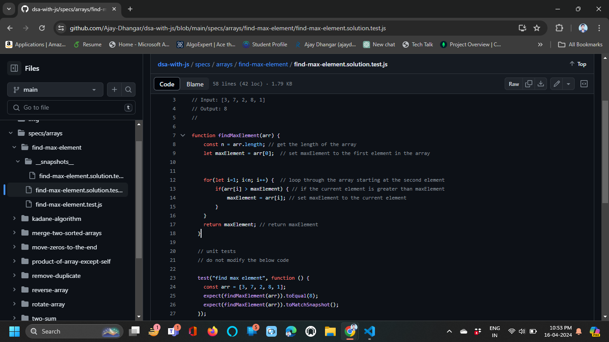

In this lesson, we will learn about unit testing with Jest. We will cover the basics of unit testing, setting up Jest in a React project, writing test cases for components, hooks, and utilities, and running tests with Jest.

## What is Unit Testing?

Unit testing is a software testing technique where individual units or components of a software application are tested in isolation. The goal of unit testing is to validate that each unit of the software performs as designed. Unit tests are typically written and executed by developers to ensure the correctness of their code.

Unit testing helps identify bugs and issues early in the development process, improves code quality, and provides confidence that changes to the codebase do not introduce regressions. Unit tests are fast, repeatable, and can be automated to run as part of the continuous integration (CI) pipeline.

## Why Unit Testing?

Unit testing offers several benefits to developers and software projects, including:

### Early Bug Detection

Unit tests help identify bugs and issues early in the development process, making it easier and cheaper to fix them. By writing tests for individual units of code, developers can catch errors before they propagate to other parts of the application.

### Code Quality

Unit tests help improve the quality of the codebase by enforcing good coding practices, such as writing modular, testable, and maintainable code. Writing tests encourages developers to write clean, well-structured code that is easier to understand and maintain.

### Regression Testing

Unit tests provide a safety net for refactoring and making changes to the codebase. By running tests after making changes, developers can ensure that existing functionality still works as expected and that new features do not introduce regressions.

### Documentation

Unit tests serve as living documentation for the codebase, describing the expected behavior of individual units of code. Tests provide insights into how the code should work and help new developers understand the codebase more quickly.

## Setting up Jest in a React Project

[Jest](https://jestjs.io/) is a popular JavaScript testing framework developed by Facebook. Jest is widely used for unit testing React applications due to its simplicity, speed, and built-in features. Jest provides a test runner, assertion library, and mocking capabilities out of the box.

To set up Jest in a React project, you can follow these steps:

1. Install Jest and React Testing Library as development dependencies:

```bash
npm install --save-dev jest @testing-library/react @testing-library/jest-dom
```

2. Add a test script to your `package.json` file:

```json title="package.json"
{
  "scripts": {
    "test": "jest"
  }
}
```

3. Create a test file with the `.test.js` or `.spec.js` extension:

```jsx title="Button.test.js"
import React from "react";
import { render, screen } from "@testing-library/react";
import Button from "./Button";

test("renders a button component", () => {
  render(<Button label="Click me" />);
  const buttonElement = screen.getByText(/click me/i);
  expect(buttonElement).toBeInTheDocument();
});
```

4. Run the tests using the `npm test` command:

```bash
npm test
```

## Writing Test Cases with Jest

Jest provides a simple and intuitive API for writing test cases for React components, hooks, and utilities. Here are some common Jest matchers and testing utilities that you can use in your test cases:

### Matchers

Matchers are functions provided by Jest to assert the expected behavior of the code under test. Here are some commonly used matchers:

- `expect(value).toBe(expected)`:

  Asserts that the value is strictly equal to the expected value. It uses `Object.is` for equality comparisons.

  For example:

  ```js title="example.test.js"
  test("adds 1 + 2 to equal 3", () => {
    expect(1 + 2).toBe(3);
  });
  ```

- `expect(value).toEqual(expected)`:

  Asserts that the value is deeply equal to the expected value. It recursively checks the equality of all fields of the value.

  For example:

  ```js title="example.test.js"
  test("returns the correct object", () => {
    expect({ a: 1, b: 2 }).toEqual({ a: 1, b: 2 });
  });
  ```

- `expect(value).toBeTruthy()`:

  Asserts that the value is truthy (i.e., not `false`, `0`, `''`, `null`, `undefined`, or `NaN`).

  For example:

  ```js title="example.test.js"
  test("returns a truthy value", () => {
    expect(1).toBeTruthy();
  });
  ```

### Testing React Components

You can test React components using Jest and React Testing Library. Here's an example of testing a simple button component:

```jsx title="Button.test.js"
import React from "react";
import { render, screen } from "@testing-library/react";
import Button from "./Button";

test("renders a button component", () => {
  render(<Button label="Click me" />);
  const buttonElement = screen.getByText(/click me/i);
  expect(buttonElement).toBeInTheDocument();
});
```

### Testing React Hooks

You can test custom React hooks using Jest. Here's an example of testing a custom hook that fetches data from an API:

```jsx title="useFetch.test.js"
import { renderHook } from "@testing-library/react-hooks";
import useFetch from "./useFetch";

test("fetches data from an API", async () => {
  const { result, waitForNextUpdate } = renderHook(() =>
    useFetch("https://api.example.com/data"),
  );
  await waitForNextUpdate();
  expect(result.current.data).toEqual({ message: "Hello, World!" });
});
```

### Testing Utilities

You can test utility functions using Jest. Here's an example of testing a utility function that adds two numbers:

```js title="add.test.js"
import add from "./add";

test("adds two numbers", () => {
  expect(add(1, 2)).toBe(3);
});
```

## Running Tests with Jest

You can run tests using Jest by running the `npm test` command in your project directory. Jest will look for test files with the `.test.js` or `.spec.js` extension in your project and execute them.

Jest provides a watch mode that automatically re-runs tests when files change. You can run Jest in watch mode by using the `--watch` flag:

```bash
npm test -- --watch
```

Jest also supports code coverage reporting to measure how much of your code is covered by tests. You can generate a code coverage report by running Jest with the `--coverage` flag:

```bash
npm test -- --coverage
```

Jest will generate a coverage report in the `coverage` directory of your project, showing the percentage of code covered by tests.

:::info 📚 Learn More:

## Practice with DSA Repository on GitHub with Jest

If you want to dive deeper into Jest and learn more about its features and capabilities, you can check out our repository on GitHub: https://github.com/Ajay-Dhangar/dsa-with-js

DSA With JS Repository is a collection of data structures and algorithms implemented in JavaScript. It also includes test cases written using Jest for each data structure and algorithm. You can explore the repository to learn how to write tests for different types of code using Jest.

:::tip tips & tricks

So, now view the code and try to implement the same in your project.



Now, checkout repository on GitHub: [DSA With JS](https://github.com/Ajay-Dhangar/dsa-with-js) and navigate spacs folder/directory to learn more about code and test cases.

And try to implement the same in your project. May be you can fork the repository and start contributing to the project. And most importantly, don't forget to star the repository if you like it.

:::

## Conclusion

In this lesson, we learned about unit testing with Jest. We covered the basics of unit testing, setting up Jest in a React project, writing test cases for components, hooks, and utilities, and running tests with Jest. Unit testing is an essential practice for developers to ensure the correctness and quality of their codebase. By writing tests for individual units of code, developers can identify bugs early, improve code quality, and provide confidence that changes to the codebase do not introduce regressions.
