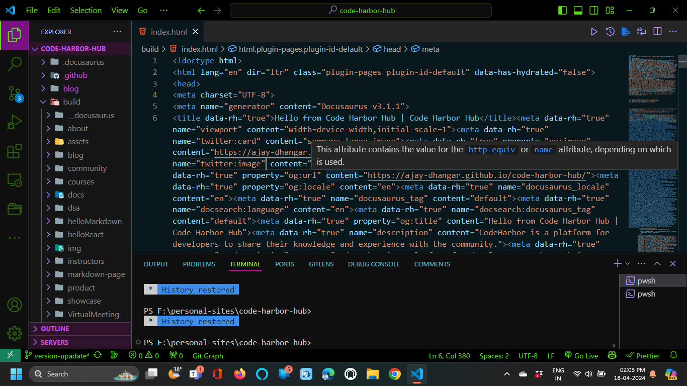

In this lesson, you will learn how to build a production-ready version of your React application. We will cover the steps involved in creating an optimized build, configuring environment variables, and deploying your application to a hosting service.

## Why build a production-ready version?

When you are ready to deploy your React application to a production environment, it is essential to build a production-ready version that is optimized for performance and security. A production build typically involves minifying and bundling your code, optimizing assets, and configuring environment variables for different deployment environments.

## Steps to build a production-ready React application

### 1. Create a production build

To create a production build of your React application, you can use the `npm run build` command provided by Create React App. This command generates a production-optimized build of your application in the `build` directory.

```bash
npm run build
```

### 2. Review the production build



After running the `npm run build` command, you can review the contents of the `build` directory to ensure that your application is correctly bundled and optimized for production. The build directory will contain the minified and optimized versions of your JavaScript, CSS, and other assets.

### 3. Configure environment variables

When deploying your React application to different environments, you may need to configure environment-specific variables such as API endpoints, authentication keys, or feature flags. Create React App allows you to define environment variables in a `.env` file or using the `REACT_APP_` prefix.

```bash
REACT_APP_API_URL=https://api.example.com
```

### 4. Deploy your application

Once you have built a production-ready version of your React application and configured the necessary environment variables, you can deploy your application to a hosting service such as Netlify, Vercel, or AWS Amplify. These services provide easy-to-use deployment options for React applications and offer features like continuous deployment, custom domains, and SSL certificates.

:::info

If you want to deploy and host your React application on internet, you can use several hosting services like:

1. [Netlify](https://www.netlify.com/)
2. [Vercel](https://vercel.com/)
3. [AWS Amplify](https://aws.amazon.com/amplify/)
4. [GitHub Pages](https://pages.github.com/) Or [GitHub](https://github.com/) itself
5. [Firebase Hosting](https://firebase.google.com/docs/hosting)

:::

## Conclusion

Building a production-ready version of your React application is an essential step before deploying it to a production environment. By following the steps outlined in this lesson, you can create an optimized build, configure environment variables, and deploy your application to a hosting service with ease.
