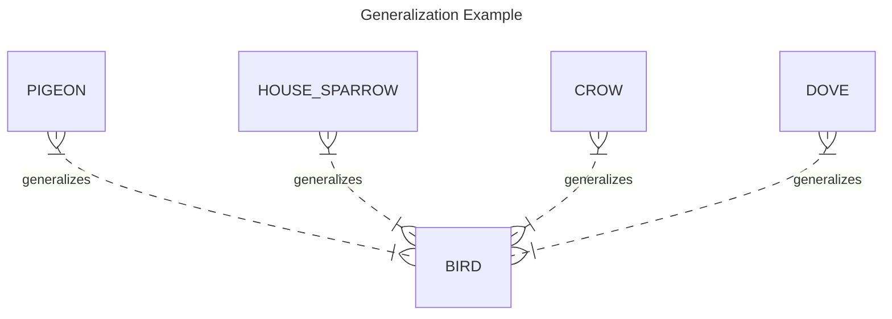
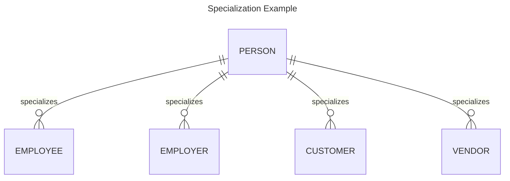
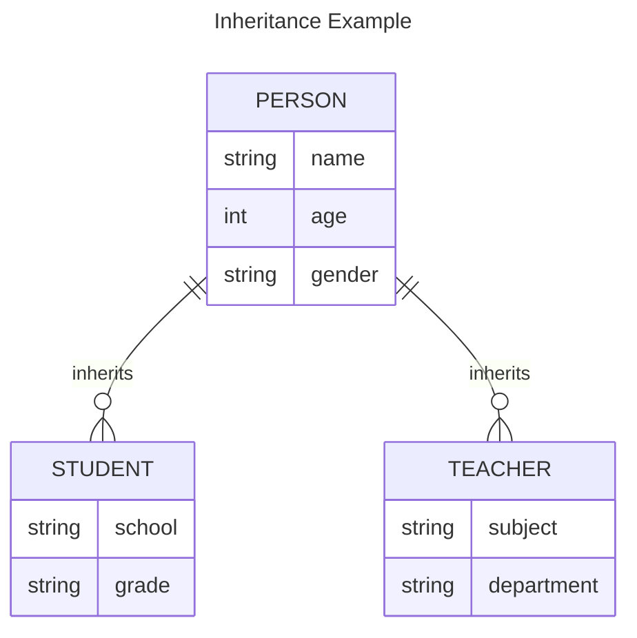

# DBMS - Generalization and Aggregation

The ER Model has the power of expressing database entities in a conceptual hierarchical manner. As the hierarchy goes up, it generalizes the view of entities, and as we go deep in the hierarchy, it gives us the detail of every entity included.

Going up in this structure is called generalization, where entities are clubbed together to represent a more generalized view. For example, a particular student named Mira can be generalized along with all the students. The entity shall be a student, and further, the student is a person. The reverse is called specialization where a person is a student, and that student is Mira.

## Generalization

As mentioned above, the process of generalizing entities, where the generalized entities contain the properties of all the generalized entities, is called generalization. In generalization, a number of entities are brought together into one generalized entity based on their similar characteristics. For example, pigeon, house sparrow, crow, and dove can all be generalized as Birds.

### Example of Generalization

| Specific Entities | Generalized Entity |
|-------------------|---------------------|
| Pigeon            | Bird                |
| House Sparrow     | Bird                |
| Crow              | Bird                |
| Dove              | Bird                |

## Specialization

Specialization is the opposite of generalization. In specialization, a group of entities is divided into sub-groups based on their characteristics. Take a group ‘Person’ for example. A person has a name, date of birth, gender, etc. These properties are common in all persons, human beings. But in a company, persons can be identified as employee, employer, customer, or vendor, based on what role they play in the company.

### Example of Specialization

| General Entity | Specialized Entities     |
|----------------|--------------------------|
| Person         | Employee, Employer, Customer, Vendor |

Similarly, in a school database, persons can be specialized as teacher, student, or a staff, based on what role they play in school as entities.

## Inheritance

We use all the above features of ER-Model in order to create classes of objects in object-oriented programming. The details of entities are generally hidden from the user; this process is known as abstraction.

Inheritance is an important feature of Generalization and Specialization. It allows lower-level entities to inherit the attributes of higher-level entities.

### Example of Inheritance

| Higher-level Entity | Attributes                  | Lower-level Entities   |
|---------------------|-----------------------------|------------------------|
| Person              | Name, Age, Gender           | Student, Teacher       |

For example, the attributes of a Person class such as name, age, and gender can be inherited by lower-level entities such as Student or Teacher.