# DBMS - ER Diagram Representation

Let us now learn how the ER Model is represented by means of an ER diagram. Any object, for example, entities, attributes of an entity, relationship sets, and attributes of relationship sets, can be represented with the help of an ER diagram.

## Entity

Entities are represented by means of rectangles. Rectangles are named with the entity set they represent.

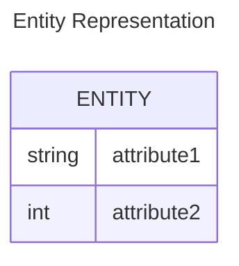

## Attributes

### Simple Attributes

Attributes are the properties of entities. Attributes are represented by means of ellipses. Every ellipse represents one attribute and is directly connected to its entity (rectangle).

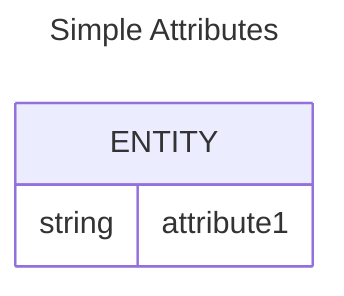

### Composite Attributes

If the attributes are composite, they are further divided in a tree-like structure. Every node is then connected to its attribute. Composite attributes are represented by ellipses that are connected with an ellipse.

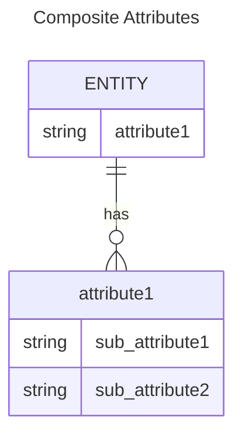

### Multivalued Attributes

Multivalued attributes are depicted by double ellipses.

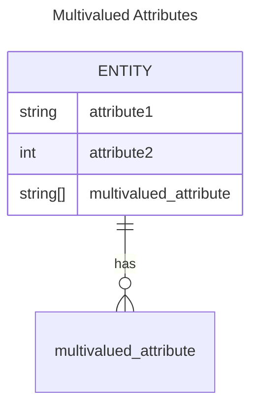

### Derived Attributes

Derived attributes are depicted by dashed ellipses.

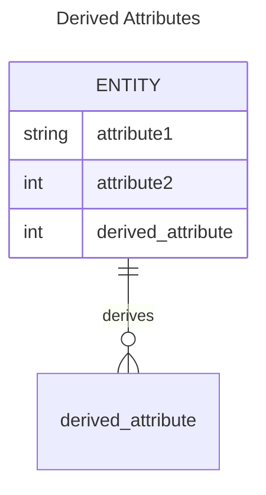

## Relationship

Relationships are represented by diamond-shaped boxes. The name of the relationship is written inside the diamond-box. All the entities (rectangles) participating in a relationship are connected to it by a line.

### Binary Relationship and Cardinality

A relationship where two entities are participating is called a binary relationship. Cardinality is the number of instances of an entity from a relation that can be associated with the relation.

#### One-to-One

When only one instance of an entity is associated with the relationship, it is marked as '1:1'. The following image reflects that only one instance of each entity should be associated with the relationship. It depicts one-to-one relationship.

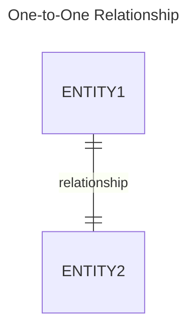

#### One-to-Many

When more than one instance of an entity is associated with a relationship, it is marked as '1:N'. The following image reflects that only one instance of entity on the left and more than one instance of an entity on the right can be associated with the relationship. It depicts one-to-many relationship.

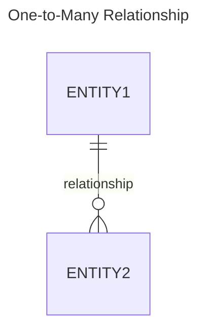

#### Many-to-One

When more than one instance of entity is associated with the relationship, it is marked as 'N:1'. The following image reflects that more than one instance of an entity on the left and only one instance of an entity on the right can be associated with the relationship. It depicts many-to-one relationship.

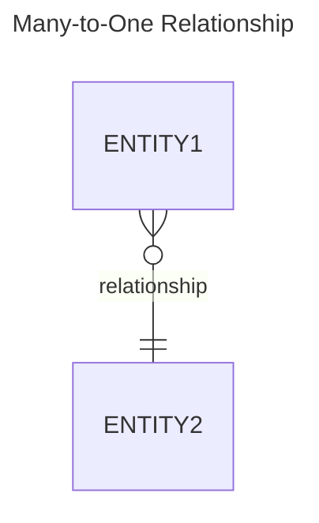

#### Many-to-Many

The following image reflects that more than one instance of an entity on the left and more than one instance of an entity on the right can be associated with the relationship. It depicts many-to-many relationship.

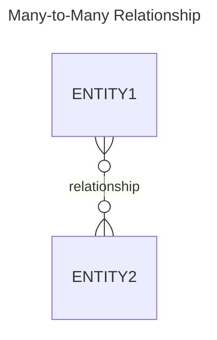

### Participation Constraints

#### Total Participation

Each entity is involved in the relationship. Total participation is represented by double lines.

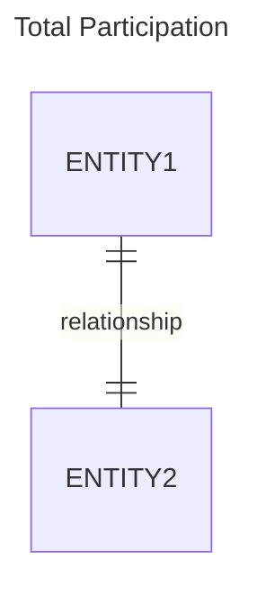

#### Partial Participation

Not all entities are involved in the relationship. Partial participation is represented by single lines.

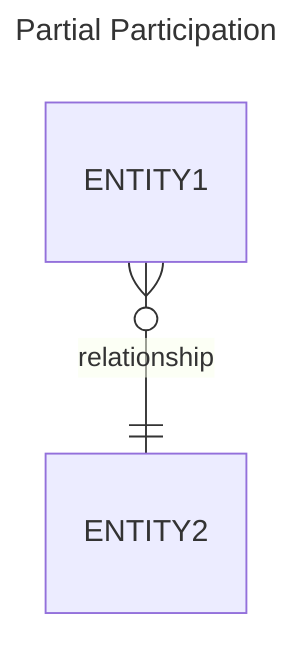
