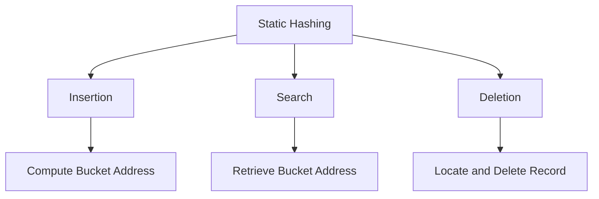
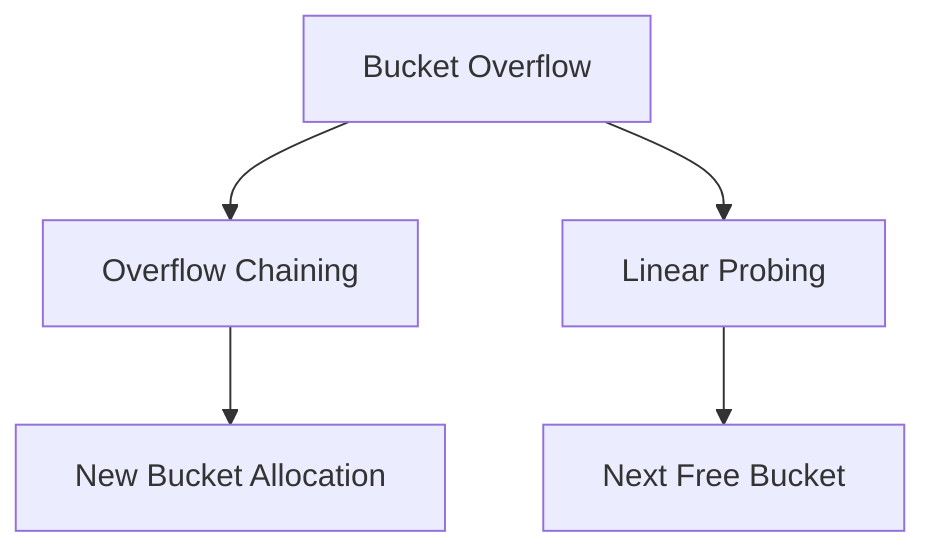
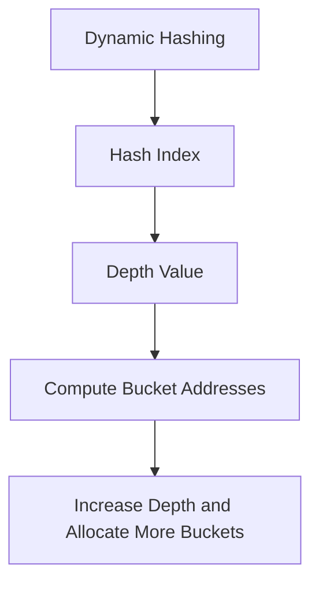
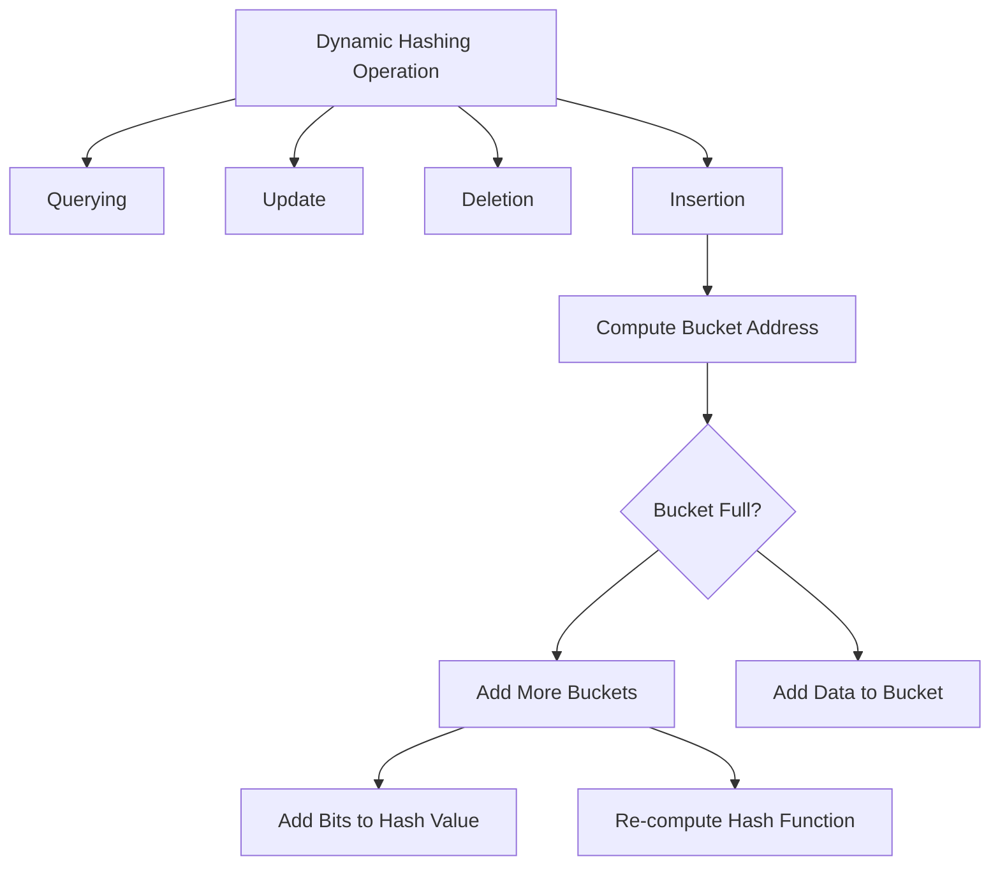

DBMS - Hashing
===

For a huge database structure, it can be almost next to impossible to search all the index values through all its levels and then reach the destination data block to retrieve the desired data. Hashing is an effective technique to calculate the direct location of a data record on the disk without using an index structure.

Hashing uses hash functions with search keys as parameters to generate the address of a data record.

Hash Organization
---

- **Bucket:** A hash file stores data in bucket format. A bucket is considered a unit of storage and typically stores one complete disk block, which in turn can store one or more records.
- **Hash Function:** A hash function, h, is a mapping function that maps all the set of search-keys K to the address where actual records are placed. It is a function from search keys to bucket addresses.

### Static Hashing

In static hashing, when a search-key value is provided, the hash function always computes the same address. For example, if a mod-4 hash function is used, then it shall generate only 5 values. The output address shall always be the same for that function. The number of buckets provided remains unchanged at all times.

#### Operation
- **Insertion:** When a record is required to be entered using static hash, the hash function h computes the bucket address for search key K, where the record will be stored.
  - Bucket address = h(K)
- **Search:** When a record needs to be retrieved, the same hash function can be used to retrieve the address of the bucket where the data is stored.
- **Delete:** This is simply a search followed by a deletion operation.

#### Bucket Overflow
The condition of bucket overflow is known as a collision. This is a critical state for any static hash function. In this case, overflow chaining can be used.

- **Overflow Chaining:** When buckets are full, a new bucket is allocated for the same hash result and is linked after the previous one. This mechanism is called Closed Hashing.
- **Linear Probing:** When a hash function generates an address at which data is already stored, the next free bucket is allocated to it. This mechanism is called Open Hashing.

### Dynamic Hashing

The problem with static hashing is that it does not expand or shrink dynamically as the size of the database grows or shrinks. Dynamic hashing provides a mechanism in which data buckets are added and removed dynamically and on-demand. Dynamic hashing is also known as extended hashing.

#### Organization
The prefix of an entire hash value is taken as a hash index. Only a portion of the hash value is used for computing bucket addresses. Every hash index has a depth value to signify how many bits are used for computing a hash function. These bits can address \(2^n\) buckets. When all these bits are consumed, that is, when all the buckets are full, then the depth value is increased linearly and twice the buckets are allocated.

#### Operation
- **Querying:** Look at the depth value of the hash index and use those bits to compute the bucket address.
- **Update:** Perform a query as above and update the data.
- **Deletion:** Perform a query to locate the desired data and delete the same.
- **Insertion:** Compute the address of the bucket.
  - If the bucket is already full:
    - Add more buckets.
    - Add additional bits to the hash value.
    - Re-compute the hash function.
  - Else:
    - Add data to the bucket.
  - If all the buckets are full, perform the remedies of static hashing.

### Comparison Table

| Feature            | Static Hashing            | Dynamic Hashing            |
|--------------------|---------------------------|----------------------------|
| Bucket Expansion   | Fixed number of buckets   | Buckets expand/shrink dynamically |
| Collision Handling | Overflow chaining, linear probing | Overflow chaining, linear probing |
| Performance        | Good for small databases  | Better for large, dynamic databases |
| Flexibility        | Less flexible             | Highly flexible            |

Hashing is not favorable when the data is organized in some ordering and the queries require a range of data. When data is discrete and random, hashing performs the best. Hashing algorithms have higher complexity than indexing. All hash operations are done in constant time.
