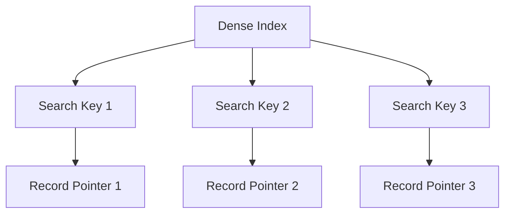
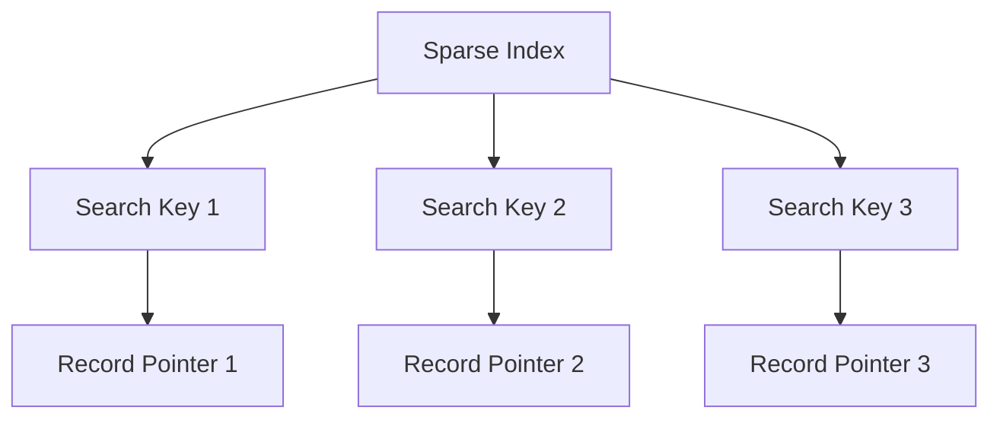
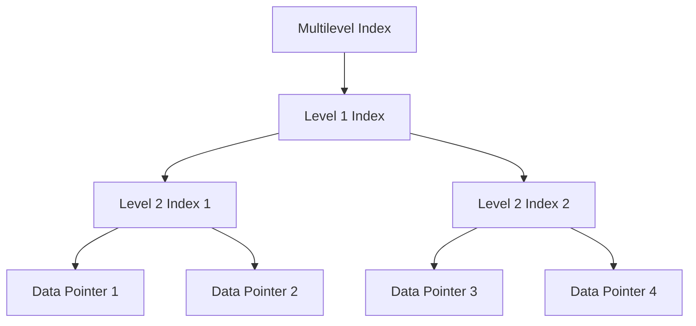
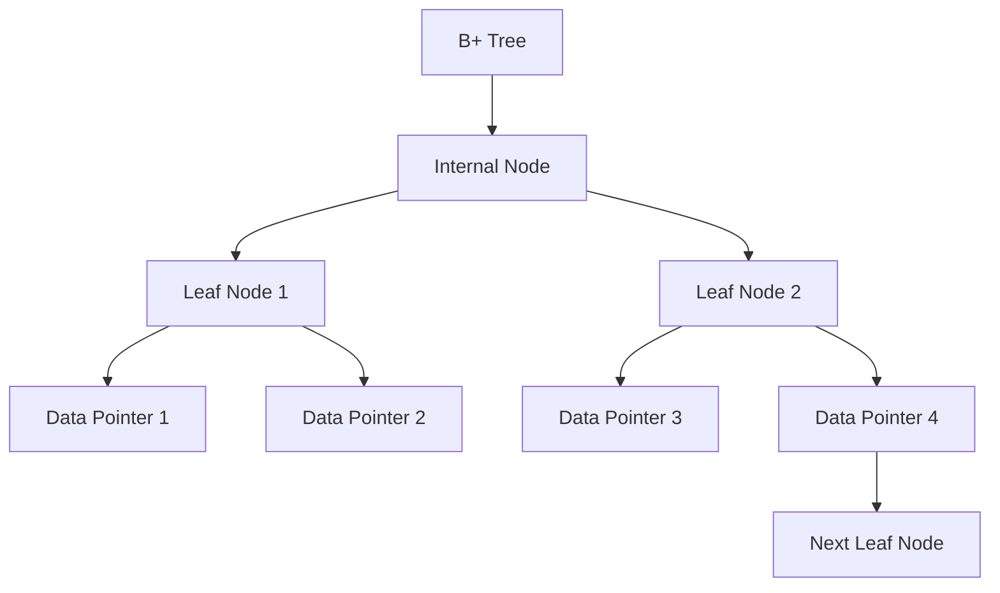

DBMS - Indexing
===

We know that data is stored in the form of records. Every record has a key field, which helps it to be recognized uniquely.

Indexing is a data structure technique to efficiently retrieve records from the database files based on some attributes on which the indexing has been done. Indexing in database systems is similar to what we see in books.

Indexing Types
---

Indexing is defined based on its indexing attributes. Indexing can be of the following types:

### Primary Index
- **Description:** Defined on an ordered data file. The data file is ordered on a key field, generally the primary key of the relation.

### Secondary Index
- **Description:** May be generated from a field which is a candidate key and has a unique value in every record, or a non-key with duplicate values.

### Clustering Index
- **Description:** Defined on an ordered data file. The data file is ordered on a non-key field.

Ordered Indexing Types
---

Ordered Indexing can be of two types:

### Dense Index
- **Description:** There is an index record for every search key value in the database.
- **Characteristics:** Faster searching but requires more space to store index records.
- **Structure:**
    - Index records contain search key value and a pointer to the actual record on the disk.

### Sparse Index
- **Description:** Index records are not created for every search key.
- **Characteristics:** Contains a search key and an actual pointer to the data on the disk.
- **Structure:**
    - To search a record, proceed by index record and reach the actual location of the data. If not found, start sequential search until the desired data is found.

### Multilevel Index
- **Description:** Index records comprise search-key values and data pointers. Stored on disk along with the actual database files.
- **Characteristics:** As the database size grows, so does the size of the indices.
- **Structure:**
    - Break down the index into several smaller indices to make the outermost level so small that it can be saved in a single disk block.

### B+ Tree
- **Description:** A balanced binary search tree that follows a multi-level index format. Leaf nodes denote actual data pointers.
- **Characteristics:** Ensures all leaf nodes remain at the same height, thus balanced. Supports random access and sequential access.

#### Structure of B+ Tree
- **Internal Nodes:**
    - Contain at least ⌈n/2⌉ pointers, except the root node.
    - At most, an internal node can contain n pointers.

- **Leaf Nodes:**
    - Contain at least ⌈n/2⌉ record pointers and ⌈n/2⌉ key values.
    - At most, a leaf node can contain n record pointers and n key values.
    - Every leaf node contains one block pointer P to point to the next leaf node, forming a linked list.

#### B+ Tree Insertion
1. **Insertion at Leaf Node:**
    - If a leaf node overflows, split node into two parts.
    - Partition at i = ⌊(m+1)/2⌋.
    - First i entries are stored in one node.
    - Rest of the entries (i+1 onwards) are moved to a new node.
    - ith key is duplicated at the parent of the leaf.

2. **Insertion at Non-leaf Node:**
    - Split node into two parts.
    - Partition the node at i = ⌈(m+1)/2⌉.
    - Entries up to i are kept in one node.
    - Rest of the entries are moved to a new node.

#### B+ Tree Deletion
1. **Deletion at Leaf Node:**
    - The target entry is searched and deleted.
    - If it is an internal node, delete and replace it with the entry from the left position.
    - After deletion, check for underflow.

2. **Handling Underflow:**
    - If underflow occurs, distribute the entries from the nodes left to it.
    - If distribution is not possible from the left, distribute from the nodes right to it.
    - If distribution is not possible from left or right, merge the node with left and right nodes.

In summary, indexing in DBMS is a crucial technique to enhance the speed and efficiency of data retrieval. Different indexing methods and structures are suited to various data and query types, ensuring optimized performance for diverse database operations.
