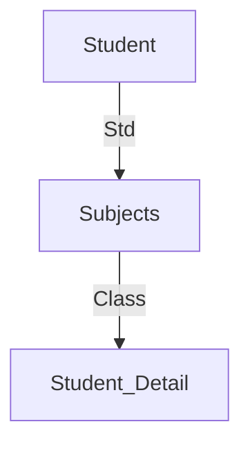
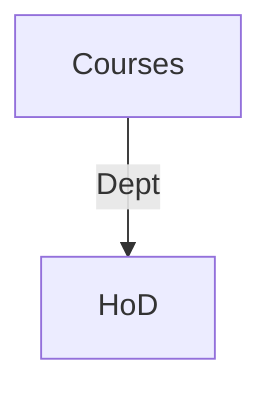

DBMS - Joins
---

Joins in database management systems allow us to combine data from multiple tables based on specified conditions. Let's explore various types of joins:

Theta (θ) Join
---

Theta join combines tuples from different relations based on a given theta condition denoted by the symbol θ. It can use various comparison operators.



Example of Theta Join:
```plaintext
Student
SID   Name    Std
101   Alex    10
102   Maria   11

Subjects
Class  Subject
10     Math
10     English
11     Music
11     Sports

Student_Detail
SID   Name    Std   Class  Subject
101   Alex    10    10     Math
101   Alex    10    10     English
102   Maria   11    11     Music
102   Maria   11    11     Sports
```

Equijoin
---

Equijoin is a type of theta join where only equality comparison operators are used. It matches tuples based on equal values of attributes.

Natural Join (⋈)
---

Natural join combines tuples from two relations based on common attributes with the same name and domain. It does not use any comparison operator.

Example of Natural Join:


Result of Natural Join:
```plaintext
Courses ⋈ HoD
Dept  CID    Course      Head
CS    CS01   Database    Alex
ME    ME01   Mechanics   Maya
EE    EE01   Electronics Mira
```

Outer Joins
---

Outer joins include all tuples from participating relations, even if there are no matching tuples.

Left Outer Join (R Left Outer Join S)
---

```plaintext
Left
A    B
100  Database
101  Mechanics
102  Electronics

Right
A    B
100  Alex
102  Maya
104  Mira

Courses Left Outer Join HoD
A    B          C    D
100  Database   100  Alex
101  Mechanics  ---  ---
102  Electronics 102  Maya
```

Right Outer Join (R Right Outer Join S)
---

```plaintext
Courses Right Outer Join HoD
A    B          C    D
100  Database   100  Alex
102  Electronics 102 Maya
---  ---        104  Mira
```

Full Outer Join (R Full Outer Join S)
---

```plaintext
Courses Full Outer Join HoD
A    B          C    D
100  Database   100  Alex
101  Mechanics  ---  ---
102  Electronics 102  Maya
---  ---        104  Mira
```

These joins are crucial for combining data effectively from multiple tables in database systems.