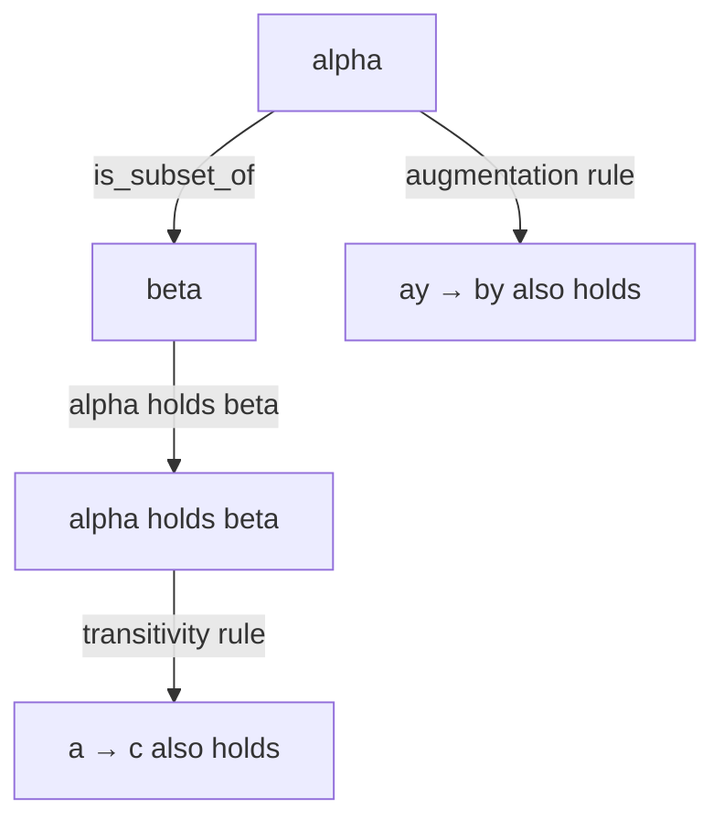
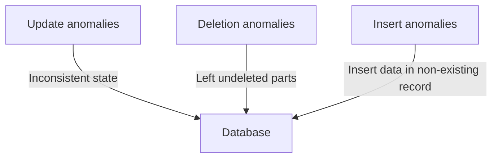
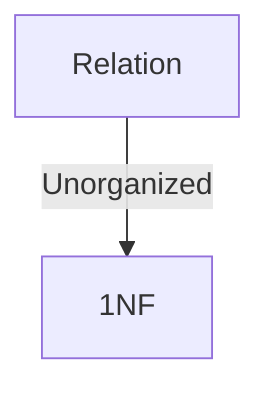
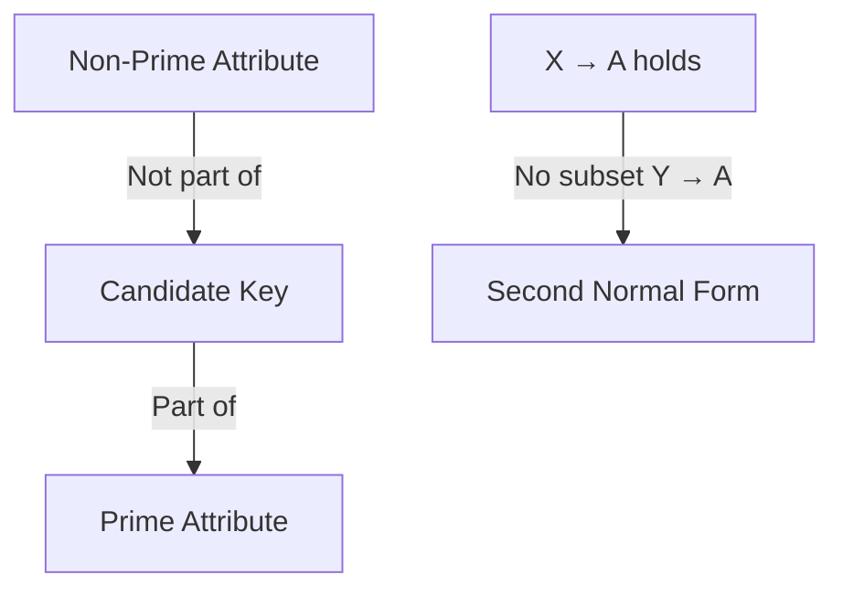
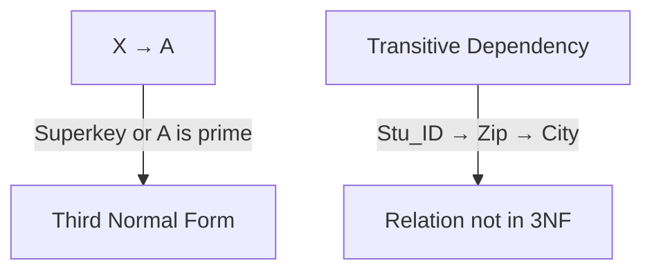
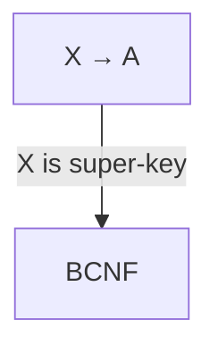

# DBMS - Normalization

## Functional Dependency

Functional dependency (FD) is a set of constraints between two attributes in a relation. Functional dependency says that if two tuples have the same values for attributes A1, A2,..., An, then those two tuples must have the same values for attributes B1, B2, ..., Bn.

Functional dependency is represented by an arrow sign (→) that is, $X \rightarrow Y$, where X functionally determines Y. The left-hand side attributes determine the values of attributes on the right-hand side.

### Armstrong's Axioms

If F is a set of functional dependencies then the closure of F, denoted as F+, is the set of all functional dependencies logically implied by F. Armstrong's Axioms are a set of rules, that when applied repeatedly, generates a closure of functional dependencies.



## Trivial Functional Dependency

- **Trivial:** If a functional dependency (FD) X → Y holds, where Y is a subset of X, then it is called a trivial FD. Trivial FDs always hold.

- **Non-trivial:**  If an FD X → Y holds, where Y is not a subset of X, then it is called a non-trivial FD.

- **Completely non-trivial:**  If an FD X → Y holds, where x intersect Y = Φ, it is said to be a completely non-trivial FD.

## Normalization

If a database design is not perfect, it may contain anomalies, which are like a bad dream for any database administrator. Managing a database with anomalies is next to impossible.

- **Update anomalies** − If data items are scattered and are not linked to each other properly, then it could lead to strange situations. For example, when we try to update one data item having its copies scattered over several places, a few instances get updated properly while a few others are left with old values. Such instances leave the database in an inconsistent state.

- **Deletion anomalies** − We tried to delete a record, but parts of it was left undeleted because of unawareness, the data is also saved somewhere else.

- **Insert anomalies** − We tried to insert data in a record that does not exist at all.

Normalization is a method to remove all these anomalies and bring the database to a consistent state.



## First Normal Form (1NF)

First Normal Form is defined in the definition of relations (tables) itself. This rule defines that all the attributes in a relation must have atomic domains. The values in an atomic domain are indivisible units.

unorganized relation



Each attribute must contain only a single value from its pre-defined domain.

## Second Normal Form (2NF)

Before we learn about the second normal form, we need to understand the following −

- **Prime attribute :** An attribute, which is a part of the candidate-key, is known as a prime attribute.

- **Non-prime attribute :** An attribute, which is not a part of the prime-key, is said to be a non-prime attribute.



## Third Normal Form (3NF)

For a relation to be in Third Normal Form, it must be in Second Normal form and the following must satisfy −

No non-prime attribute is transitively dependent on the prime key attribute.



## Boyce-Codd Normal Form (BCNF)

BCNF is an extension of Third Normal Form on strict terms. BCNF states that −

For any non-trivial functional dependency, X → A, X must be a super-key.



In the above image, Stu_ID is the super-key in the relation Student_Detail and Zip is the super-key in the relation ZipCodes. So,
```
Stu_ID → Stu_Name, Zip
```
and
```
Zip → City
```
Which confirms that both the relations are in BCNF.