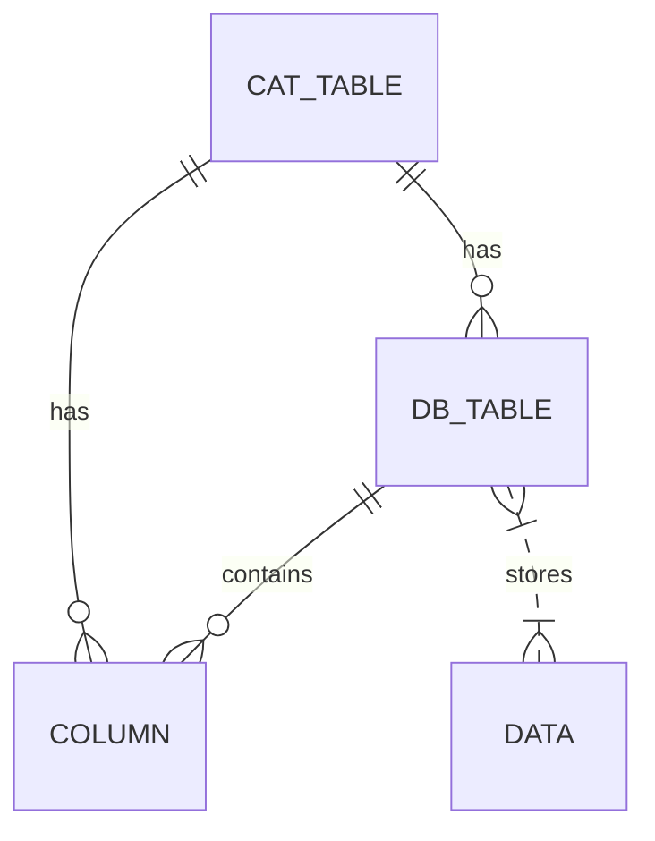

# DBMS - Codd's 12 Rules

Dr. Edgar F. Codd, after his extensive research on the Relational Model of database systems, came up with twelve rules of his own, which according to him, a database must obey in order to be regarded as a true relational database.

## Rule 1: Information Rule

The data stored in a database, may it be user data or metadata, must be a value of some table cell. Everything in a database must be stored in a table format.

### Example:

Consider a database for a library. The Information Rule ensures that every piece of data, like the title of a book or the name of an author, is stored within a specific table cell, such as the 'Book Title' attribute in the 'Books' table.

## Rule 2: Guaranteed Access Rule

Every single data element (value) is guaranteed to be accessible logically with a combination of table-name, primary-key (row value), and attribute-name (column value). No other means, such as pointers, can be used to access data.

### Example:

In a customer database, the Guaranteed Access Rule ensures that you can access a specific customer's details using their unique customer ID, such as querying "SELECT \* FROM Customers WHERE CustomerID = '123'".

## Rule 3: Systematic Treatment of NULL Values

The NULL values in a database must be given a systematic and uniform treatment. This is a very important rule because a NULL can be interpreted as one of the following − data is missing, data is not known, or data is not applicable.

### Example:

In an employee database, the Systematic Treatment of NULL Values ensures that if an employee's middle name is unknown or not applicable, it's represented as NULL in the database rather than an empty string or a placeholder.

## Rule 4: Active Online Catalog

The structure description of the entire database must be stored in an online catalog, known as data dictionary, which can be accessed by authorized users. Users can use the same query language to access the catalog which they use to access the database itself.

### Example:

An Active Online Catalog provides metadata about the database schema. For instance, it includes information about tables, columns, data types, and relationships, allowing users to understand and query the database structure.

## Rule 5: Comprehensive Data Sub-Language Rule

A database can only be accessed using a language having linear syntax that supports data definition, data manipulation, and transaction management operations. This language can be used directly or by means of some application. If the database allows access to data without any help of this language, then it is considered as a violation.

### Example:

SQL (Structured Query Language) is a comprehensive data sub-language that fulfills the requirements of data definition, manipulation, and transaction management. It allows users to interact with the database through standard commands like SELECT, INSERT, UPDATE, DELETE, and COMMIT.

## Rule 6: View Updating Rule

All the views of a database, which can theoretically be updated, must also be updatable by the system.

### Example:

Consider a view that combines data from multiple tables for reporting purposes. The View Updating Rule ensures that if the view includes columns from a single base table, those columns can be updated through the view.

## Rule 7: High-Level Insert, Update, and Delete Rule

A database must support high-level insertion, updation, and deletion. This must not be limited to a single row, that is, it must also support union, intersection and minus operations to yield sets of data records.

### Example:

The High-Level Insert, Update, and Delete Rule allows you to insert, update, or delete multiple rows at once. For instance, you can use an SQL statement like "DELETE FROM Employees WHERE Salary < 50000" to delete all employees with a salary below $50,000.

## Rule 8: Physical Data Independence

The data stored in a database must be independent of the applications that access the database. Any change in the physical structure of a database must not have any impact on how the data is being accessed by external applications.

### Example:

Physical Data Independence allows you to modify the storage structures (like changing indexes or file organization) without affecting how users and applications interact with the data. This ensures that applications remain functional even if the database undergoes structural changes.

## Rule 9: Logical Data Independence

The logical data in a database must be independent of its user’s view (application). Any change in logical data must not affect the applications using it. For example, if two tables are merged or one is split into two different tables, there should be no impact or change on the user application. This is one of the most difficult rules to apply.

### Example:

Imagine merging two tables 'Customers' and 'Suppliers' into a single table 'Partners'. Logical Data Independence ensures that existing applications accessing 'Customers' or 'Suppliers' continue to function seamlessly after the merge.

## Rule 10: Integrity Independence

A database must be independent of the application that uses it. All its integrity constraints can be independently modified without the need of any change in the application. This rule makes a database independent of the front-end application and its interface.

### Example:

Integrity constraints like primary keys, foreign keys, and unique constraints can be modified or added without affecting how applications interact with the database. This allows for changes in data validation rules without altering application logic.

## Rule 11: Distribution Independence

The end-user must not be able to see that the data is distributed over various locations. Users should always get the impression that the data is located at one site only. This rule has been regarded as the foundation of distributed database systems.

### Example:

In a distributed database, data may be stored across multiple physical locations. Distribution Independence ensures that users perceive and interact with the data as if it's stored in a single location, regardless of its actual distribution.

## Rule 12: Non-Subversion Rule

If a system has an interface that provides access to low-level records, then the interface must not be able to subvert the system and bypass security and integrity constraints.

### Example:

The Non-Subversion Rule prevents unauthorized access to low-level records or system components that could compromise security or integrity. It ensures that access controls and security measures are enforced, even through direct interfaces.
    