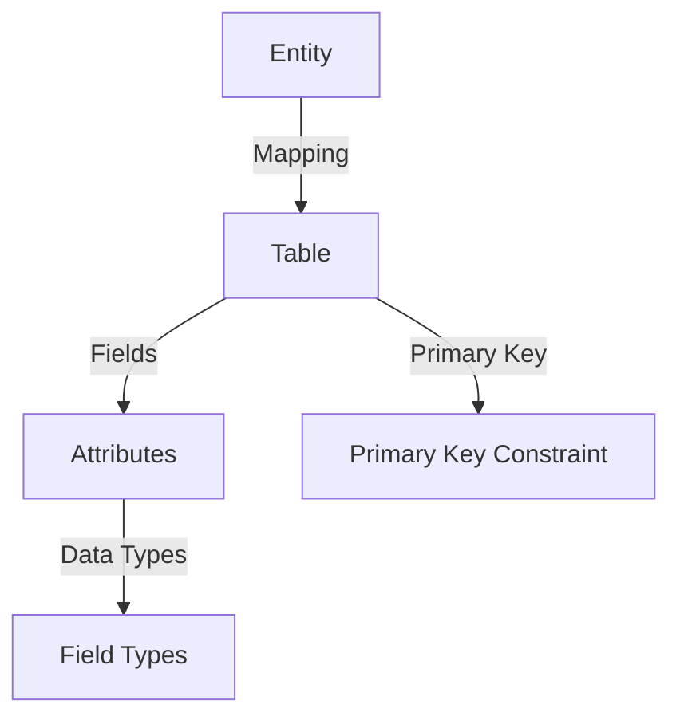
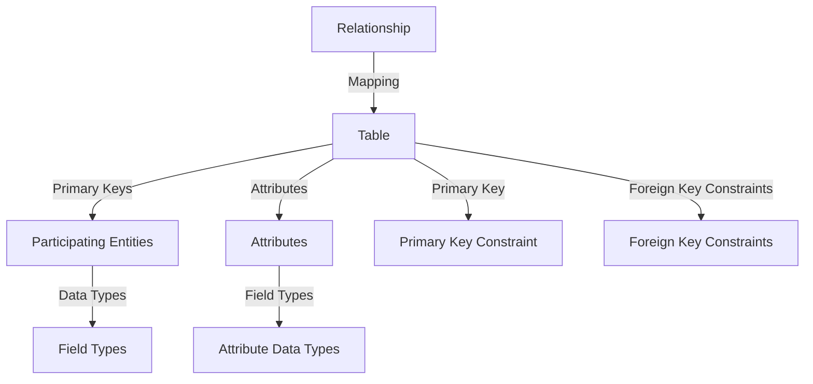
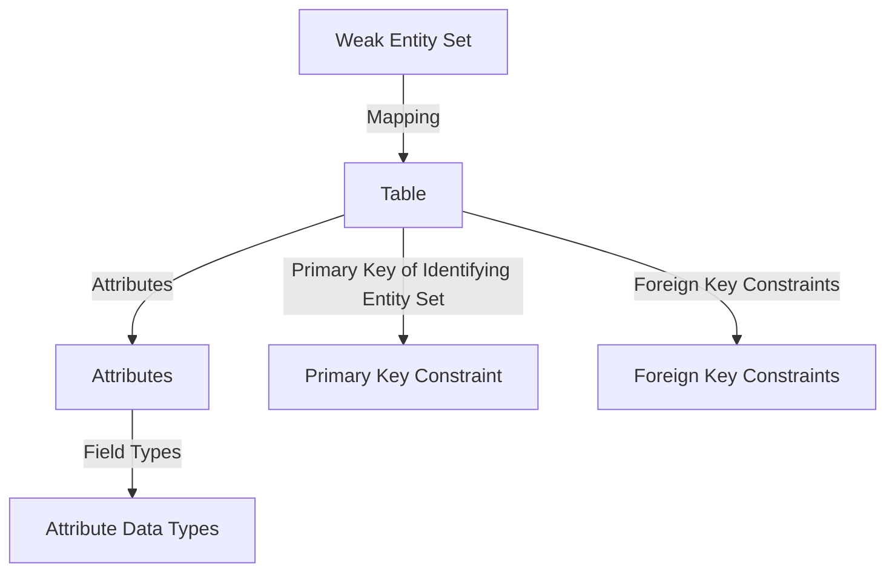
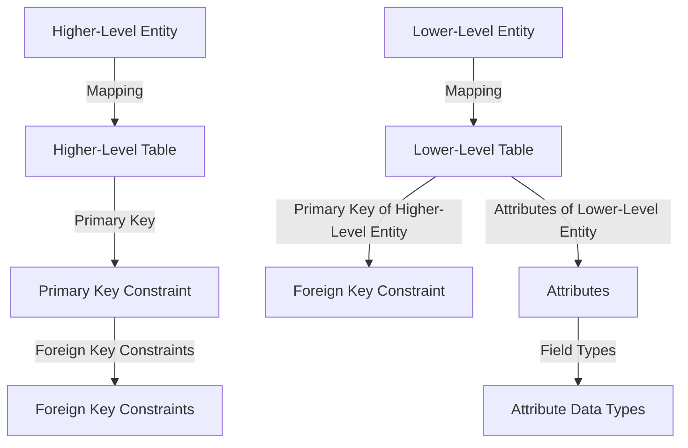

# Convert ER Model to Relational Model

ER Model, when conceptualized into diagrams, gives a good overview of entity-relationship, which is easier to understand. ER diagrams can be mapped to a relational schema, meaning it is possible to create a relational schema using an ER diagram. Although not all ER constraints can be imported into the relational model, an approximate schema can be generated.

## Mapping Entity

An entity is a real-world object with some attributes.

### Mapping Process (Algorithm)

1. Create a table for each entity.
2. Entity's attributes should become fields of tables with their respective data types.
3. Declare the primary key.

## Mapping Relationship

A relationship is an association among entities.

### Mapping Process

1. Create a table for a relationship.
2. Add the primary keys of all participating entities as fields of the table with their respective data types.
3. If the relationship has any attributes, add each attribute as a field of the table.
4. Declare a primary key composing all the primary keys of participating entities.
5. Declare all foreign key constraints.

## Mapping Weak Entity Sets

A weak entity set is one which does not have any primary key associated with it.

### Mapping Process

1. Create a table for the weak entity set.
2. Add all its attributes to the table as fields.
3. Add the primary key of the identifying entity set.
4. Declare all foreign key constraints.

## Mapping Hierarchical Entities

ER specialization or generalization comes in the form of hierarchical entity sets.

### Mapping Process

1. Create tables for all higher-level entities.
2. Create tables for lower-level entities.
3. Add primary keys of higher-level entities in the table of lower-level entities.
4. In lower-level tables, add all other attributes of lower-level entities.
5. Declare the primary key of the higher-level table and the primary key for the lower-level table.
6. Declare foreign key constraints.

