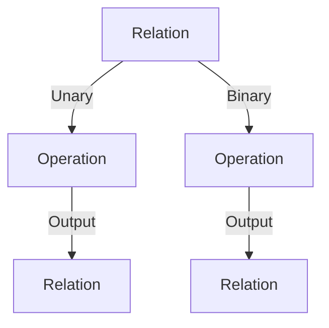
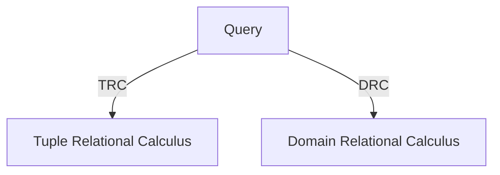

# DBMS - Relational Algebra

Relational database systems are expected to be equipped with a query language that can assist its users to query the database instances. There are two kinds of query languages − relational algebra and relational calculus.

## Relational Algebra

Relational algebra is a procedural query language that takes instances of relations as input and yields instances of relations as output. It uses operators to perform queries. An operator can be either unary or binary. They accept relations as their input and yield relations as their output. Relational algebra is performed recursively on a relation, and intermediate results are also considered relations.

The fundamental operations of relational algebra are as follows:

- **Select**: $σ_p(r)$
- **Project**: $∏_{A1, A2, An} (r)$
- **Union**: $r ∪ s$
- **Set Difference**: $r - s$
- **Cartesian Product**: $r Χ s$
- **Rename**: $ρ_x (E)$

### Select Operation (σ)

It selects tuples that satisfy the given predicate from a relation.

**Notation**: $σ_p(r)$

1. $σ_{subject = "database"}(Books)$
  - Selects tuples from books where subject is 'database'.
2. $σ_{subject = "database" and price = "450"}(Books)$
  - Selects tuples from books where subject is 'database' and price is 450.
3. $σ_{subject = "database" and price = "450" or year > "2010"}(Books)$
  - Selects tuples from books where subject is 'database' and price is 450 or those books published after 2010.

### Project Operation (∏)

It projects columns that satisfy a given predicate.

**Notation**: $∏_{subject, author} (Books)$

- $∏_{subject, author} (Books)$
  - Selects and projects columns named subject and author from the relation Books.

### Union Operation (∪)

It performs binary union between two given relations.

**Notation**: $r ∪ s$

- $∏_{author} (Books) ∪ ∏_{author} (Articles)$
  - Projects the names of the authors who have either written a book or an article or both.

### Set Difference (-)

The result of set difference operation is tuples present in one relation but not in the second relation.

**Notation**: $r - s$

- $∏_{author} (Books) - ∏_{author} (Articles)$
  - Provides the names of authors who have written books but not articles.

### Cartesian Product (Χ)

Combines information of two different relations into one.

**Notation**: $r Χ s$

- $σ_{author = 'tutorialspoint'}(Books Χ Articles)$
  - Yields a relation showing all the books and articles written by tutorialspoint.

### Rename Operation (ρ)

The results of relational algebra are relations without any name. The rename operation allows us to rename the output relation.

**Notation**: $ρ_x (E)$

- $ρ_x (Books ∏_{author})$
  - Renames the output relation of Books ∏ author to x.

Additional operations include Set Intersection, Assignment, and Natural Join.

## Relational Calculus

Relational calculus is a non-procedural query language, that is, it tells what to do but never explains how to do it. It exists in two forms:

- Tuple Relational Calculus (TRC)
- Domain Relational Calculus (DRC)

TRC and DRC involve quantifiers and relational operators to define queries.

> **NOTE:** TRC and DRC allow specifying conditions and constraints on the result sets without specifying how to retrieve the data.
