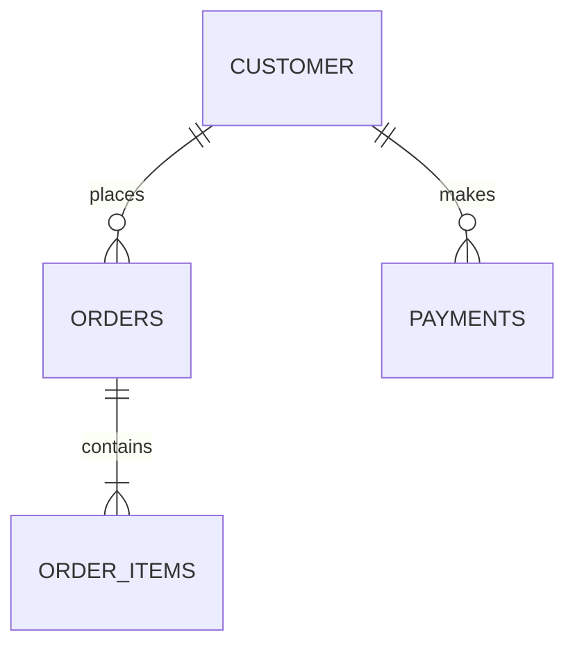

# DBMS - Relational Data Model

The relational data model is the primary data model used widely around the world for data storage and processing. This model is simple and has all the properties and capabilities required to process data with storage efficiency.

## Concepts

### Tables

In the relational data model, relations are saved in the format of Tables. This format stores the relation among entities. A table has rows and columns, where rows represent records and columns represent attributes.

### Tuple

A single row of a table, which contains a single record for that relation, is called a tuple.

### Relation Instance

A finite set of tuples in the relational database system represents a relation instance. Relation instances do not have duplicate tuples.

### Relation Schema

A relation schema describes the relation name (table name), attributes, and their names.

### Relation Key

Each row has one or more attributes, known as a relation key, which can identify the row in the relation (table) uniquely.

### Attribute Domain

Every attribute has some predefined value scope, known as an attribute domain.

## Constraints

Every relation has some conditions that must hold for it to be a valid relation. These conditions are called Relational Integrity Constraints. There are three main integrity constraints −

1. **Key Constraints**
2. **Domain Constraints**
3. **Referential Integrity Constraints**

### Key Constraints

There must be at least one minimal subset of attributes in the relation, which can identify a tuple uniquely. This minimal subset of attributes is called a key for that relation. If there are more than one such minimal subsets, these are called candidate keys.

Key constraints force that −

- In a relation with a key attribute, no two tuples can have identical values for key attributes.
- A key attribute cannot have NULL values.

Key constraints are also referred to as Entity Constraints.

### Domain Constraints

Attributes have specific values in real-world scenarios. For example, age can only be a positive integer. The same constraints have been tried to employ on the attributes of a relation. Every attribute is bound to have a specific range of values. For example, age cannot be less than zero, and telephone numbers cannot contain a digit outside 0-9.

### Referential Integrity Constraints

Referential integrity constraints work on the concept of Foreign Keys. A foreign key is a key attribute of a relation that can be referred to in another relation.

Referential integrity constraint states that if a relation refers to a key attribute of a different or same relation, then that key element must exist.

| Constraint Type       | Description                                                                            |
| --------------------- | -------------------------------------------------------------------------------------- |
| Key Constraints       | Ensure uniqueness of key attributes and disallow NULL values.                          |
| Domain Constraints    | Define allowable values for attributes based on their data types and real-world rules. |
| Referential Integrity | Enforce relationships between tables, ensuring that references remain valid.           |
