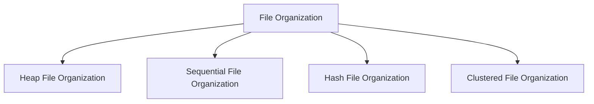
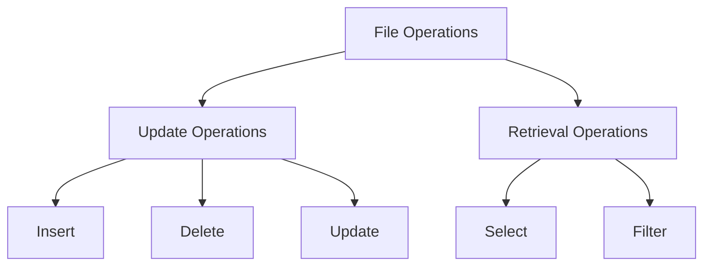

DBMS - File Structure
---

Relative data and information are stored collectively in file formats. A file is a sequence of records stored in binary format. A disk drive is formatted into several blocks that can store records. File records are mapped onto those disk blocks.

File Organization
---

File Organization defines how file records are mapped onto disk blocks. We have four types of File Organization to organize file records:

### Heap File Organization
- **Description:** When a file is created using Heap File Organization, the Operating System allocates memory area to that file without any further accounting details. File records can be placed anywhere in that memory area.
- **Characteristics:** No ordering, sequencing, or indexing.
- **Responsibility:** Software manages the records.

### Sequential File Organization
- **Description:** Records are placed in the file in some sequential order based on a unique key field or search key.
- **Characteristics:** Practically, not all records can be stored sequentially in physical form.
- **Example:** Library cataloging system where books are stored based on a unique identifier.

### Hash File Organization
- **Description:** Uses Hash function computation on some fields of the records. The output of the hash function determines the location of the disk block where the records are to be placed.
- **Characteristics:** Efficient for retrieval when the search is based on the hashed attribute.
- **Example:** Student records where student ID is used to determine storage location.

### Clustered File Organization
- **Description:** Related records from one or more relations are kept in the same disk block.
- **Characteristics:** Not based on primary key or search key.
- **Use Case:** Used when accessing related data together.



File Operations
---

Operations on database files can be broadly classified into two categories:

1. **Update Operations**
    - **Description:** Change data values by insertion, deletion, or update.

2. **Retrieval Operations**
    - **Description:** Retrieve data without altering it, potentially with optional conditional filtering.

### Common File Operations
- **Open:** 
    - **Modes:** Read mode (data is read-only) and Write mode (data modification allowed).
    - **Characteristics:** Files in read mode can be shared; files in write mode cannot be shared.

- **Locate:**
    - **Description:** File pointer tells the current position where data is to be read or written.
    - **Function:** Can be moved forward or backward using find (seek) operation.

- **Read:**
    - **Description:** By default, the file pointer points to the beginning of the file when opened in read mode.
    - **Characteristics:** User can specify where to locate the file pointer.

- **Write:**
    - **Description:** Enables editing file contents, including deletion, insertion, or modification.
    - **Characteristics:** File pointer can be dynamically changed if allowed by the operating system.

- **Close:**
    - **Description:** Crucial for the operating system.
    - **Function:**
        1. Removes all locks if in shared mode.
        2. Saves data to secondary storage if altered.
        3. Releases all buffers and file handlers associated with the file.



The organization of data inside a file plays a major role in how efficiently these operations can be performed. The method used to locate the file pointer to a desired record inside a file varies based on whether the records are arranged sequentially or clustered.

In summary, understanding the various file structures and their operations is crucial for efficient database management, ensuring optimal performance and reliability.
```