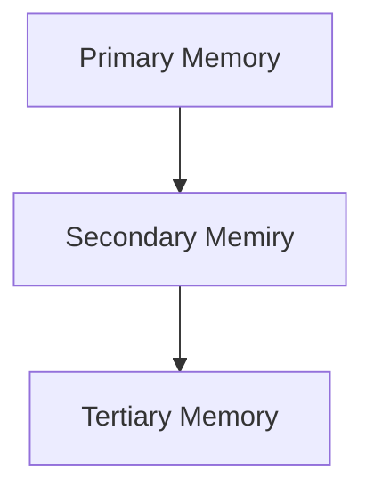
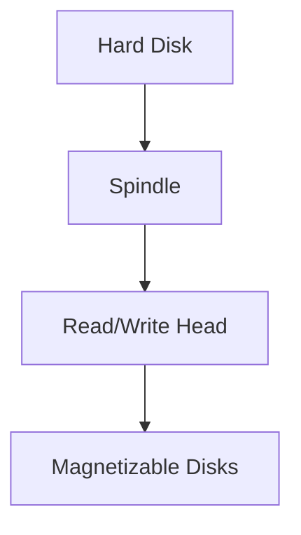

# DBMS - Storage System
---

Databases are stored in various file formats and devices, each serving different purposes and performance requirements. Let's explore the different types of storage systems and their hierarchical organization.

## Memory Types

1. **Primary Storage**

   - **Description:** Directly accessible to the CPU.
   - **Examples:** CPU's internal memory (registers), cache, main memory (RAM).
   - **Characteristics:** Ultra-fast, volatile, requires continuous power.

2. **Secondary Storage**

   - **Description:** Used for future data use or backup.
   - **Examples:** Magnetic disks, optical disks (DVD, CD), hard disks, flash drives, magnetic tapes.
   - **Characteristics:** Non-volatile, slower than primary storage, larger capacity.

3. **Tertiary Storage**
   - **Description:** Used for storing huge volumes of data.
   - **Examples:** Optical disks, magnetic tapes.
   - **Characteristics:** Slowest in speed, used for system backups.

## Memory Hierarchy

A computer system's memory hierarchy ranges from the fastest, smallest, and most expensive types to the slowest, largest, and least expensive.

- **Registers:** Fastest access time, smallest capacity, highest cost.
- **Cache Memory:** Faster access time than RAM, used to store frequently accessed data.
- **Main Memory (RAM):** Directly accessible by the CPU, larger capacity than cache.
- **Secondary Storage:** Larger capacity, slower access time, used for data storage and backup.
- **Tertiary Storage:** Largest capacity, slowest access time, used for extensive backups.

## Magnetic Disks

Hard disk drives (HDDs) are the most common secondary storage devices, using magnetization to store information.

- **Structure:** Consists of metal disks coated with magnetizable material, placed on a spindle.
- **Operation:** A read/write head magnetizes or de-magnetizes spots to represent data bits (0 or 1).
- **Organization:** Disks have concentric circles (tracks), each divided into sectors (typically 512 bytes).

## Redundant Array of Independent Disks (RAID)

RAID technology connects multiple secondary storage devices to function as a single unit, enhancing performance and data redundancy.

1. **RAID 0:**

   - **Description:** Striped array of disks.
   - **Features:** Enhances speed and performance, no parity or backup.

2. **RAID 1:**

   - **Description:** Mirroring technique.
   - **Features:** Provides 100% redundancy, copies data to all disks.

3. **RAID 2:**

   - **Description:** Uses Error Correction Code (ECC) with Hamming distance.
   - **Features:** Stripes data bits and ECC codes, high cost and complexity.

4. **RAID 3:**

   - **Description:** Stripes data with parity bit on a separate disk.
   - **Features:** Overcomes single disk failures.

5. **RAID 4:**

   - **Description:** Block-level striping with dedicated parity disk.
   - **Features:** Requires at least three disks, similar to RAID 3 but with block-level striping.

6. **RAID 5:**

   - **Description:** Block-level striping with distributed parity.
   - **Features:** Distributes parity bits among all data disks.

7. **RAID 6:**
   - **Description:** Extension of RAID 5 with dual parity.
   - **Features:** Provides additional fault tolerance, requires at least four disks.

Each RAID level serves specific needs, balancing between performance, data redundancy, and fault tolerance.
