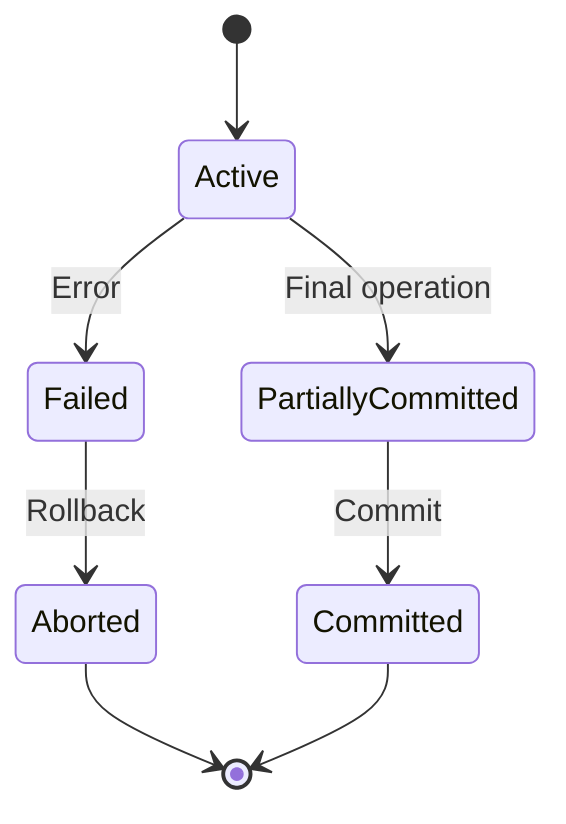

# DBMS - Transactions

A transaction in a Database Management System (DBMS) is defined as a group of tasks that together form a single unit of work. Each task in a transaction is the smallest processing unit that cannot be divided further. Transactions are crucial in ensuring data integrity and consistency within a database.

## Example of a Transaction

Consider a bank transaction where Rs 500 is transferred from A's account to B's account. This transaction involves the following tasks:

**A's Account:**
1. Open_Account(A)
2. Old_Balance = A.balance
3. New_Balance = Old_Balance - 500
4. A.balance = New_Balance
5. Close_Account(A)

**B's Account:**
1. Open_Account(B)
2. Old_Balance = B.balance
3. New_Balance = Old_Balance + 500
4. B.balance = New_Balance
5. Close_Account(B)

## ACID Properties

Transactions must satisfy the ACID properties to ensure accuracy, completeness, and data integrity.

- **Atomicity:** Ensures that all operations within the transaction are completed; if not, the transaction is aborted.
- **Consistency:** Ensures that the database remains in a consistent state before and after the transaction.
- **Isolation:** Ensures that transactions are executed in isolation, without interference from other transactions.
- **Durability:** Ensures that the results of a committed transaction are permanently stored in the database, even in the case of a system failure.

## Serializability

Serializability ensures that the transactions produce the same results as if they were executed serially, one after the other. This is crucial in a multi-transaction environment.

### Types of Schedules

- **Serial Schedule:** Transactions are executed one after the other, without overlapping.
- **Equivalence Schedules:** Schedules that are considered equivalent if they satisfy certain properties.

#### Equivalence Schedules Types

- **Result Equivalence:** Schedules that produce the same result after execution.

- **View Equivalence:** Schedules where transactions perform similar actions in a similar manner.

##### Example 

- If T reads the initial data in S1, then it also reads the initial data in S2.

- If T reads the value written by J in S1, then it also reads the value written by J in S2.

- If T performs the final write on the data value in S1, then it also performs the final write on the data value in S2.

- **Conflict Equivalence:** Schedules with conflicting operations that access the same data item, where at least one operation is a write.

Two schedules would be conflicting if they have the following properties −

- Both belong to separate transactions.
- Both accesses the same data item.
- At least one of them is "write" operation.

Two schedules having multiple transactions with conflicting operations are said to be conflict equivalent if and only if −

- Both the schedules contain the same set of Transactions.
- The order of conflicting pairs of operation is maintained in both the schedules.

> **Note :** View equivalent schedules are view serializable and conflict equivalent schedules are conflict serializable. All conflict serializable schedules are view serializable too.

## Equivalence Types Comparison Table

| Equivalence Type | Description | Significance |
|------------------|-------------|--------------|
| Result Equivalence | Produces the same result after execution. | Not generally significant due to variable results. |
| View Equivalence | Transactions perform similar actions in a similar manner. | Ensures transactions read and write similar values. |
| Conflict Equivalence | Transactions have conflicting operations accessing the same data item. | Ensures conflicting operations maintain order. |

## States of Transactions

A transaction in a database can be in one of the following states:

- **Active:** The transaction is being executed.
- **Partially Committed:** The transaction has executed its final operation but not yet committed.
- **Failed:** The transaction has encountered an error and cannot proceed.
- **Aborted:** The transaction has been rolled back to its original state.
- **Committed:** The transaction has successfully completed and its changes are permanently applied to the database.

### Transaction States Diagram

## Summary

Transactions are vital for maintaining data integrity and consistency in DBMS. By adhering to the ACID properties, transactions ensure reliable and accurate database operations. Understanding transaction states and serializability helps in managing and optimizing concurrent transactions effectively.