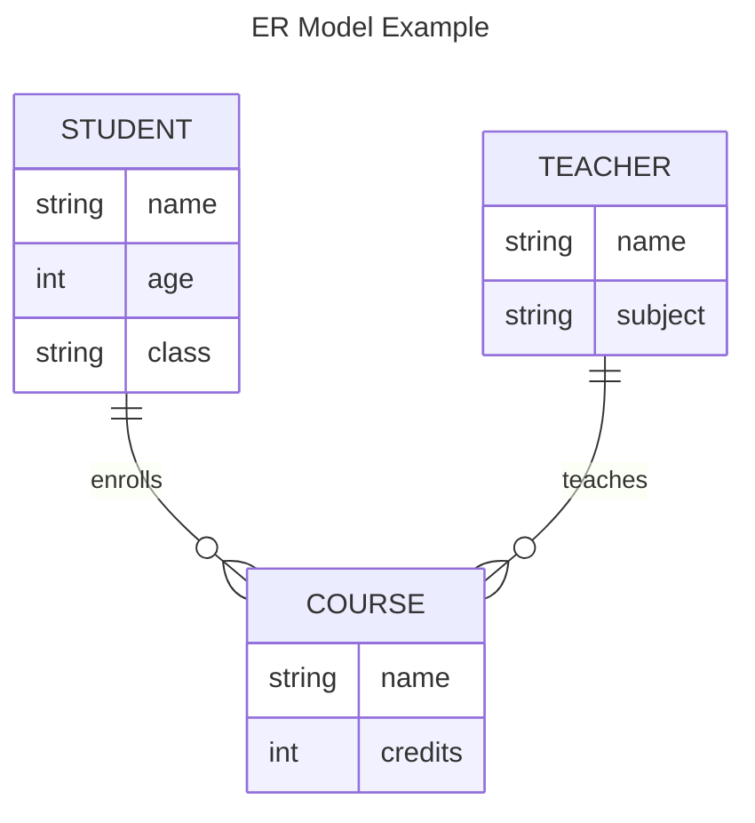
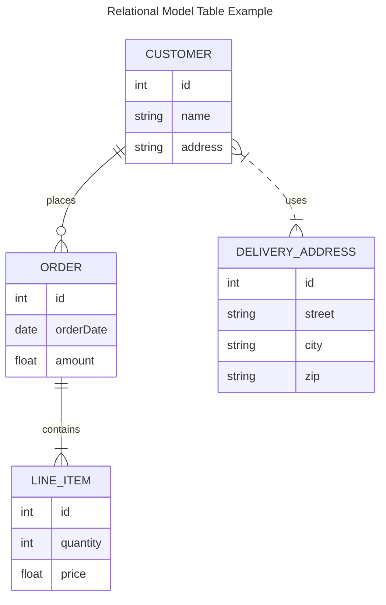

# DBMS - Data Models

Data models define the logical structure of a database and introduce abstraction in a DBMS. They specify how data is connected, processed, and stored within the system.

## Flat Data Models

Flat data models were the earliest, where all data was kept on the same plane. However, they were prone to duplication and update anomalies due to their non-scientific nature.

## Entity-Relationship Model (ER Model)

The Entity-Relationship (ER) Model is based on real-world entities and their relationships. It creates entity sets, relationship sets, attributes, and constraints, making it suitable for conceptual database design.

### Concepts of ER Model

- **Entity**: A real-world entity with attributes defined by a domain. For example, in a school database, a student is an entity with attributes like name, age, and class.
- **Relationship**: Logical associations between entities, defined by mapping cardinalities such as one-to-one, one-to-many, many-to-one, and many-to-many.

## Relational Model

The Relational Model is the most popular data model in DBMS, based on first-order predicate logic. It defines a table as an n-ary relation.

### Highlights of Relational Model

- Data stored in tables (relations).
- Relations can be normalized.
- Normalized relations contain atomic values.
- Each row in a relation has a unique value.
- Columns in a relation contain values from the same domain.