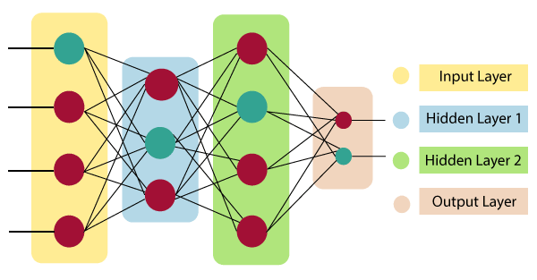
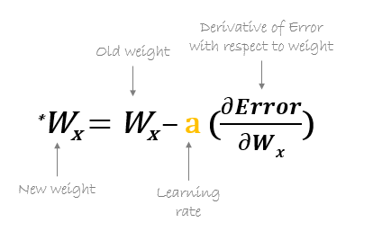

Artificial Neural Networks (ANNs) are computing systems inspired by the biological neural networks that constitute animal brains. They are a key component of deep learning and machine learning. ANNs consist of interconnected layers of nodes, called neurons, which process and transmit information. These networks are capable of learning from data, making them powerful tools for various applications.

### **Structure of ANNs**

1. **Input Layer**: The input layer receives the initial data and passes it to the subsequent layers.
2. **Hidden Layers**: These layers perform computations and feature extraction. There can be one or multiple hidden layers, making the network deeper and more capable of handling complex tasks.
3. **Output Layer**: The final layer produces the output, which can be a classification, prediction, or any other result based on the input data.

The learning process of Artificial Neural Networks (ANNs) involves several key steps, starting from initializing the network to adjusting its parameters based on data. Here’s a detailed breakdown:

### 1. Initialization
- **Architecture Design**: Choose the number of layers and the number of neurons in each layer. The architecture can be shallow (few layers) or deep (many layers).
- **Weight Initialization**: Assign initial values to the weights and biases in the network. This can be done randomly or using specific strategies like Xavier or He initialization.

#### Example 
- **Architecture**: 1 input layer (2 neurons), 1 hidden layer (3 neurons), 1 output layer (1 neuron).
- **Weights and Biases**: Randomly initialized.

### 2. Forward Propagation
- **Input Layer**: The input layer receives the raw data. Each neuron in this layer represents an input feature.
- **Hidden Layers**: Each neuron in a hidden layer computes a weighted sum of its inputs, adds a bias term, and applies an activation function (e.g., ReLU, Sigmoid, Tanh) to introduce non-linearity.
- **Output Layer**: The final layer produces the network's output. The activation function in this layer depends on the task (e.g., Softmax for classification, linear for regression).

### 3. Loss Computation
- **Loss Function**: Calculate the loss (or error) which quantifies the difference between the predicted output and the actual target. Common loss functions include Mean Squared Error (MSE) for regression and Cross-Entropy Loss for classification.

### 4. Backpropagation
- **Gradient Computation**: Calculate the gradient of the loss function with respect to each weight and bias in the network using the chain rule of calculus. This involves computing the partial derivatives of the loss with respect to each parameter.
- **Weight Update**: Adjust the weights and biases using a gradient-based optimization algorithm. The most common method is Stochastic Gradient Descent (SGD) and its variants (e.g., Adam, RMSprop). The update rule typically looks like:

    

### 5. Epochs and Iterations
- **Epoch**: One full pass through the entire training dataset.
- **Iteration**: One update of the network's weights, usually after processing a mini-batch of data.

### 6. Convergence
- **Stopping Criteria**: Training continues for a predefined number of epochs or until the loss converges to a satisfactory level. Early stopping can be used to halt training when performance on a validation set starts to degrade, indicating overfitting.

The learning process of ANNs involves initializing the network, propagating inputs forward to compute outputs, calculating loss, backpropagating errors to update weights, and iterating until the model converges. Each step is crucial for the network to learn and make accurate predictions on new, unseen data.

### **Types of ANNs**

Artificial Neural Networks (ANNs) come in various types, each designed to address specific tasks and data structures. Here’s a detailed overview of the most common types of ANNs:

### 1. Feedforward Neural Networks (FNN)
-  The simplest type of ANN, where the data moves in only one direction—from the input layer through hidden layers to the output layer.
- **Use Cases**: Basic pattern recognition, regression, and classification tasks.
- **Example**: A neural network for predicting house prices based on features like size, location, and number of rooms.

### 2. Convolutional Neural Networks (CNN)
-  Specialized for processing grid-like data such as images. They use convolutional layers that apply filters to the input data to capture spatial hierarchies.
- **Components**:
  - **Convolutional Layers**: Extract features from input data.
  - **Pooling Layers**: Reduce dimensionality and retain important information.
  - **Fully Connected Layers**: Perform classification based on extracted features.
- **Use Cases**: Image and video recognition, object detection, and medical image analysis.
- **Example**: A CNN for classifying handwritten digits (MNIST dataset).

### 3. Recurrent Neural Networks (RNN)
  - Designed for sequential data. They have connections that form directed cycles, allowing information to persist.
- **Components**:
  - **Hidden State**: Carries information across sequence steps.
  - **Loop Connections**: Enable memory of previous inputs.
- **Use Cases**: Time series prediction, natural language processing, and speech recognition.
- **Example**: An RNN for predicting the next word in a sentence.

### 4. Long Short-Term Memory Networks (LSTM)
-  A type of RNN that addresses the vanishing gradient problem with a special architecture that allows it to remember information for long periods.
- **Components**:
  - **Cell State**: Manages the flow of information.
  - **Gates**: Control the cell state (input, forget, and output gates).
- **Use Cases**: Long-term dependency tasks like language modeling, machine translation, and speech synthesis.
- **Example**: An LSTM for translating text from one language to another.

### 5. Gated Recurrent Units (GRU)
-  A simplified version of LSTM with fewer gates, making it computationally more efficient while still handling the vanishing gradient problem.
- **Components**:
  - **Update Gate**: Decides how much past information to keep.
  - **Reset Gate**: Determines how much past information to forget.
- **Use Cases**: Similar to LSTM, used for time series prediction and NLP tasks.
- **Example**: A GRU for predicting stock prices.

### 6. Autoencoders
-  Neural networks used to learn efficient representations of data, typically for dimensionality reduction or denoising.
- **Components**:
  - **Encoder**: Compresses the input into a latent-space representation.
  - **Decoder**: Reconstructs the input from the latent representation.
- **Use Cases**: Anomaly detection, image denoising, and data compression.
- **Example**: An autoencoder for reducing the dimensionality of a dataset while preserving its structure.

### 7. Variational Autoencoders (VAE)
 : A type of autoencoder that generates new data points by learning the probability distribution of the input data.
- **Components**:
  - **Encoder**: Maps input data to a distribution.
  - **Decoder**: Generates data from the distribution.
- **Use Cases**: Generative tasks like image and text generation.
- **Example**: A VAE for generating new faces based on a dataset of human faces.

### 8. Generative Adversarial Networks (GAN)
-  Consists of two networks (generator and discriminator) that compete against each other. The generator creates data, and the discriminator evaluates it.
- **Components**:
  - **Generator**: Generates new data instances.
  - **Discriminator**: Distinguishes between real and generated data.
- **Use Cases**: Image generation, style transfer, and data augmentation.
- **Example**: A GAN for generating realistic images of landscapes.

### 9. Radial Basis Function Networks (RBFN)
-  Uses radial basis functions as activation functions. Typically consists of three layers: input, hidden (with RBF activation), and output.
- **Use Cases**: Function approximation, time-series prediction, and control systems.
- **Example**: An RBFN for approximating complex nonlinear functions.

### 10. Self-Organizing Maps (SOM)
-  An unsupervised learning algorithm that produces a low-dimensional (typically 2D) representation of the input space, preserving topological properties.
- **Use Cases**: Data visualization, clustering, and feature mapping.
- **Example**: A SOM for visualizing high-dimensional data like customer purchase behavior.

### 11. Transformer Networks
-  A model architecture that relies on self-attention mechanisms to process input sequences in parallel rather than sequentially.
- **Key Components**:
  - **Self-Attention Mechanism**: Computes the relationship between different positions in the input sequence.
  - **Feedforward Layers**: Process the self-attention outputs.
- **Use Cases**: Natural language processing tasks like translation, summarization, and question answering.
- **Example**: The Transformer model for language translation (e.g., Google Translate).

Each type of ANN has its own strengths and is suited for different types of tasks. The choice of ANN depends on the specific problem at hand, the nature of the data, and the desired outcome. Understanding these various architectures allows for better design and implementation of neural networks to solve complex real-world problems.

### **Applications**

1. **Image and Video Recognition**: ANNs can identify objects, faces, and actions in images and videos.
2. **Natural Language Processing (NLP)**: Used for tasks like language translation, sentiment analysis, and chatbots.
3. **Speech Recognition**: Convert spoken language into text.
4. **Predictive Analytics**: Forecasting future trends based on historical data.
5. **Autonomous Systems**: Control systems in self-driving cars, robots, and drones.

### **Advantages**

1. **Adaptability**: ANNs can learn and adapt to new data.
2. **Versatility**: Applicable to a wide range of tasks.
3. **Efficiency**: Capable of processing large amounts of data quickly.

### **Challenges**

1. **Complexity**: Designing and training large neural networks can be complex and computationally intensive.
2. **Data Requirements**: ANNs often require large amounts of labeled data for training.
3. **Interpretability**: Understanding how a trained neural network makes decisions can be difficult.

### **Conclusion**

Artificial Neural Networks are a foundational technology in the field of artificial intelligence and machine learning. Their ability to learn from data and adapt to new situations makes them invaluable for a wide range of applications, from image recognition to autonomous systems. Despite their complexity and data requirements, the advancements in computational power and algorithms continue to enhance their capabilities and broaden their applications.
