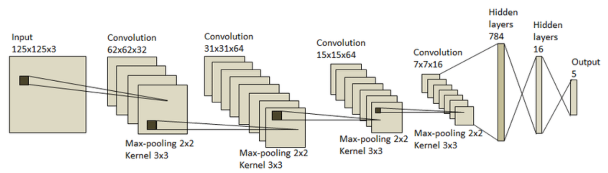

### Introduction to Convolutional Neural Networks
Convolutional Neural Networks (CNNs) are a class of deep learning algorithms designed primarily for image processing and pattern recognition tasks. They leverage convolutional layers to automatically and adaptively learn spatial hierarchies of features from input images, making them powerful tools for visual data analysis.

### What is a Convolutional Neural Network?
Convolutional Neural Networks involve several key components and layers:

- **Convolutional Layers**: These layers apply convolution operations to the input, using a set of learnable filters (kernels) to produce feature maps. Convolution helps in extracting local features from the input image.

- **Pooling Layers**: These layers downsample the feature maps to reduce their spatial dimensions and computational load. Common pooling operations include max pooling and average pooling.

- **Fully Connected Layers**: After several convolutional and pooling layers, the network usually transitions to fully connected layers, where each neuron is connected to every neuron in the previous layer, enabling high-level reasoning.

- **Activation Functions**: Non-linear functions like ReLU (Rectified Linear Unit) are applied to introduce non-linearity into the model, allowing it to learn more complex patterns.



### Example:
Consider using a CNN for handwritten digit recognition. The network might learn edges and simple shapes in early layers and complex digit shapes in deeper layers. This hierarchical learning enables accurate classification of handwritten digits.

### Advantages of Convolutional Neural Networks
CNNs offer several advantages:

- **Automatic Feature Extraction**: CNNs automatically learn relevant features from raw input images, reducing the need for manual feature engineering.
- **Parameter Sharing**: Convolutional layers share parameters across spatial locations, significantly reducing the number of parameters and computational complexity.
- **Translation Invariance**: CNNs are robust to translations of the input image, making them effective for recognizing objects regardless of their position.

### Example:
In medical imaging, CNNs can classify MRI scans to detect tumors by learning relevant features from the scans without manual intervention, aiding in accurate diagnosis.

### Disadvantages of Convolutional Neural Networks
Despite their advantages, CNNs have limitations:

- **Data-Intensive**: CNNs typically require large amounts of labeled data for training to achieve good performance.
- **Computationally Expensive**: Training CNNs can be computationally intensive, often requiring specialized hardware like GPUs.
- **Black Box Nature**: The learned features and decision-making process in CNNs can be difficult to interpret and understand.

### Example:
In real-time video analysis, the computational requirements of CNNs can be a bottleneck, necessitating efficient implementations and hardware acceleration.

### Practical Tips for Using Convolutional Neural Networks
To maximize the effectiveness of CNNs:

- **Data Augmentation**: Use techniques like rotation, scaling, and flipping to artificially increase the size of the training dataset.
- **Transfer Learning**: Utilize pre-trained models and fine-tune them on your specific dataset to leverage learned features from large-scale datasets.
- **Regularization**: Apply dropout and weight regularization techniques to prevent overfitting and improve generalization.

### Example:
In facial recognition systems, data augmentation helps create diverse training samples, improving the model's ability to generalize to unseen faces.

### Real-World Examples

#### Autonomous Driving
CNNs are used in self-driving cars for tasks like object detection and lane detection. They process images from cameras mounted on the car to recognize pedestrians, vehicles, traffic signs, and road lanes, enabling safe navigation.

#### Image Captioning
CNNs are combined with Recurrent Neural Networks (RNNs) to generate captions for images. The CNN extracts features from the image, and the RNN generates a sequence of words describing the image, producing coherent and meaningful captions.

### Difference Between CNN and Traditional Neural Networks
| Feature                         | Convolutional Neural Networks (CNN) | Traditional Neural Networks (NN) |
|---------------------------------|-------------------------------------|----------------------------------|
| Feature Extraction              | Automatically extracts features using convolutional layers. | Requires manual feature extraction or flattened input. |
| Parameter Sharing               | Yes, reduces the number of parameters significantly. | No, each neuron has its own parameters. |
| Spatial Hierarchies             | Learns spatial hierarchies of features from images. | Typically does not capture spatial hierarchies. |

### Implementation
To implement and train a Convolutional Neural Network, you can use libraries such as TensorFlow or PyTorch in Python. Below are the steps to install the necessary libraries and train a CNN model.

#### Libraries to Download
- `TensorFlow` or `PyTorch`: Essential for building and training neural networks.
- `numpy`: Essential for numerical operations.
- `matplotlib`: Useful for visualizing data and model performance.

You can install these libraries using pip:

```bash
pip install tensorflow numpy matplotlib
```

#### Training a Convolutional Neural Network
Here’s a step-by-step guide to training a CNN model using TensorFlow:

**Import Libraries:**

```python
import tensorflow as tf
from tensorflow.keras import layers, models
import numpy as np
import matplotlib.pyplot as plt
```

**Load and Prepare Data:**
Assuming you are using the MNIST dataset of handwritten digits:

```python
# Load the dataset
(X_train, y_train), (X_test, y_test) = tf.keras.datasets.mnist.load_data()

# Normalize the pixel values
X_train, X_test = X_train / 255.0, X_test / 255.0

# Add a channel dimension (required by Conv2D)
X_train = X_train[..., np.newaxis]
X_test = X_test[..., np.newaxis]
```

**Define the Convolutional Neural Network:**

```python
model = models.Sequential([
    layers.Conv2D(32, (3, 3), activation='relu', input_shape=(28, 28, 1)),
    layers.MaxPooling2D((2, 2)),
    layers.Conv2D(64, (3, 3), activation='relu'),
    layers.MaxPooling2D((2, 2)),
    layers.Conv2D(64, (3, 3), activation='relu'),
    layers.Flatten(),
    layers.Dense(64, activation='relu'),
    layers.Dense(10, activation='softmax')
])
```

**Compile the Model:**

```python
model.compile(optimizer='adam',
              loss='sparse_categorical_crossentropy',
              metrics=['accuracy'])
```

**Train the Model:**

```python
history = model.fit(X_train, y_train, epochs=5, 
                    validation_data=(X_test, y_test))
```

**Evaluate the Model:**

```python
test_loss, test_acc = model.evaluate(X_test, y_test, verbose=2)
print(f'\nTest accuracy: {test_acc:.2f}')
```

This example demonstrates loading data, defining a CNN architecture, training the model, and evaluating its performance using TensorFlow. Adjust parameters and preprocessing steps based on your specific dataset and requirements.

### Performance Considerations

#### Computational Efficiency
- **Hardware Acceleration**: Utilize GPUs or TPUs to accelerate training and inference processes.
- **Batch Processing**: Train the model using mini-batches to efficiently utilize computational resources.

### Example:
In real-time video processing, leveraging GPUs ensures timely analysis and response, critical for applications like surveillance and autonomous driving.

### Conclusion
Convolutional Neural Networks are a versatile and powerful tool for image analysis and pattern recognition. By understanding their architecture, advantages, limitations, and implementation, practitioners can effectively apply CNNs to a wide range of computer vision tasks in data science and machine learning projects.
