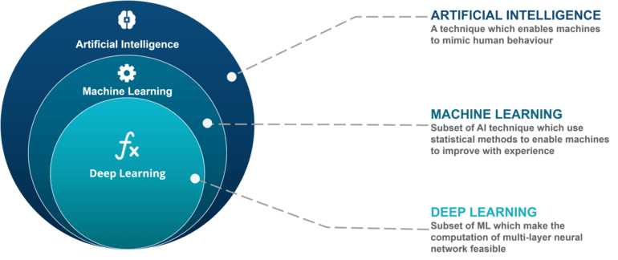

Deep learning is a subset of machine learning and artificial intelligence (AI) that mimics the workings of the human brain in processing data and creating patterns for use in decision-making. It uses neural networks with many layers (hence "deep") to analyze various factors of data.

In a fully connected Deep neural network, there is an input layer and one or more hidden layers connected one after the other. Each neuron receives input from the previous layer neurons or the input layer. The output of one neuron becomes the input to other neurons in the next layer of the network, and this process continues until the final layer produces the output of the network. The layers of the neural network transform the input data through a series of nonlinear transformations, allowing the network to learn complex representations of the input data.

Today Deep learning AI has become one of the most popular and visible areas of machine learning, due to its success in a variety of applications, such as computer vision, natural language processing, and Reinforcement learning.

Deep learning AI can be used for supervised, unsupervised, and reinforcement machine learning, each utilizing different methods for processing data.

**Supervised Machine Learning**: In supervised machine learning, the neural network learns to make predictions or classify data based on labeled datasets. We provide both input features and target outcomes. The neural network learns by minimizing the error between predicted and actual targets through a process called backpropagation. Deep learning algorithms like Convolutional Neural Networks (CNNs) and Recurrent Neural Networks (RNNs) are used for tasks such as image classification, sentiment analysis, and language translation.

**Unsupervised Machine Learning**: In unsupervised machine learning, the neural network discovers patterns or clusters within unlabeled datasets, meaning there are no target variables. The machine identifies hidden patterns or relationships within the data. Deep learning algorithms like autoencoders and generative models are used for tasks such as clustering, dimensionality reduction, and anomaly detection.

**Reinforcement Machine Learning**: In reinforcement machine learning, an agent learns to make decisions in an environment to maximize a reward signal. The agent takes actions, observes the results, and receives rewards. Deep learning helps the agent learn policies, or sets of actions, that maximize cumulative rewards over time. Algorithms like Deep Q Networks (DQNs) and Deep Deterministic Policy Gradient (DDPG) are used for tasks like robotics and game playing.

## **Core Concept**
- **Artificial Neural Networks (ANNs)** : Inspired by the structure and function of the human brain, ANNs consist of interconnected nodes (artificial neurons) that process information.

- **Hidden Layers**: Unlike simpler neural networks, deep learning models have multiple hidden layers between the input and output layers. These layers allow the network to learn increasingly complex features from the data.
- **Learning Process**: Deep learning models learn through a process called backpropagation. This involves adjusting the connections between neurons based on the difference between the model's predictions and the actual data.

## **Key Characteristics of Deep Learning**

- **High Capacity**: Deep neural networks can learn intricate relationships within data due to their multiple layers and numerous connections.
- **Unsupervised vs. Supervised Learning**: Deep learning can be applied in both supervised learning (models trained with labeled data) and unsupervised learning (models identify patterns in unlabeled data).
- **Representation Learning**: Deep learning models can automatically learn features (representations) from the data, eliminating the need for manual feature engineering in many cases.

## **Benefits of Deep Learning**

- **Superior Performance**: Deep learning models have achieved state-of-the-art performance in various tasks, including image recognition, natural language processing, and speech recognition.
- **Automating Feature Extraction**: Deep learning reduces the need for manual feature engineering, a time-consuming and domain-specific task.
- **Handling Complex Data**: Deep learning can effectively handle complex data types like images, audio, and text, making it well-suited for modern applications.

## **Disadvantages of Deep Learning**
- **High computational requirements**: Deep Learning AI models require large amounts of data and computational resources to train and optimize.
Requires large amounts of labeled data: Deep Learning models often require a large amount of labeled data for training, which can be expensive and time- consuming to acquire.
- **Interpretability**: Deep Learning models can be challenging to interpret, making it difficult to understand how they make decisions.
- **Overfitting**: Deep Learning models can sometimes overfit to the training data, resulting in poor performance on new and unseen data.
Black-box nature: Deep Learning models are often treated as black boxes, making it difficult to understand how they work and how they arrived at their predictions.

## **Applications of Deep Learning**

- **Computer Vision**: Image recognition, object detection, facial recognition, medical image analysis.
- **Natural Language Processing**: Machine translation, sentiment analysis, text summarization, chatbots.
- **Speech Recognition and Synthesis**: Voice assistants, automatic transcription, language learning apps.
- **Recommender Systems**: Personalization of recommendations for products, music, movies, etc.
- **Anomaly Detection**: Identifying unusual patterns or events in data for fraud detection, network security, etc.
## **Challenges of Deep Learning**

- **Computational Cost**: Training deep learning models often requires significant computational resources and large datasets.
- **Data Requirements**: Deep learning models can be data-hungry, and performance can suffer with limited data availability.
- **Explainability**: Understanding how deep learning models arrive at their decisions can be challenging, limiting interpretability in some applications.
