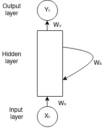
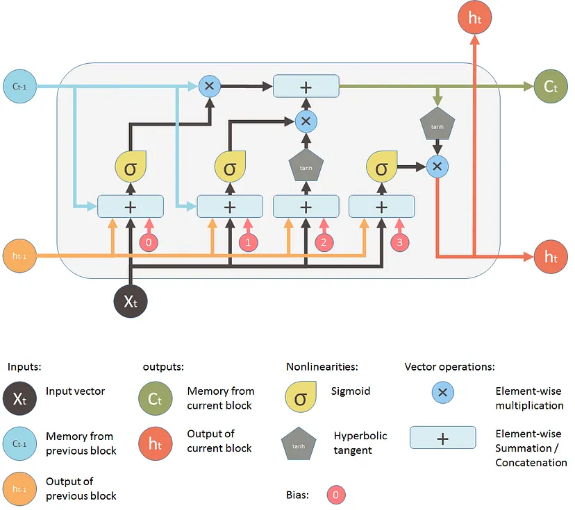

# Recurrent Neural Networks (RNNs) in Deep Learning

## Introduction

Recurrent Neural Networks (RNNs) are a class of artificial neural networks designed to work with sequential data. Unlike traditional feedforward neural networks, RNNs can use their internal state (memory) to process sequences of inputs, making them particularly suited for tasks such as natural language processing, speech recognition, and time series analysis.

## Basic Structure

An RNN processes a sequence of inputs $(x_1, x_2, ..., x_T)$ and produces a sequence of outputs $(y_1, y_2, ..., y_T)$. At each time step $t$, the network updates its hidden state $h_t$ based on the current input $x_t$ and the previous hidden state $h_{t-1}$.

## The different types of RNN are:
- **One to One RNN**
- **One to Many RNN**
- **Many to One RNN**
- **Many to Many RNN**

### One to One RNN
One to One RNN (Tx=Ty=1) is the most basic and traditional type of Neural network giving a single output for a single input, as can be seen in the above image.It is also known as Vanilla Neural Network. It is used to solve regular machine learning problems.

### One to Many
One to Many (Tx=1,Ty>1) is a kind of RNN architecture is applied in situations that give multiple output for a single input. A basic example of its application would be Music generation. In Music generation models, RNN models are used to generate a music piece(multiple output) from a single musical note(single input).

### Many to One
Many-to-one RNN architecture (Tx>1,Ty=1) is usually seen for sentiment analysis model as a common example. As the name suggests, this kind of model is used when multiple inputs are required to give a single output.

Take for example The Twitter sentiment analysis model. In that model, a text input (words as multiple inputs) gives its fixed sentiment (single output). Another example could be movie ratings model that takes review texts as input to provide a rating to a movie that may range from 1 to 5.

### Many-to-Many
As is pretty evident, Many-to-Many RNN (Tx>1,Ty>1) Architecture takes multiple input and gives multiple output, but Many-to-Many models can be two kinds as represented above:

1. Tx=Ty:

This refers to the case when input and output layers have the same size. This can be also understood as every input having a output, and a common application can be found in Named entity Recognition.

2. Tx!=Ty:

Many-to-Many architecture can also be represented in models where input and output layers are of different size, and the most common application of this kind of RNN architecture is seen in Machine Translation. For example, “I Love you”, the 3 magical words of the English language translates to only 2 in Spanish, “te amo”. Thus, machine translation models are capable of returning words more or less than the input string because of a non-equal Many-to-Many RNN architecture works in the background.

## Mathematical Formulation

**Simplified Architecture Of RNN**

The basic RNN can be described by the following equations:

1. Hidden state update:
   $$ h_t = f(W_{hh}h_{t-1} + W_{xh}x_t + b_h) $$

2. Output calculation:
   $$ y_t = g(W_{hy}h_t + b_y) $$

Where:
- $h_t$ is the hidden state at time $t$
- $x_t$ is the input at time $t$
- $y_t$ is the output at time $t$
- $W_{hh}$, $W_{xh}$, and $W_{hy}$ are weight matrices
- $b_h$ and $b_y$ are bias vectors
- $f$ and $g$ are activation functions (often tanh or ReLU for $f$, and softmax for $g$ in classification tasks)

## Backpropagation Through Time (BPTT)

RNNs are trained using Backpropagation Through Time (BPTT), an extension of the standard backpropagation algorithm. The loss is calculated at each time step and propagated backwards through the network:

$$ \frac{\partial L}{\partial W} = \sum_{t=1}^T \frac{\partial L_t}{\partial W} $$

Where $L$ is the total loss and $L_t$ is the loss at time step $t$.

## Variants of RNNs
### Long Short-Term Memory (LSTM)

LSTMs address the vanishing gradient problem in standard RNNs by introducing a memory cell and gating mechanisms. The LSTM architecture contains three gates and a memory cell:

$$ f_t = \sigma(W_f \cdot [h_{t-1}, x_t] + b_f) $$
$$ i_t = \sigma(W_i \cdot [h_{t-1}, x_t] + b_i) $$
$$ \tilde{C}_t = \tanh(W_C \cdot [h_{t-1}, x_t] + b_C) $$
$$ C_t = f_t * C_{t-1} + i_t * \tilde{C}_t $$
$$ o_t = \sigma(W_o \cdot [h_{t-1}, x_t] + b_o) $$
$$ h_t = o_t * \tanh(C_t) $$

Where:
- $f_t$, $i_t$, and $o_t$ are the forget, input, and output gates respectively
- $C_t$ is the cell state
- $h_t$ is the hidden state
- $\sigma$ is the sigmoid function
- $*$ denotes element-wise multiplication

**This is how an LSTM Architecture looks like:**

#### Gate Descriptions:

1. **Forget Gate** $(f_t)$:
   - Purpose: Decides what information to discard from the cell state.
   - Operation: Takes $h_{t-1}$ and $x_t$ as input and outputs a number between 0 and 1 for each number in the cell state $C_{t-1}$.
   - Interpretation: 1 means "keep this" while 0 means "forget this".
   - This is how as forget gate look like:

      

2. **Input Gate** $(i_t)$:
   - Purpose: Decides which new information to store in the cell state.
   - Operation: 
     - $i_t$: Decides which values we'll update.
     - $\tilde{C}_t$: Creates a vector of new candidate values that could be added to the state.
    - This is how as Input gate look like:

     

3. **Cell State Update**:
   - Purpose: Updates the old cell state, $C_{t-1}$, into the new cell state $C_t$.
   - Operation: 
     - Multiply the old state by $f_t$, forgetting things we decided to forget earlier.
     - Add $i_t * \tilde{C}_t$. This is the new candidate values, scaled by how much we decided to update each state value.
     - 

4. **Output Gate** $(o_t)$:
   - Purpose: Decides what parts of the cell state we're going to output.
   - Operation:
     - $o_t$: Decides what parts of the cell state we're going to output.
     - Multiply it by a tanh of the cell state to push the values to be between -1 and 1.

The power of LSTMs lies in their ability to selectively remember or forget information over long sequences, mitigating the vanishing gradient problem that plagues simple RNNs.

## Applications

1. Natural Language Processing (NLP)
2. Speech Recognition
3. Machine Translation
4. Time Series Prediction
5. Sentiment Analysis
6. Music Generation

## Challenges and Considerations

1. Vanishing and Exploding Gradients
2. Long-term Dependencies
3. Computational Complexity
4. Choosing the Right Architecture (LSTM vs GRU vs Simple RNN)

## Conclusion

RNNs and their variants like LSTM are powerful tools for processing sequential data. They have revolutionized many areas of machine learning, particularly in tasks involving time-dependent or sequential information. Understanding their structure, mathematics, and applications is crucial for effectively applying them to real-world problems.