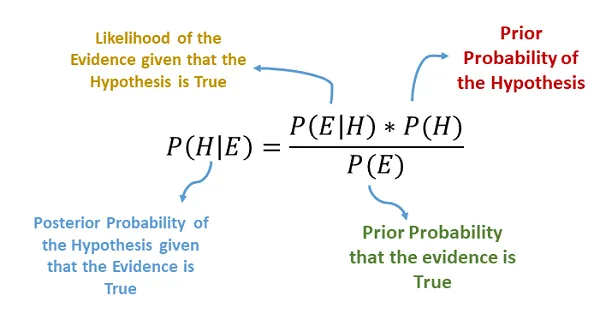

# Naive Bayes Classifier

## Introduction

Naive Bayes is a probabilistic machine learning algorithm based on Bayes' theorem, with an assumption of independence between predictors. It's particularly useful for classification tasks and is known for its simplicity and effectiveness, especially with high-dimensional datasets.

<p align="center">
  
</p>
 

## Theory

### Bayes' Theorem

The foundation of Naive Bayes is Bayes' theorem, which describes the probability of an event based on prior knowledge of conditions that might be related to the event.


$$ P(A|B) = \frac{P(B|A) \cdot P(A)}{P(B)} $$

Where:
- $P(A|B)$ is the posterior probability
- $P(B|A)$ is the likelihood
- $P(A)$ is the prior probability
- $P(B)$ is the marginal likelihood

<p align="center">
  
</p>

### Naive Bayes Classifier

The Naive Bayes classifier extends this to classify data points into categories. It assumes that the presence of a particular feature in a class is unrelated to the presence of any other feature (the "naive" assumption).

For a data point $X = (x_1, x_2, ..., x_n)$ and a class variable $$:

$$ P(C|X) = \frac{P(X|C) \cdot P(C)}{P(X)} $$

The classifier chooses the class with the highest posterior probability:

$$ C^* = \underset{c \in C}{argmax} P(X|c) \cdot P(c) $$

### Mathematical Formulation

For a given set of features $(x_1, x_2, ..., x_n)$:

$$ P(C|x_1, x_2, ..., x_n) \propto P(C) \cdot P(x_1|C) \cdot P(x_2|C) \cdot ... \cdot P(x_n|C) $$

Where:
- $P(C|x_1, x_2, ..., x_n)$ is the posterior probability of class $C$ given the features
- $P(C)$ is the prior probability of class $C$
- $P(x_i|C)$ is the likelihood of feature $x_i$ given class $C$

## Types of Naive Bayes Classifiers

1. **Gaussian Naive Bayes**: Assumes continuous values associated with each feature are distributed according to a Gaussian distribution.

2. **Multinomial Naive Bayes**: Typically used for discrete counts, like word counts in text classification.

3. **Bernoulli Naive Bayes**: Used for binary feature models (0s and 1s).

## Example: Gaussian Naive Bayes in scikit-learn

Here's a simple example of using Gaussian Naive Bayes in scikit-learn:

```python
from sklearn.naive_bayes import GaussianNB
from sklearn.datasets import load_iris
from sklearn.model_selection import train_test_split
from sklearn.metrics import accuracy_score

# Load the iris dataset
iris = load_iris()
X, y = iris.data, iris.target

# Split the data into training and testing sets
X_train, X_test, y_train, y_test = train_test_split(X, y, test_size=0.3, random_state=42)

# Initialize and train 
gnb = GaussianNB()
gnb.fit(X_train, y_train)

# Predictions
y_pred = gnb.predict(X_test)

# Accuracy
accuracy = accuracy_score(y_test, y_pred)
print(f"Accuracy: {accuracy:.2f}")

```

## Applications of Naive Bayes Algorithm
- Real-time Prediction.
- Multi-class Prediction.
- Text classification/ Spam Filtering/ Sentiment Analysis.
- Recommendation Systems.
