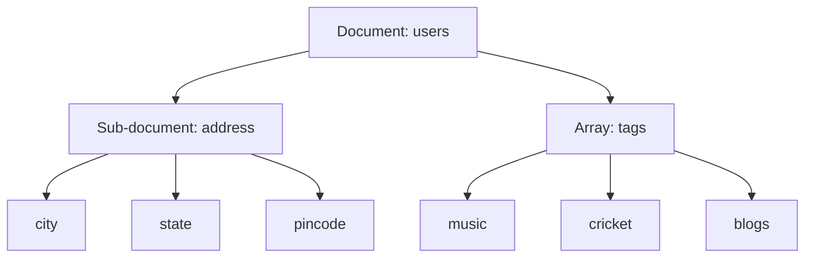

## Indexing Array Fields

We have inserted the following document in the collection named `users`:

```javascript
db.users.insert(
	{
		"address": {
			"city": "Los Angeles",
			"state": "California",
			"pincode": "123"
		},
		"tags": [
			"music",
			"cricket",
			"blogs"
		],
		"name": "Tom Benzamin"
	}
)
```

The above document contains an `address` sub-document and a `tags` array.

### Creating an Index on Array Fields

Suppose we want to search user documents based on the user’s tags. For this, we will create an index on the `tags` array in the collection.

Creating an index on an array in turn creates separate index entries for each of its fields. So in our case, when we create an index on the `tags` array, separate indexes will be created for its values `music`, `cricket`, and `blogs`.

To create an index on the `tags` array, use the following code:

```javascript
db.users.createIndex({"tags":1})
```

```json
{
	"createdCollectionAutomatically" : false,
	"numIndexesBefore" : 2,
	"numIndexesAfter" : 3,
	"ok" : 1
}
```

After creating the index, we can search on the `tags` field of the collection like this:

```javascript
db.users.find({tags:"cricket"}).pretty()
```

```json
{
	"_id" : ObjectId("5dd7c927f1dd4583e7103fdf"),
	"address" : {
		"city" : "Los Angeles",
		"state" : "California",
		"pincode" : "123"
	},
	"tags" : [
		"music",
		"cricket",
		"blogs"
	],
	"name" : "Tom Benzamin"
}
```

To verify that proper indexing is used, use the following `explain` command:

```javascript
db.users.find({tags:"cricket"}).explain()
```

This gives you the following result:

```json
{
	"queryPlanner" : {
		"plannerVersion" : 1,
		"namespace" : "mydb.users",
		"indexFilterSet" : false,
		"parsedQuery" : {
			"tags" : {
				"$eq" : "cricket"
			}
		},
		"queryHash" : "9D3B61A7",
		"planCacheKey" : "04C9997B",
		"winningPlan" : {
			"stage" : "FETCH",
			"inputStage" : {
				"stage" : "IXSCAN",
				"keyPattern" : {
					"tags" : 1
				},
				"indexName" : "tags_1",
				"isMultiKey" : false,
				"multiKeyPaths" : {
					"tags" : [ ]
				},
				"isUnique" : false,
				"isSparse" : false,
				"isPartial" : false,
				"indexVersion" : 2,
				"direction" : "forward",
				"indexBounds" : {
					"tags" : [
						"[\"cricket\", \"cricket\"]"
					]
				}
			}
		},
		"rejectedPlans" : [ ]
	},
	"serverInfo" : {
		"host" : "Krishna",
		"port" : 27017,
		"version" : "4.2.1",
		"gitVersion" : "edf6d45851c0b9ee15548f0f847df141764a317e"
	},
	"ok" : 1
}
```

The above command resulted in `"stage" : "IXSCAN", "indexName" : "tags_1"` which confirms that proper indexing is used.

## Indexing Sub-Document Fields

Suppose that we want to search documents based on `city`, `state`, and `pincode` fields. Since all these fields are part of the `address` sub-document field, we will create an index on all the fields of the sub-document.

For creating an index on all the three fields of the sub-document, use the following code:

```javascript
db.users.createIndex({"address.city":1,"address.state":1,"address.pincode":1})
```

```json
{
	"numIndexesBefore" : 4,
	"numIndexesAfter" : 4,
	"note" : "all indexes already exist",
	"ok" : 1
}
```

Once the index is created, we can search for any of the sub-document fields utilizing this index as follows:

```javascript
db.users.find({"address.city":"Los Angeles"}).pretty()
```

```json
{
	"_id" : ObjectId("5dd7c927f1dd4583e7103fdf"),
	"address" : {
		"city" : "Los Angeles",
		"state" : "California",
		"pincode" : "123"
	},
	"tags" : [
		"music",
		"cricket",
		"blogs"
	],
	"name" : "Tom Benzamin"
}
```

Remember that the query expression has to follow the order of the index specified. So the index created above would support the following queries:

```javascript
db.users.find({"address.city":"Los Angeles","address.state":"California"}).pretty()
```

```json
{
	"_id" : ObjectId("5dd7c927f1dd4583e7103fdf"),
	"address" : {
		"city" : "Los Angeles",
		"state" : "California",
		"pincode" : "123"
	},
	"tags" : [
		"music",
		"cricket",
		"blogs"
	],
	"name" : "Tom Benzamin"
}
```

### Diagram (Mermaid)

Here is a visual representation of the document structure and indexing process:



### Notes

- Indexing array fields in MongoDB creates separate index entries for each value in the array.
- Indexing sub-document fields allows efficient queries on nested fields.
- Ensure the query order matches the index order to fully utilize the indexes.

### Table

| Field           | Type             | Indexed | Description                              |
|-----------------|------------------|---------|------------------------------------------|
| `address`       | Sub-document     | Yes     | Contains nested fields for address info. |
| `address.city`  | String           | Yes     | City name in the address.                |
| `address.state` | String           | Yes     | State name in the address.               |
| `address.pincode`| String          | Yes     | Pincode in the address.                  |
| `tags`          | Array of Strings | Yes     | User's tags for indexing.                |
