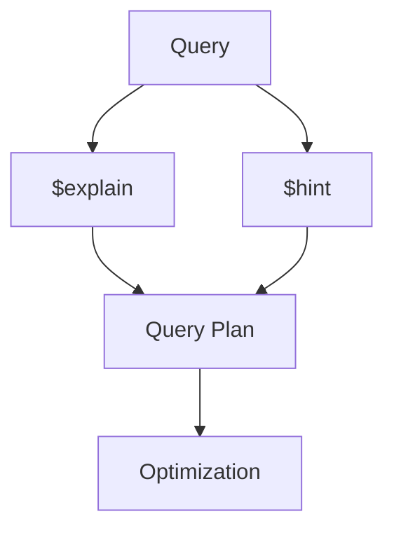

# MongoDB - Analyzing Queries

Analyzing queries is a very important aspect of measuring how effective the database and indexing design is. We will learn about the frequently used `$explain` and `$hint` queries.

## Using $explain

The `$explain` operator provides information on the query, indexes used in a query, and other statistics. It is very useful when analyzing how well your indexes are optimized.

In the last chapter, we had already created an index for the `users` collection on fields `gender` and `user_name` using the following query:

```mongodb
db.users.createIndex({gender:1,user_name:1})
{
	"numIndexesBefore" : 2,
	"numIndexesAfter" : 2,
	"note" : "all indexes already exist",
	"ok" : 1
}
```

We will now use `$explain` on the following query:

```mongodb
db.users.find({gender:"M"},{user_name:1,_id:0}).explain()
```

The above `explain()` query returns the following analyzed result:

```json
{
	"queryPlanner" : {
		"plannerVersion" : 1,
		"namespace" : "mydb.users",
		"indexFilterSet" : false,
		"parsedQuery" : {
			"gender" : {
				"$eq" : "M"
			}
		},
		"queryHash" : "B4037D3C",
		"planCacheKey" : "DEAAE17C",
		"winningPlan" : {
			"stage" : "PROJECTION_COVERED",
			"transformBy" : {
				"user_name" : 1,
				"_id" : 0
			},
			"inputStage" : {
				"stage" : "IXSCAN",
				"keyPattern" : {
					"gender" : 1,
					"user_name" : 1
				},
				"indexName" : "gender_1_user_name_1",
				"isMultiKey" : false,
				"multiKeyPaths" : {
					"gender" : [ ],
					"user_name" : [ ]
				},
				"isUnique" : false,
				"isSparse" : false,
				"isPartial" : false,
				"indexVersion" : 2,
				"direction" : "forward",
				"indexBounds" : {
					"gender" : [
						"[\"M\", \"M\"]"
					],
					"user_name" : [
						"[MinKey, MaxKey]"
					]
				}
			}
		},
		"rejectedPlans" : [ ]
	},
	"serverInfo" : {
		"host" : "Krishna",
		"port" : 27017,
		"version" : "4.2.1",
		"gitVersion" : "edf6d45851c0b9ee15548f0f847df141764a317e"
	},
	"ok" : 1
}
```

We will now look at the fields in this result set:

- **queryPlanner:** Contains details about the query plan, indexes used, and stages involved in executing the query.
- **indexOnly:** Indicates whether the query was covered by an index.
- **cursor:** Specifies the type of cursor used (e.g., `BTreeCursor` for indexed queries).
- **n:** Indicates the number of documents matching the query.
- **nscannedObjects:** Indicates the total number of documents scanned.
- **nscanned:** Indicates the total number of documents or index entries scanned.

## Using $hint

The `$hint` operator forces the query optimizer to use the specified index to run a query. This is particularly useful when you want to test the performance of a query with different indexes. For example, the following query specifies the index on fields `gender` and `user_name` to be used for this query:

```mongodb
db.users.find({gender:"M"},{user_name:1,_id:0}).hint({gender:1,user_name:1})
{ "user_name" : "tombenzamin" }
```

To analyze the above query using `$explain`:

```mongodb
db.users.find({gender:"M"},{user_name:1,_id:0}).hint({gender:1,user_name:1}).explain()
```

Which gives you the following result:

```json
{
	"queryPlanner" : {
		"plannerVersion" : 1,
		"namespace" : "mydb.users",
		"indexFilterSet" : false,
		"parsedQuery" : {
			"gender" : {
				"$eq" : "M"
			}
		},
		"queryHash" : "B4037D3C",
		"planCacheKey" : "DEAAE17C",
		"winningPlan" : {
			"stage" : "PROJECTION_COVERED",
			"transformBy" : {
				"user_name" : 1,
				"_id" : 0
			},
			"inputStage" : {
				"stage" : "IXSCAN",
				"keyPattern" : {
					"gender" : 1,
					"user_name" : 1
				},
				"indexName" : "gender_1_user_name_1",
				"isMultiKey" : false,
				"multiKeyPaths" : {
					"gender" : [ ],
					"user_name" : [ ]
				},
				"isUnique" : false,
				"isSparse" : false,
				"isPartial" : false,
				"indexVersion" : 2,
				"direction" : "forward",
				"indexBounds" : {
					"gender" : [
						"[\"M\", \"M\"]"
					],
					"user_name" : [
						"[MinKey, MaxKey]"
					]
				}
			}
		},
		"rejectedPlans" : [ ]
	},
	"serverInfo" : {
		"host" : "Krishna",
		"port" : 27017,
		"version" : "4.2.1",
		"gitVersion" : "edf6d45851c0b9ee15548f0f847df141764a317e"
	},
	"ok" : 1
}
```

## Diagram



## Summary Table

| Operator  | Description                                                     | Usage Example                                                                                           |
|-----------|-----------------------------------------------------------------|---------------------------------------------------------------------------------------------------------|
| $explain  | Provides information on query execution, indexes used, and stats| `db.users.find({gender:"M"},{user_name:1,_id:0}).explain()`                                              |
| $hint     | Forces the query to use a specified index                       | `db.users.find({gender:"M"},{user_name:1,_id:0}).hint({gender:1,user_name:1})`                           |
