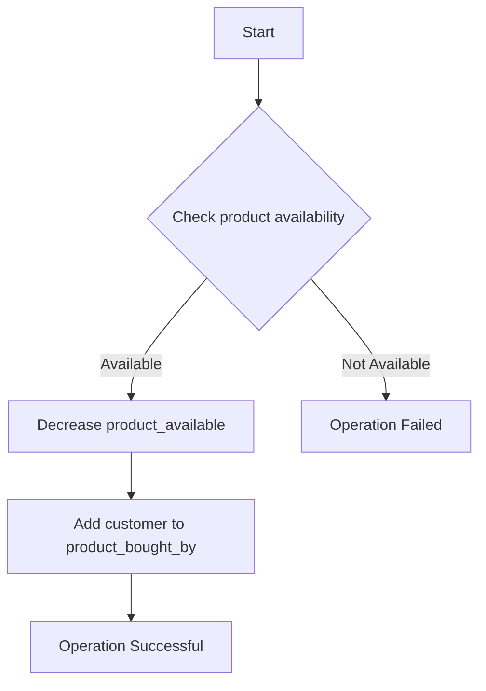

# MongoDB - Atomic Operations

## Model Data for Atomic Operations

The recommended approach to maintain atomicity is to keep all related information, which is frequently updated together, in a single document using embedded documents. This ensures that all updates for a single document are atomic.

### Example Scenario

Assume we have created a collection named `products` and inserted a document in it as shown below:

```javascript
> db.createCollection("products")
{ "ok" : 1 }

> db.productDetails.insert({
    "_id": 1,
    "product_name": "Samsung S3",
    "category": "mobiles",
    "product_total": 5,
    "product_available": 3,
    "product_bought_by": [
        {
            "customer": "john",
            "date": "7-Jan-2014"
        },
        {
            "customer": "mark",
            "date": "8-Jan-2014"
        }
    ]
})
WriteResult({ "nInserted" : 1 })
```

In this document, we have embedded the information of the customer who buys the product in the `product_bought_by` field. Whenever a new customer buys the product, we will first check if the product is still available using the `product_available` field. If available, we will reduce the value of the `product_available` field and insert the new customer's embedded document in the `product_bought_by` field. We will use the `findAndModify` command for this functionality because it searches and updates the document in one go.

### Atomic Update Example

```javascript
> db.products.findAndModify({ 
    query: { _id: 2, product_available: { $gt: 0 } }, 
    update: { 
        $inc: { product_available: -1 }, 
        $push: { product_bought_by: { customer: "rob", date: "9-Jan-2014" } } 
    }    
})
```

Our approach of using embedded documents and the `findAndModify` query ensures that the product purchase information is updated only if the product is available. The whole transaction, being in a single query, is atomic.

### Non-Atomic Update Example

In contrast, consider a scenario where we keep the product availability and the purchase information separately. In this case, we first check if the product is available using the first query. Then, in the second query, we update the purchase information. However, it is possible that between the executions of these two queries, another user has purchased the product and it is no longer available. Without knowing this, our second query will update the purchase information based on the result of our first query. This will make the database inconsistent because we have sold a product that is not available.

### Atomic Operations Diagram



### Key Points

- **Atomicity:** Ensuring all related updates are performed together.
- **Embedded Documents:** Keeping frequently updated related information in a single document.
- **findAndModify:** A MongoDB command to search and update a document in one atomic operation.

### Table: findAndModify Command

| Field             | Description                                      |
|-------------------|--------------------------------------------------|
| `query`           | The selection criteria for the document to update|
| `update`          | The modifications to apply                       |
| `$inc`            | Increment a field value                          |
| `$push`           | Append a value to an array                       |
| `product_available` | Number of products available                    |
| `product_bought_by` | Array of customers who bought the product       |

By embedding related data and using atomic operations like `findAndModify`, MongoDB ensures data consistency and integrity, even in complex transactions.
