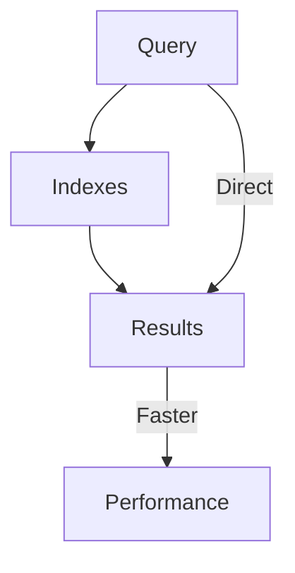

# MongoDB - Covered Queries

In this chapter, we will learn about covered queries.

## What is a Covered Query?

As per the official MongoDB documentation, a covered query is a query in which −

- All the fields in the query are part of an index.
- All the fields returned in the query are in the same index.

Since all the fields present in the query are part of an index, MongoDB matches the query conditions and returns the result using the same index without actually looking inside the documents. Since indexes are present in RAM, fetching data from indexes is much faster as compared to fetching data by scanning documents.

## Using Covered Queries

To test covered queries, consider the following document in the `users` collection −

```json
{
   "_id": ObjectId("53402597d852426020000003"),
   "contact": "987654321",
   "dob": "01-01-1991",
   "gender": "M",
   "name": "Tom Benzamin",
   "user_name": "tombenzamin"
}
```

We will first create a compound index for the `users` collection on the fields `gender` and `user_name` using the following query −

```mongodb
db.users.createIndex({gender:1,user_name:1})
{
	"createdCollectionAutomatically" : false,
	"numIndexesBefore" : 1,
	"numIndexesAfter" : 2,
	"ok" : 1
}
```

Now, this index will cover the following query −

```mongodb
db.users.find({gender:"M"},{user_name:1,_id:0})
{ "user_name" : "tombenzamin" }
```

That is to say that for the above query, MongoDB would not go looking into database documents. Instead, it would fetch the required data from indexed data which is very fast.

Since our index does not include `_id` field, we have explicitly excluded it from the result set of our query, as MongoDB by default returns `_id` field in every query. So the following query would not have been covered inside the index created above −

```mongodb
db.users.find({gender:"M"},{user_name:1})
{ "_id" : ObjectId("53402597d852426020000003"), "user_name" : "tombenzamin" }
```

Lastly, remember that an index cannot cover a query if −

- Any of the indexed fields is an array.
- Any of the indexed fields is a subdocument.

## Diagram



## Summary Table

| Query Type       | Description                                                                             | Performance Impact                      |
|------------------|-----------------------------------------------------------------------------------------|-----------------------------------------|
| Covered Query    | All fields in query and result are part of an index                                     | High - Utilizes indexes only, faster    |
| Non-Covered Query| Fields in query or result are not entirely part of an index, may require document scan  | Lower - May need to scan documents      |
