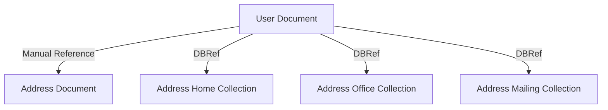

# MongoDB - Database References

As seen in the last chapter of MongoDB relationships, to implement a normalized database structure in MongoDB, we use the concept of Referenced Relationships, also referred to as Manual References, in which we manually store the referenced document's id inside another document. However, in cases where a document contains references from different collections, we can use MongoDB DBRefs.

## DBRefs vs Manual References

As an example scenario, where we would use DBRefs instead of manual references, consider a database where we are storing different types of addresses (home, office, mailing, etc.) in different collections (address_home, address_office, address_mailing, etc). Now, when a user collection's document references an address, it also needs to specify which collection to look into based on the address type. In such scenarios where a document references documents from many collections, we should use DBRefs.

## Using DBRefs

There are three fields in DBRefs −

- **$ref** − This field specifies the collection of the referenced document.
- **$id** − This field specifies the `_id` field of the referenced document.
- **$db** − This is an optional field and contains the name of the database in which the referenced document lies.

Consider a sample user document having DBRef field `address` as shown in the code snippet −

```json
{
   "_id":ObjectId("53402597d852426020000002"),
   "address": {
      "$ref": "address_home",
      "$id": ObjectId("534009e4d852427820000002"),
      "$db": "tutorialspoint"
   },
   "contact": "987654321",
   "dob": "01-01-1991",
   "name": "Tom Benzamin"
}
```

The `address` DBRef field here specifies that the referenced address document lies in `address_home` collection under `tutorialspoint` database and has an id of `534009e4d852427820000002`.

The following code dynamically looks in the collection specified by `$ref` parameter (address_home in our case) for a document with id as specified by `$id` parameter in DBRef.

```mongodb
var user = db.users.findOne({"name":"Tom Benzamin"})
var dbRef = user.address
db[dbRef.$ref].findOne({"_id":(dbRef.$id)})
```

The above code returns the following address document present in `address_home` collection −

```json
{
   "_id" : ObjectId("534009e4d852427820000002"),
   "building" : "22 A, Indiana Apt",
   "pincode" : 123456,
   "city" : "Los Angeles",
   "state" : "California"
}
```

## Diagram



## Summary Table

| Approach           | Description                                                                     | Pros                                        | Cons                                               |
|--------------------|---------------------------------------------------------------------------------|---------------------------------------------|----------------------------------------------------|
| Manual References  | Store the referenced document's id inside another document                      | Simple to implement, straightforward        | Requires multiple queries, no collection context   |
| DBRefs             | Store references with `$ref`, `$id`, and `$db` fields specifying collection and id | Includes collection context, more dynamic   | Slightly more complex, still requires multiple queries |
