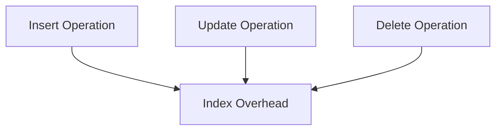
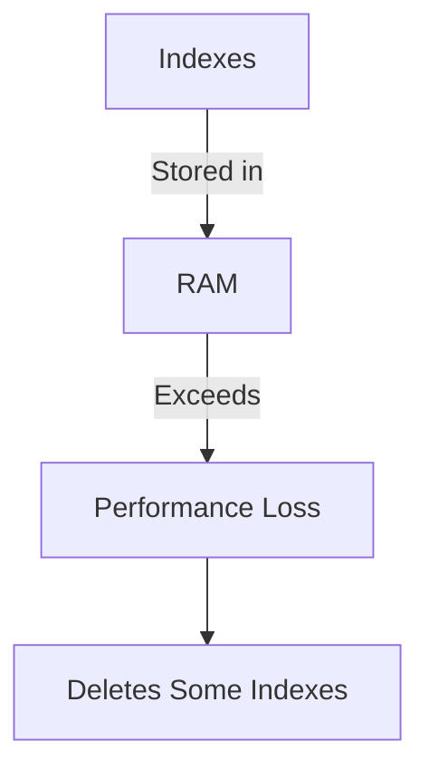
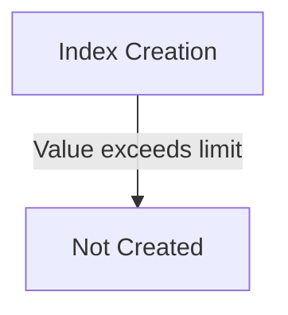
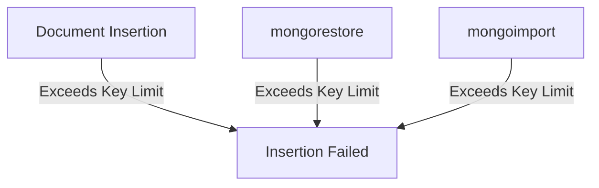
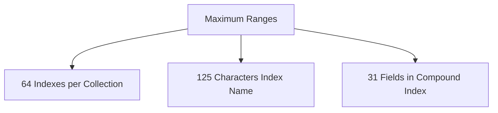

# MongoDB - Indexing Limitations

In this chapter, we will learn about Indexing Limitations and its other components.

## Extra Overhead

Every index occupies some space as well as causes an overhead on each insert, update and delete. So if you rarely use your collection for read operations, it makes sense not to use indexes.

:::note 
- Indexes require additional space.
- Each insert, update, and delete operation requires additional processing due to index maintenance.
:::

## RAM Usage

Since indexes are stored in RAM, you should make sure that the total size of the index does not exceed the RAM limit. If the total size increases the RAM size, it will start deleting some indexes, causing performance loss.

:::note
 Ensure that the total size of all indexes does not exceed the available RAM to avoid performance issues.
:::

## Query Limitations

Indexing can't be used in queries which use:
- Regular expressions or negation operators like `$nin`, `$not`, etc.
- Arithmetic operators like `$mod`, etc.
- `$where` clause

:::note
- Regular expressions and negation operators cannot use indexes.
- Arithmetic operators and `$where` clause cannot use indexes.
:::

| Query Type      | Index Usage  |
|-----------------|--------------|
| Regular Expressions | Not Supported |
| Negation Operators | Not Supported |
| Arithmetic Operators | Not Supported |
| `$where` Clause      | Not Supported |

## Index Key Limits

Starting from version 2.6, MongoDB will not create an index if the value of existing index field exceeds the index key limit.

> **Note:** Index creation is restricted if any field value exceeds the index key limit.

## Inserting Documents Exceeding Index Key Limit

MongoDB will not insert any document into an indexed collection if the indexed field value of this document exceeds the index key limit. The same is the case with `mongorestore` and `mongoimport` utilities.

:::note
 Documents with indexed field values exceeding the key limit will not be inserted into an indexed collection.
:::

## Maximum Ranges

- A collection cannot have more than 64 indexes.
- The length of the index name cannot be longer than 125 characters.
- A compound index can have a maximum of 31 fields indexed.

> **Table: Maximum Ranges**

| Limit Type               | Maximum Value       |
|--------------------------|---------------------|
| Number of Indexes        | 64                  |
| Length of Index Name     | 125 Characters      |
| Fields in Compound Index | 31 Fields           |

