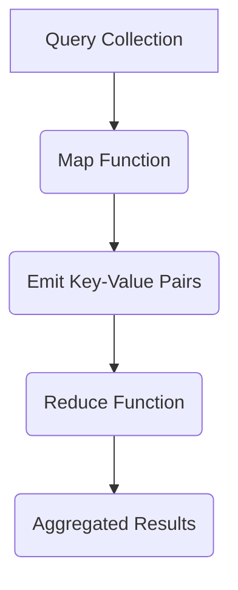

According to MongoDB documentation, MapReduce is a data processing paradigm used to condense large data sets into useful aggregated results. MongoDB employs the `mapReduce` command for map-reduce operations, primarily for processing substantial data sets.

## MapReduce Command Syntax

The basic syntax of the `mapReduce` command in MongoDB is as follows:

```javascript
db.collection.mapReduce(
   function() {emit(key,value);},  // map function
   function(key,values) {return reduceFunction;},  // reduce function
   {   // options
      out: collection,  // specifies the location of the query result
      query: document,  // optional selection criteria for documents
      sort: document,   // optional sort criteria
      limit: number     // optional maximum number of documents to return
   }
)
```

In the above syntax:

- `map` is a JavaScript function that maps a value with a key and emits a key-value pair.
- `reduce` is a JavaScript function that reduces or groups documents with the same key.
- `out` specifies the location of the map-reduce query result.
- `query` specifies optional selection criteria for selecting documents.
- `sort` specifies optional sort criteria.
- `limit` specifies the optional maximum number of documents to return.

### Using MapReduce

Consider a document structure storing user posts with fields like `post_text`, `user_name`, and `status`. We will perform a mapReduce function to select active posts, group them by `user_name`, and count the number of posts by each user.

```javascript
db.posts.mapReduce( 
   function() { emit(this.user_name, 1); }, 
   function(key, values) { return Array.sum(values); }, 
   {  
      query: { status: "active" },  
      out: "post_total" 
   }
)
```

The above mapReduce query outputs the following result:

```json
{
   "result" : "post_total",
   "timeMillis" : 9,
   "counts" : {
      "input" : 4,
      "emit" : 4,
      "reduce" : 2,
      "output" : 2
   },
   "ok" : 1
}
```

To see the result of this mapReduce query, you can use the `find` operator:

```javascript
db.post_total.find()
```

This query will return results showing the count of active posts for each user:

```json
{ "_id" : "tom", "value" : 2 }
{ "_id" : "mark", "value" : 2 }
```

MapReduce queries in MongoDB are powerful for constructing complex aggregation queries using custom JavaScript functions, providing flexibility in data processing and analysis.

### Diagram: MapReduce Process



### Note: Performance Considerations

When using MapReduce in MongoDB:
- Consider the performance overhead, especially for large data sets.
- Optimize your map and reduce functions for efficiency.
- Utilize indexes to improve query performance.

### Table: MapReduce Options

| Option | Description                                    |
|--------|------------------------------------------------|
| out    | Specifies the location of the query result.    |
| query  | Optional selection criteria for documents.     |
| sort   | Optional sort criteria.                        |
| limit  | Optional maximum number of documents to return|
