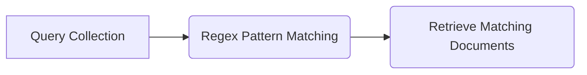

Regular Expressions are commonly used in programming languages to search for patterns or words within strings. MongoDB supports regular expressions for string pattern matching using the $regex operator, based on PCRE (Perl Compatible Regular Expression) syntax.

## Using Regular Expressions

Assume we have a document in the `posts` collection:

```javascript
db.posts.insert({
   "post_text": "enjoy the mongodb articles on tutorialspoint",
   "tags": ["mongodb", "tutorialspoint"]
})
```

To search for posts containing the string "tutorialspoint" in their `post_text` field using a regular expression:

```javascript
db.posts.find({ post_text: { $regex: "tutorialspoint" } }).pretty()
```

### Diagram: Regular Expression Query Process



### Note: Case Insensitive Search

To perform a case-insensitive search, use the $options parameter with value "$i" in the regex query:

```javascript
db.posts.find({ post_text: { $regex: "tutorialspoint", $options: "$i" } })
```

### Using Regex for Array Elements

Regular expressions can also be applied to array fields, such as searching for posts with tags starting from "tutorial":

```javascript
db.posts.find({ tags: { $regex: "tutorial" } })
```

### Optimizing Regex Queries

- Indexed fields improve the performance of regular expression queries by using indexed values for matching.
- Prefix expressions in regular expressions, like "^tut," optimize searches by matching strings starting with specific characters.

## Table: Regex Search Options

| Option       | Description                                                    |
|--------------|----------------------------------------------------------------|
| $regex       | Operator for regular expression pattern matching.                |
| $options     | Optional parameter for regex options like case insensitivity.   |
| ^            | Anchor for matching the start of a string.                       |
| $            | Anchor for matching the end of a string.                         |
