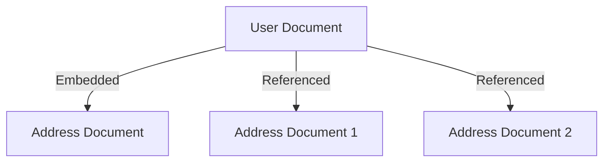

# MongoDB - Relationships

Relationships in MongoDB represent how various documents are logically related to each other. Relationships can be modeled via Embedded and Referenced approaches. Such relationships can be either 1:1, 1:N, N:1 or N:N.

Let us consider the case of storing addresses for users. So, one user can have multiple addresses making this a 1:N relationship.

Following is the sample document structure of user document −

```json
{
   "_id":ObjectId("52ffc33cd85242f436000001"),
   "name": "Tom Hanks",
   "contact": "987654321",
   "dob": "01-01-1991"
}
```

Following is the sample document structure of address document −

```json
{
   "_id":ObjectId("52ffc4a5d85242602e000000"),
   "building": "22 A, Indiana Apt",
   "pincode": 123456,
   "city": "Los Angeles",
   "state": "California"
}
``` 

## Modeling Embedded Relationships

In the embedded approach, we will embed the address document inside the user document.

```mongodb
db.users.insert({
	{
		"_id":ObjectId("52ffc33cd85242f436000001"),
		"contact": "987654321",
		"dob": "01-01-1991",
		"name": "Tom Benzamin",
		"address": [
			{
				"building": "22 A, Indiana Apt",
				"pincode": 123456,
				"city": "Los Angeles",
				"state": "California"
			},
			{
				"building": "170 A, Acropolis Apt",
				"pincode": 456789,
				"city": "Chicago",
				"state": "Illinois"
			}
		]
	}
})
```

This approach maintains all the related data in a single document, which makes it easy to retrieve and maintain. The whole document can be retrieved in a single query such as −

```mongodb
db.users.findOne({"name":"Tom Benzamin"},{"address":1})
```

Note that in the above query, `db` and `users` are the database and collection respectively.

:::note
The drawback is that if the embedded document keeps on growing too much in size, it can impact the read/write performance.
:::

## Modeling Referenced Relationships

This is the approach of designing normalized relationships. In this approach, both the user and address documents will be maintained separately but the user document will contain a field that will reference the address document's `id` field.

```json
{
   "_id":ObjectId("52ffc33cd85242f436000001"),
   "contact": "987654321",
   "dob": "01-01-1991",
   "name": "Tom Benzamin",
   "address_ids": [
      ObjectId("52ffc4a5d85242602e000000"),
      ObjectId("52ffc4a5d85242602e000001")
   ]
}
```

As shown above, the user document contains the array field `address_ids` which contains `ObjectIds` of corresponding addresses. Using these `ObjectIds`, we can query the address documents and get address details from there. With this approach, we will need two queries: first to fetch the `address_ids` fields from the user document and second to fetch these addresses from the address collection.

```mongodb
var result = db.users.findOne({"name":"Tom Benzamin"},{"address_ids":1})
var addresses = db.address.find({"_id":{"$in":result["address_ids"]}})
```

## Diagram



## Summary Table

| Approach | Description | Pros | Cons |
|----------|-------------|------|------|
| Embedded | Address documents are embedded within user documents | Easy retrieval, less complex queries | May lead to large documents, impacting performance |
| Referenced | User document references address documents via `ObjectIds` | Normalized data, avoids large documents | Requires multiple queries to retrieve related data |

