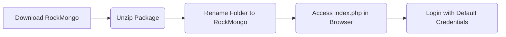

RockMongo is a powerful MongoDB administration tool that provides a user-friendly interface for managing MongoDB databases, collections, documents, and indexes. It is similar to PHPMyAdmin for PHP and MySQL.

## Downloading and Installing RockMongo

You can download the latest version of RockMongo from the [official GitHub repository](https://github.com/iwind/rockmongo). After downloading, follow these steps to install RockMongo:

1. Unzip the downloaded package into your server's root folder.
2. Rename the extracted folder to "rockmongo."
3. Access RockMongo by opening any web browser and navigating to the `index.php` page in the `rockmongo` folder.
4. Log in using the default credentials: Username - admin, Password - admin.

### Diagram: RockMongo Installation Process

### Note: Default Credentials

Upon installation, RockMongo uses default credentials (Username: admin, Password: admin). Change these credentials for security purposes.

## Basic Operations with RockMongo

Let's explore some basic operations you can perform with RockMongo:

### Creating New Database

1. Click on the "Databases" tab.
2. Click "Create New Database."
3. Enter the new database name and click "Create."

### Creating New Collection

1. Select the desired database from the left panel.
2. Click "New Collection" at the top.
3. Provide the collection name and click "Create."

### Creating New Document

1. Navigate to the collection where you want to add documents.
2. Click "Insert" at the top.
3. Enter the document's data in JSON or array format and click "Save."

### Export/Import Data

1. Select a collection.
2. Click "Export/Import" at the top to export or import data in zip format.

## Table: RockMongo Operations Overview

| Operation          | Description                                             |
|---------------------|---------------------------------------------------------|
| Create New Database | Add a new database to the MongoDB server.                |
| Create New Collection| Create a new collection within a database.               |
| Create New Document | Add a new document to a collection.                      |
| Export/Import Data  | Transfer data in and out of collections in zip format.   |
