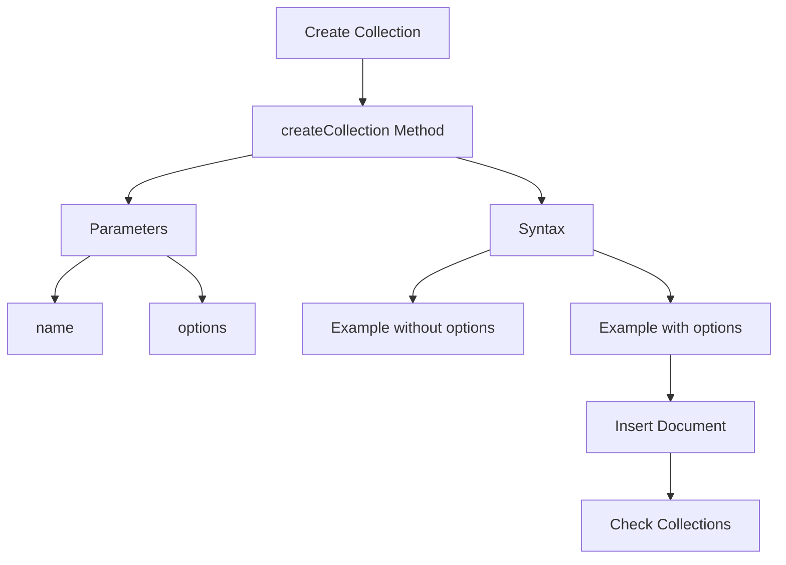

# MongoDB - Create Collection

In this chapter, we will see how to create a collection using MongoDB.

## The `createCollection()` Method

MongoDB `db.createCollection(name, options)` is used to create a collection.

### Syntax

The basic syntax of the `createCollection()` command is as follows:

```sql
db.createCollection(name, options)
```

In the command, `name` is the name of the collection to be created. `Options` is a document and is used to specify the configuration of the collection.

### Parameters

| Parameter | Type   | Description                                                      |
|-----------|--------|------------------------------------------------------------------|
| name      | String | Name of the collection to be created                             |
| options   | Document | (Optional) Specify options about memory size and indexing       |

The `options` parameter is optional, so you need to specify only the name of the collection. Following is the list of options you can use:

### Options

| Field         | Type    | Description                                                                                                        |
|---------------|---------|--------------------------------------------------------------------------------------------------------------------|
| capped        | Boolean | (Optional) If true, enables a capped collection. Capped collection is a fixed size collection that automatically overwrites its oldest entries when it reaches its maximum size. If you specify true, you need to specify the `size` parameter also. |
| autoIndexId   | Boolean | (Optional) If true, automatically creates an index on the `_id` field. Default value is false.                      |
| size          | Number  | (Optional) Specifies a maximum size in bytes for a capped collection. If capped is true, then you need to specify this field also. |
| max           | Number  | (Optional) Specifies the maximum number of documents allowed in the capped collection.                              |

While inserting the document, MongoDB first checks the `size` field of the capped collection, then it checks the `max` field.

### Examples

The basic syntax of the `createCollection()` method without options is as follows:

```bash
> use test
switched to db test
> db.createCollection("mycollection")
{ "ok" : 1 }
```

You can check the created collection by using the command `show collections`.

```bash
> show collections
mycollection
system.indexes
```

The following example shows the syntax of the `createCollection()` method with a few important options:

```bash
> db.createCollection("mycol", { capped: true, autoIndexId: true, size: 6142800, max: 10000 })
{
   "ok" : 0,
   "errmsg" : "BSON field 'create.autoIndexId' is an unknown field.",
   "code" : 40415,
   "codeName" : "Location40415"
}
```

In MongoDB, you don't need to create a collection explicitly. MongoDB creates the collection automatically when you insert some document.

```bash
> db.tutorialspoint.insert({"name" : "tutorialspoint"})
WriteResult({ "nInserted" : 1 })
> show collections
mycol
mycollection
system.indexes
tutorialspoint
```

## Collection Creation Diagram



## Command Summary

| Command                                    | Description                                                                 |
|--------------------------------------------|-----------------------------------------------------------------------------|
| `db.createCollection(name, options)`       | Create a collection with the specified name and options                     |
| `show collections`                         | List all collections in the current database                                |
| `db.collection.insert(document)`           | Insert a document into a collection, creating the collection if it does not exist |
