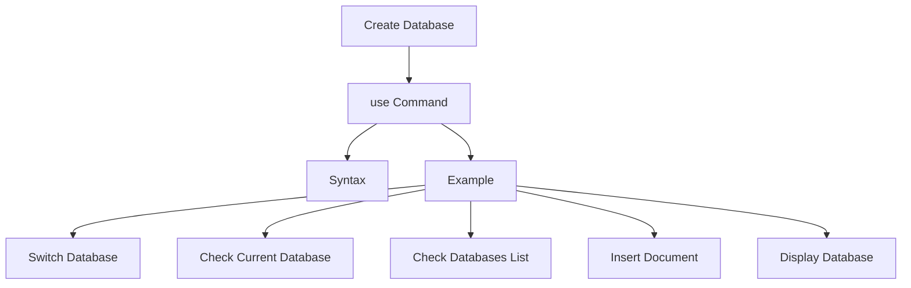

# MongoDB - Create Database

In this chapter, we will see how to create a database in MongoDB.

## The `use` Command

The `use DATABASE_NAME` command in MongoDB is used to create a database. The command will create a new database if it doesn't exist; otherwise, it will return the existing database.

### Syntax

The basic syntax of the `use DATABASE` statement is as follows:

```sql
use DATABASE_NAME
```

### Example

If you want to use a database named `mydb`, the `use DATABASE` statement would be as follows:

```bash
> use mydb
switched to db mydb
```

To check your currently selected database, use the command `db`:

```bash
> db
mydb
```

If you want to check your databases list, use the command `show dbs`:

```bash
> show dbs
local     0.78125GB
test      0.23012GB
```

Your created database (`mydb`) is not present in the list. To display the database, you need to insert at least one document into it:

```bash
> db.movie.insert({"name":"tutorials point"})
> show dbs
local      0.78125GB
mydb       0.23012GB
test       0.23012GB
```

In MongoDB, the default database is `test`. If you didn't create any database, then collections will be stored in the `test` database.

## Data Modeling Diagram



## Command Summary

| Command                           | Description                                                  |
|-----------------------------------|--------------------------------------------------------------|
| `use DATABASE_NAME`               | Create or switch to a database                               |
| `db`                              | Check the currently selected database                        |
| `show dbs`                        | List all databases                                           |
| `db.<collection>.insert(document)`| Insert a document into a collection                          |
