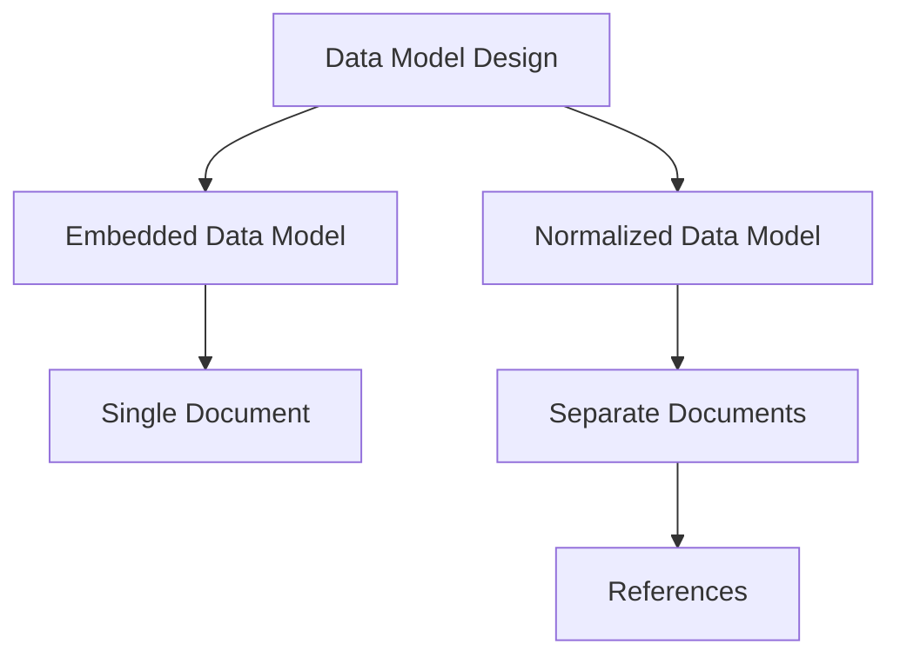

# MongoDB - Data Modelling

Data in MongoDB has a flexible schema. Documents in the same collection do not need to have the same set of fields or structure. Common fields in a collection’s documents may hold different types of data.

## Data Model Design

MongoDB provides two types of data models: Embedded data model and Normalized data model. Based on the requirement, you can use either of the models while preparing your document.

### Embedded Data Model

In this model, you can have (embed) all the related data in a single document. It is also known as the de-normalized data model.

For example, assume we are getting the details of employees in three different documents, namely, Personal_details, Contact, and Address. You can embed all three documents into a single one as shown below:

```json
{
    "_id": "ObjectId",
    "Emp_ID": "10025AE336",
    "Personal_details": {
        "First_Name": "Radhika",
        "Last_Name": "Sharma",
        "Date_Of_Birth": "1995-09-26"
    },
    "Contact": {
        "email": "radhika_sharma.123@gmail.com",
        "phone": "9848022338"
    },
    "Address": {
        "city": "Hyderabad",
        "Area": "Madapur",
        "State": "Telangana"
    }
}
```

### Normalized Data Model

In this model, you can refer to the sub-documents in the original document using references. For example, you can rewrite the above document in the normalized model as:

#### Employee

```json
{
    "_id": "<ObjectId101>",
    "Emp_ID": "10025AE336"
}
```

#### Personal_details

```json
{
    "_id": "<ObjectId102>",
    "empDocID": "<ObjectId101>",
    "First_Name": "Radhika",
    "Last_Name": "Sharma",
    "Date_Of_Birth": "1995-09-26"
}
```

#### Contact

```json
{
    "_id": "<ObjectId103>",
    "empDocID": "<ObjectId101>",
    "email": "radhika_sharma.123@gmail.com",
    "phone": "9848022338"
}
```

#### Address

```json
{
    "_id": "<ObjectId104>",
    "empDocID": "<ObjectId101>",
    "city": "Hyderabad",
    "Area": "Madapur",
    "State": "Telangana"
}
```

## Considerations while Designing Schema in MongoDB

1. **Design your schema according to user requirements.**
2. **Combine objects into one document if you will use them together. Otherwise, separate them (but make sure there is no need for joins).**
3. **Duplicate the data (but limited) because disk space is cheap compared to compute time.**
4. **Do joins while writing, not on reading.**
5. **Optimize your schema for the most frequent use cases.**
6. **Do complex aggregation in the schema.**

## Example

Suppose a client needs a database design for their blog/website. Let's see the differences between RDBMS and MongoDB schema design. The website has the following requirements:

- Every post has a unique title, description, and URL.
- Every post can have one or more tags.
- Every post has the name of its publisher and the total number of likes.
- Every post has comments given by users along with their name, message, date-time, and likes.
- On each post, there can be zero or more comments.

### RDBMS Schema Design

In RDBMS schema design, for the above requirements, you will have at least three tables.

### MongoDB Schema Design

In MongoDB schema design, you will have one collection called `post` with the following structure:

```json
{
   "_id": "POST_ID",
   "title": "TITLE_OF_POST", 
   "description": "POST_DESCRIPTION",
   "by": "POST_BY",
   "url": "URL_OF_POST",
   "tags": ["TAG1", "TAG2", "TAG3"],
   "likes": "TOTAL_LIKES", 
   "comments": [
      {
         "user": "COMMENT_BY",
         "message": "TEXT",
         "dateCreated": "DATE_TIME",
         "like": "LIKES"
      },
      {
         "user": "COMMENT_BY",
         "message": "TEXT",
         "dateCreated": "DATE_TIME",
         "like": "LIKES"
      }
   ]
}
```

So, while showing the data, in RDBMS you need to join three tables, but in MongoDB, data will be shown from one collection only.

### Data Modeling Diagram



### Data Modeling Summary

| Feature                         | Embedded Data Model         | Normalized Data Model       |
|---------------------------------|-----------------------------|-----------------------------|
| **Data Storage**                | Single document             | Separate documents          |
| **Schema Complexity**           | Simple                      | Complex                     |
| **Performance**                 | Fast reads                  | Fast writes                 |
| **Use Case**                    | High read/write frequency   | Large data with references  |

MongoDB provides a flexible and efficient way to model your data based on your application needs. Choosing the right data model depends on the use case and access patterns.
