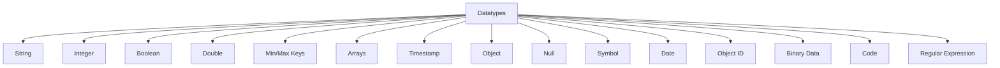

# MongoDB - Datatypes

MongoDB supports many datatypes. Some of them are listed below:

| Datatype           | Description                                                                 |
|--------------------|-----------------------------------------------------------------------------|
| **String**         | Stores UTF-8 valid strings.                                                 |
| **Integer**        | Stores 32-bit or 64-bit numerical values.                                   |
| **Boolean**        | Stores a boolean value (true/false).                                        |
| **Double**         | Stores floating-point values.                                               |
| **Min/Max Keys**   | Used to compare values against the lowest and highest BSON elements.        |
| **Arrays**         | Stores arrays or lists of multiple values.                                  |
| **Timestamp**      | Stores timestamps, useful for recording modification or addition times.     |
| **Object**         | Used for embedded documents.                                                |
| **Null**           | Stores a Null value.                                                        |
| **Symbol**         | Used identically to a string, reserved for specific languages.              |
| **Date**           | Stores the current date/time in UNIX format.                                |
| **Object ID**      | Stores the document’s ID.                                                   |
| **Binary Data**    | Stores binary data.                                                         |
| **Code**           | Stores JavaScript code in the document.                                     |
| **Regular Expression** | Stores regular expressions.                                            |

## Datatype Diagram

