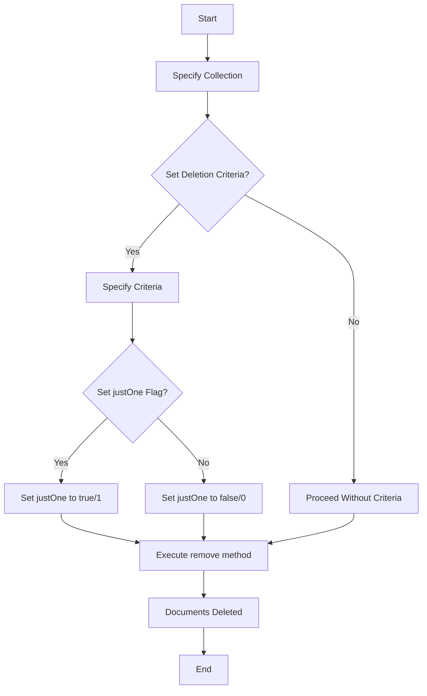

# MongoDB - Delete Document

In this chapter, we will learn how to delete a document using MongoDB.

## The remove() Method

MongoDB's `remove()` method is used to remove a document from the collection. The `remove()` method accepts two parameters: one is the deletion criteria and the second is the `justOne` flag.

- **deletion criteria** − (Optional) The criteria according to which documents will be removed.
- **justOne** − (Optional) If set to `true` or `1`, then only one document will be removed.

### Syntax

The basic syntax of the `remove()` method is as follows:

```bash
> db.COLLECTION_NAME.remove(DELETION_CRITERIA)
```

### Example

Consider the `mycol` collection has the following data:

```json
{ "_id" : ObjectId("507f191e810c19729de860e1"), "title": "MongoDB Overview" },
{ "_id" : ObjectId("507f191e810c19729de860e2"), "title": "NoSQL Overview" },
{ "_id" : ObjectId("507f191e810c19729de860e3"), "title": "Tutorials Point Overview" }
```

Following example will remove all the documents whose title is 'MongoDB Overview'.

```bash
> db.mycol.remove({'title':'MongoDB Overview'})
WriteResult({ "nRemoved" : 1 })
> db.mycol.find()
{ "_id" : ObjectId("507f191e810c19729de860e2"), "title": "NoSQL Overview" }
{ "_id" : ObjectId("507f191e810c19729de860e3"), "title": "Tutorials Point Overview" }
```

### Remove Only One

If there are multiple records and you want to delete only the first record, then set the `justOne` parameter in the `remove()` method.

```bash
> db.COLLECTION_NAME.remove(DELETION_CRITERIA, 1)
```

### Remove All Documents

If you don't specify deletion criteria, then MongoDB will delete all documents from the collection. This is equivalent to SQL's `TRUNCATE` command.

```bash
> db.mycol.remove({})
WriteResult({ "nRemoved" : 2 })
> db.mycol.find()
```

## Diagrams

### Remove Document Flow


## Notes

- Always double-check your deletion criteria to avoid accidental removal of unintended documents.
- Use `justOne` flag to limit deletion to a single document if needed.
- Omitting the deletion criteria will result in removing all documents from the collection.

## Table of Commands

| Command | Description |
| ------- | ----------- |
| `db.COLLECTION_NAME.remove(DELETION_CRITERIA)` | Removes documents matching the criteria. |
| `db.COLLECTION_NAME.remove(DELETION_CRITERIA, 1)` | Removes only the first document matching the criteria. |
| `db.COLLECTION_NAME.remove({})` | Removes all documents from the collection. |
