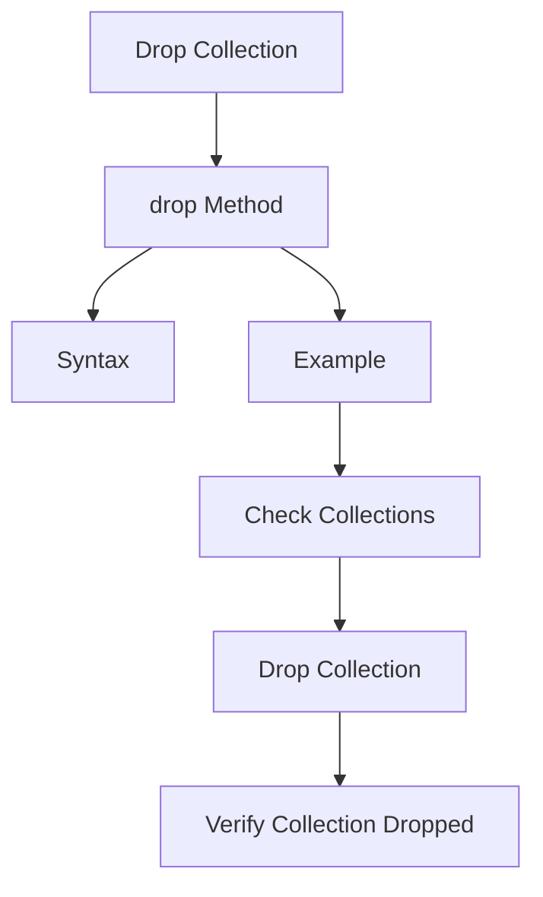

# MongoDB - Drop Collection

In this chapter, we will see how to drop a collection using MongoDB.

## The `drop()` Method

MongoDB's `db.collection.drop()` is used to drop a collection from the database.

### Syntax

The basic syntax of the `drop()` command is as follows:

```sql
db.COLLECTION_NAME.drop()
```

### Example

First, check the available collections in your database `mydb`.

```bash
> use mydb
switched to db mydb
> show collections
mycol
mycollection
system.indexes
tutorialspoint
```

Now drop the collection with the name `mycollection`.

```bash
> db.mycollection.drop()
true
```

Again, check the list of collections in the database.

```bash
> show collections
mycol
system.indexes
tutorialspoint
```

The `drop()` method will return `true` if the selected collection is dropped successfully; otherwise, it will return `false`.

## Drop Collection Diagram



## Command Summary

| Command                       | Description                                          |
|-------------------------------|------------------------------------------------------|
| `db.COLLECTION_NAME.drop()`   | Drop the specified collection from the database      |
| `show collections`            | List all collections in the current database         |
| `use DATABASE_NAME`           | Switch to the specified database                     |
