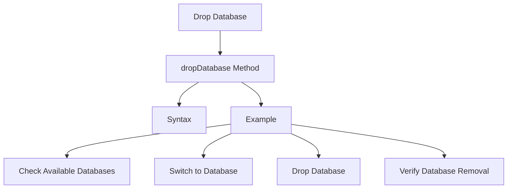

# MongoDB - Drop Database

In this chapter, we will see how to drop a database using the MongoDB command.

## The `dropDatabase()` Method

The MongoDB `db.dropDatabase()` command is used to drop an existing database.

### Syntax

The basic syntax of the `dropDatabase()` command is as follows:

```sql
db.dropDatabase()
```

This will delete the selected database. If you have not selected any database, then it will delete the default `test` database.

### Example

First, check the list of available databases by using the command `show dbs`:

```bash
> show dbs
local      0.78125GB
mydb       0.23012GB
test       0.23012GB
```

If you want to delete the new database `mydb`, the `dropDatabase()` command would be as follows:

```bash
> use mydb
switched to db mydb
> db.dropDatabase()
{ "dropped" : "mydb", "ok" : 1 }
```

Now check the list of databases:

```bash
> show dbs
local      0.78125GB
test       0.23012GB
```

## Dropping Database Diagram



## Command Summary

| Command                 | Description                                           |
|-------------------------|-------------------------------------------------------|
| `db.dropDatabase()`     | Drop the currently selected database                  |
| `show dbs`              | List all databases                                    |
| `use DATABASE_NAME`     | Switch to a specific database                         |
