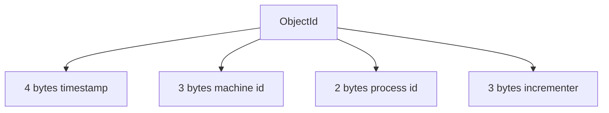

# MongoDB - Insert Document

In this chapter, we will learn how to insert documents in MongoDB collections.

## The insert() Method

To insert data into a MongoDB collection, you can use MongoDB's `insert()` or `save()` method.

### Syntax

The basic syntax of the `insert()` command is as follows:

```javascript
db.COLLECTION_NAME.insert(document)
```

### Example

```javascript
> db.users.insert({
... _id : ObjectId("507f191e810c19729de860ea"),
... title: "MongoDB Overview",
... description: "MongoDB is no SQL database",
... by: "tutorials point",
... url: "http://www.tutorialspoint.com",
... tags: ['mongodb', 'database', 'NoSQL'],
... likes: 100
... })
WriteResult({ "nInserted" : 1 })
>
```

In the inserted document, if you don't specify the `_id` parameter, MongoDB assigns a unique ObjectId for this document.

### ObjectId Structure



### Inserting Multiple Documents

You can also pass an array of documents into the `insert()` method.

```javascript
> db.createCollection("post")
> db.post.insert([
    {
        title: "MongoDB Overview",
        description: "MongoDB is no SQL database",
        by: "tutorials point",
        url: "http://www.tutorialspoint.com",
        tags: ["mongodb", "database", "NoSQL"],
        likes: 100
    },
    {
        title: "NoSQL Database",
        description: "NoSQL database doesn't have tables",
        by: "tutorials point",
        url: "http://www.tutorialspoint.com",
        tags: ["mongodb", "database", "NoSQL"],
        likes: 20,
        comments: [
            {
                user: "user1",
                message: "My first comment",
                dateCreated: new Date(2013, 11, 10, 2, 35),
                like: 0
            }
        ]
    }
])
BulkWriteResult({
    "writeErrors" : [ ],
    "writeConcernErrors" : [ ],
    "nInserted" : 2,
    "nUpserted" : 0,
    "nMatched" : 0,
    "nModified" : 0,
    "nRemoved" : 0,
    "upserted" : [ ]
})
>
```

## The insertOne() Method

If you need to insert only one document into a collection, you can use this method.

### Syntax

The basic syntax of the `insertOne()` command is as follows:

```javascript
db.COLLECTION_NAME.insertOne(document)
```

### Example

```javascript
> db.createCollection("empDetails")
{ "ok" : 1 }
> db.empDetails.insertOne(
    {
        First_Name: "Radhika",
        Last_Name: "Sharma",
        Date_Of_Birth: "1995-09-26",
        e_mail: "radhika_sharma.123@gmail.com",
        phone: "9848022338"
    })
{
    "acknowledged" : true,
    "insertedId" : ObjectId("5dd62b4070fb13eec3963bea")
}
>
```

## The insertMany() Method

You can insert multiple documents using the `insertMany()` method. To this method, you need to pass an array of documents.

### Example

```javascript
> db.empDetails.insertMany(
    [
        {
            First_Name: "Radhika",
            Last_Name: "Sharma",
            Date_Of_Birth: "1995-09-26",
            e_mail: "radhika_sharma.123@gmail.com",
            phone: "9000012345"
        },
        {
            First_Name: "Rachel",
            Last_Name: "Christopher",
            Date_Of_Birth: "1990-02-16",
            e_mail: "Rachel_Christopher.123@gmail.com",
            phone: "9000054321"
        },
        {
            First_Name: "Fathima",
            Last_Name: "Sheik",
            Date_Of_Birth: "1990-02-16",
            e_mail: "Fathima_Sheik.123@gmail.com",
            phone: "9000054321"
        }
    ]
)
{
    "acknowledged" : true,
    "insertedIds" : [
        ObjectId("5dd631f270fb13eec3963bed"),
        ObjectId("5dd631f270fb13eec3963bee"),
        ObjectId("5dd631f270fb13eec3963bef")
    ]
}
>
```

## Summary Table

| Method        | Description                             |
|---------------|-----------------------------------------|
| **insert()**  | Inserts one or multiple documents       |
| **insertOne()** | Inserts a single document              |
| **insertMany()** | Inserts multiple documents            |
