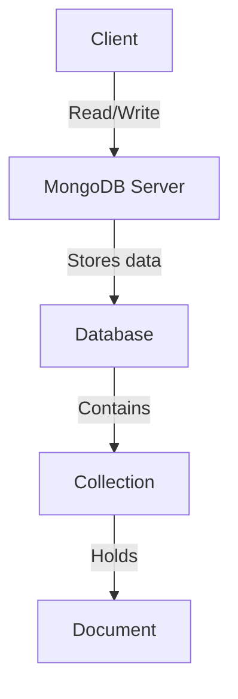

# MongoDB - Advantages

Any relational database has a typical schema design that shows the number of tables and the relationship between these tables. While in MongoDB, there is no concept of relationship.

## Advantages of MongoDB over RDBMS

- **Schema-less:** MongoDB is a document database in which one collection holds different documents. The number of fields, content, and size of the document can differ from one document to another.
- **Structure of a single object is clear.**
- **No complex joins.**
- **Deep query-ability:** MongoDB supports dynamic queries on documents using a document-based query language that's nearly as powerful as SQL.
- **Tuning.**
- **Ease of scale-out:** MongoDB is easy to scale.
- **Conversion/mapping of application objects to database objects not needed.**
- **Uses internal memory for storing the (windowed) working set, enabling faster access of data.**

> **Note:** MongoDB's schema-less design and flexible structure make it an excellent choice for applications that require rapid development and iterative changes.

## Why Use MongoDB?

- **Document Oriented Storage:** Data is stored in the form of JSON style documents.
- **Index on any attribute.**
- **Replication and high availability.**
- **Auto-Sharding.**
- **Rich queries.**
- **Fast in-place updates.**
- **Professional support by MongoDB.**

## Where to Use MongoDB?

- **Big Data.**
- **Content Management and Delivery.**
- **Mobile and Social Infrastructure.**
- **User Data Management.**
- **Data Hub.**

### MongoDB Architecture Diagram

### Advantages Summary

| Feature | Description |
|---------|-------------|
| Schema-less | Flexible document structure, no predefined schema required. |
| No complex joins | Simplifies queries by avoiding complex joins. |
| Deep query-ability | Powerful querying capabilities using a document-based query language. |
| Easy scale-out | Simplified scaling process. |
| Fast access | Uses internal memory for fast data access. |

MongoDB offers numerous advantages over traditional RDBMS, particularly for applications that require flexibility, scalability, and performance. Its document-oriented storage model and rich querying capabilities make it a versatile choice for modern data-driven applications.
