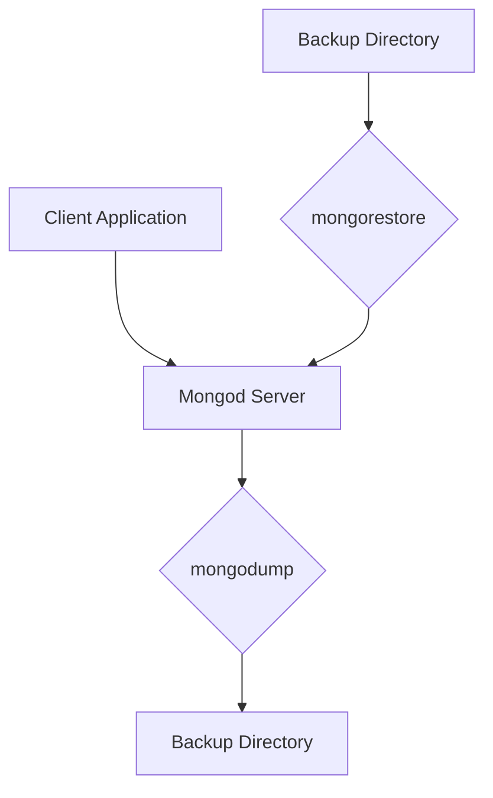

# MongoDB - Create Backup

In this chapter, we will see how to create a backup in MongoDB.

## Dump MongoDB Data

To create a backup of a database in MongoDB, use the `mongodump` command. This command dumps the entire data of your server into the dump directory. There are many options available to limit the amount of data or create a backup of your remote server.

### Syntax

The basic syntax of the `mongodump` command is as follows:

```
mongodump
```

### Example

Start your `mongod` server. Assuming that your `mongod` server is running on `localhost` and port `27017`, open a command prompt, go to the `bin` directory of your MongoDB instance, and type the command `mongodump`.

Consider the `mycol` collection has the following data.

```
mongodump
```

The command will connect to the server running at `127.0.0.1` and port `27017` and back up all data of the server to the directory `/bin/dump/`. Following is the output of the command:

```plaintext
2023-06-10T12:34:56.789+0000    writing mydb.mycol to /bin/dump/mydb/mycol.bson
2023-06-10T12:34:56.789+0000    done
```

## Available Options for `mongodump`

| Syntax                                      | Description                                              | Example                                                 |
|---------------------------------------------|----------------------------------------------------------|---------------------------------------------------------|
| `mongodump --host HOST_NAME --port PORT_NUMBER` | This command will back up all databases of the specified `mongod` instance. | `mongodump --host tutorialspoint.com --port 27017`      |
| `mongodump --dbpath DB_PATH --out BACKUP_DIRECTORY` | This command will back up only the specified database at the specified path. | `mongodump --dbpath /data/db/ --out /data/backup/`      |
| `mongodump --collection COLLECTION --db DB_NAME` | This command will back up only the specified collection of the specified database. | `mongodump --collection mycol --db test`                |

## Restore Data

To restore backup data, use MongoDB's `mongorestore` command. This command restores all of the data from the backup directory.

### Syntax

The basic syntax of the `mongorestore` command is:

```
mongorestore
```

### Example

Following is the output of the command:

```plaintext
2023-06-10T12:34:56.789+0000    preparing to restore mydb.mycol from /bin/dump/mydb/mycol.bson
2023-06-10T12:34:56.789+0000    done
```

### Diagram



### Notes
> - Ensure the `mongod` server is running before executing the `mongodump` or `mongorestore` commands.
> - Use appropriate options with `mongodump` to back up specific databases or collections.
> - The backup directory should be accessible and writable by the MongoDB instance.

Creating backups regularly ensures that you have a recovery option in case of data loss or corruption.