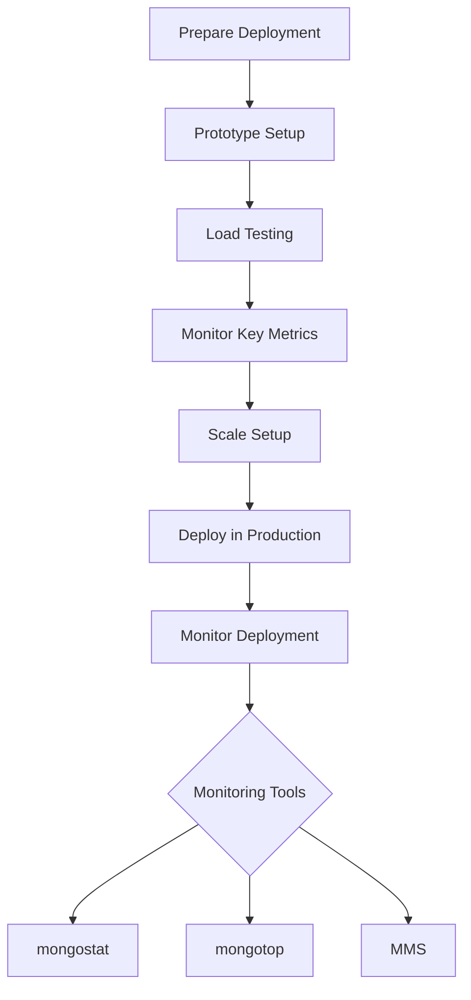

# MongoDB - Deployment

When you are preparing a MongoDB deployment, you should try to understand how your application is going to hold up in production. It’s a good idea to develop a consistent, repeatable approach to managing your deployment environment so that you can minimize any surprises once you’re in production.

The best approach incorporates prototyping your setup, conducting load testing, monitoring key metrics, and using that information to scale your setup. The key part of the approach is to proactively monitor your entire system - this will help you understand how your production system will hold up before deploying and determine where you will need to add capacity. Having insight into potential spikes in your memory usage, for example, could help put out a write-lock fire before it starts.

## Monitoring Your Deployment

To monitor your deployment, MongoDB provides some of the following commands:

### `mongostat`

This command checks the status of all running `mongod` instances and returns counters of database operations. These counters include inserts, queries, updates, deletes, and cursors. The command also shows when you’re hitting page faults and showcases your lock percentage. This means that you're running low on memory, hitting write capacity, or have some performance issues.

To run the command, start your `mongod` instance. In another command prompt, go to the `bin` directory of your MongoDB installation and type `mongostat`.

```shell
D:\set up\mongodb\bin>mongostat
```

Following is the output of the command:

```plaintext
insert query update delete getmore command % dirty % used flushes vsize   res   qrw arw net_in net_out conn                time
     *0    *0     *0     *0       0     1|0       0       0       0 54.3M  2.0M    0|0  0|0      0       0    1   2024-06-10T12:34:56.789+0000
```

### `mongotop`

This command tracks and reports the read and write activity of MongoDB instances on a collection basis. By default, `mongotop` returns information each second, which you can change accordingly. You should check that this read and write activity matches your application intention, and you’re not firing too many writes to the database at a time, reading too frequently from a disk, or exceeding your working set size.

To run the command, start your `mongod` instance. In another command prompt, go to the `bin` directory of your MongoDB installation and type `mongotop`.

```shell
D:\set up\mongodb\bin>mongotop
```

Following is the output of the command:

```plaintext
ns             total      read      write     2024-06-10T12:34:56.789+0000
mydb.mycol     0ms        0ms       0ms
```

To change the `mongotop` command to return information less frequently, specify a specific number after the `mongotop` command.

```shell
D:\set up\mongodb\bin>mongotop 30
```

The above example will return values every 30 seconds.

## MongoDB Management Service (MMS)

Apart from the MongoDB tools, 10gen provides a free, hosted monitoring service, MongoDB Management Service (MMS), that provides a dashboard and gives you a view of the metrics from your entire cluster.

## Diagram



### Notes

> - Regularly prototype, test, and monitor your deployment environment.
> - Use `mongostat` to check the status of your `mongod` instances and monitor database operations.
> -  Use `mongotop` to track and report read/write activity on a collection basis.
> - Utilize MongoDB Management Service (MMS) for comprehensive monitoring and a visual dashboard.

Having a well-planned and monitored deployment strategy ensures the stability and performance of your MongoDB in a production environment.
