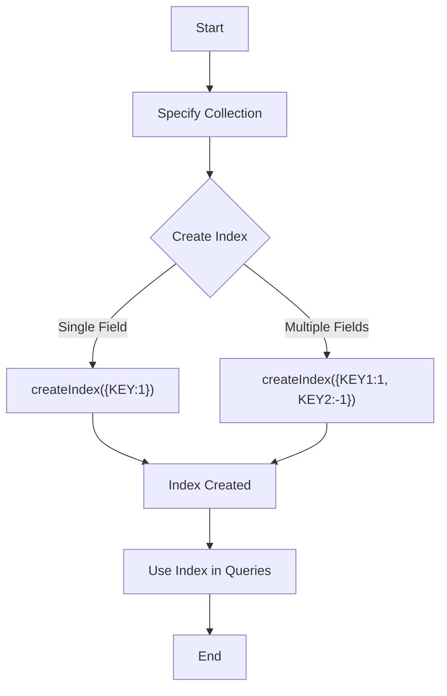

# MongoDB - Indexing

Indexes support the efficient resolution of queries. Without indexes, MongoDB must scan every document of a collection to select those documents that match the query statement. This scan is highly inefficient and requires MongoDB to process a large volume of data.

Indexes are special data structures that store a small portion of the data set in an easy-to-traverse form. The index stores the value of a specific field or set of fields, ordered by the value of the field as specified in the index.

## The createIndex() Method

To create an index, you need to use the `createIndex()` method of MongoDB.

### Syntax

The basic syntax of the `createIndex()` method is as follows:

```shell
>db.COLLECTION_NAME.createIndex({KEY:1})
```

Here, `KEY` is the name of the field on which you want to create an index, and `1` is for ascending order. To create an index in descending order, you need to use `-1`.

### Example

```shell
>db.mycol.createIndex({"title":1})
{
    "createdCollectionAutomatically" : false,
    "numIndexesBefore" : 1,
    "numIndexesAfter" : 2,
    "ok" : 1
}
```

In the `createIndex()` method, you can pass multiple fields to create an index on multiple fields.

```shell
>db.mycol.createIndex({"title":1,"description":-1})
```

## Index Options

This method also accepts a list of options (which are optional). Following is the list:

| Parameter           | Type     | Description                                                                                                                       |
|---------------------|----------|-----------------------------------------------------------------------------------------------------------------------------------|
| background          | Boolean  | Builds the index in the background so that building an index does not block other database activities. Default value is `false`.  |
| unique              | Boolean  | Creates a unique index so that the collection will not accept insertion of documents where the index key matches an existing value. Specify `true` to create a unique index. Default value is `false`.  |
| name                | String   | The name of the index. If unspecified, MongoDB generates an index name by concatenating the names of the indexed fields and the sort order. |
| sparse              | Boolean  | If `true`, the index only references documents with the specified field. These indexes use less space but behave differently in some situations (particularly sorts). Default value is `false`. |
| expireAfterSeconds  | Integer  | Specifies a value, in seconds, as a TTL to control how long MongoDB retains documents in this collection.                         |
| weights             | Document | The weight is a number ranging from 1 to 99,999 and denotes the significance of the field relative to other indexed fields in terms of the score.  |
| default_language    | String   | For a text index, the language that determines the list of stop words and the rules for the stemmer and tokenizer. Default value is `English`.  |
| language_override   | String   | For a text index, specify the name of the field in the document that contains the language to override the default language. Default value is `language`.  |

## The dropIndex() Method

You can drop a particular index using the `dropIndex()` method of MongoDB.

### Syntax

The basic syntax of the `dropIndex()` method is as follows:

```shell
>db.COLLECTION_NAME.dropIndex({KEY:1})
```

Here, `KEY` is the name of the field on which you want to remove an existing index. Instead of the index specification document (above syntax), you can also specify the name of the index directly as:

```shell
dropIndex("name_of_the_index")
```

### Example

```shell
> db.mycol.dropIndex({"title":1})
{
    "ok" : 0,
    "errmsg" : "can't find index with key: { title: 1.0 }",
    "code" : 27,
    "codeName" : "IndexNotFound"
}
```

## The dropIndexes() Method

This method deletes multiple (specified) indexes on a collection.

### Syntax

The basic syntax of the `dropIndexes()` method is as follows:

```shell
>db.COLLECTION_NAME.dropIndexes()
```

### Example

Assume we have created 2 indexes in the named `mycol` collection as shown below:

```shell
> db.mycol.createIndex({"title":1,"description":-1})
```

Following example removes the above-created indexes of `mycol`:

```shell
>db.mycol.dropIndexes({"title":1,"description":-1})
{ "nIndexesWas" : 2, "ok" : 1 }
```

## The getIndexes() Method

This method returns the description of all the indexes in the collection.

### Syntax

Following is the basic syntax of the `getIndexes()` method:

```shell
db.COLLECTION_NAME.getIndexes()
```

### Example

Assume we have created 2 indexes in the named `mycol` collection as shown below:

```shell
> db.mycol.createIndex({"title":1,"description":-1})
```

Following example retrieves all the indexes in the collection `mycol`:

```shell
> db.mycol.getIndexes()
[
    {
        "v" : 2,
        "key" : {
            "_id" : 1
        },
        "name" : "_id_",
        "ns" : "test.mycol"
    },
    {
        "v" : 2,
        "key" : {
            "title" : 1,
            "description" : -1
        },
        "name" : "title_1_description_-1",
        "ns" : "test.mycol"
    }
]
```

## Diagram



## Note
> Indexes can greatly improve query performance, but they also come with overhead. It's important to balance the benefits of indexing with the cost of maintaining them, especially for write-heavy operations.
