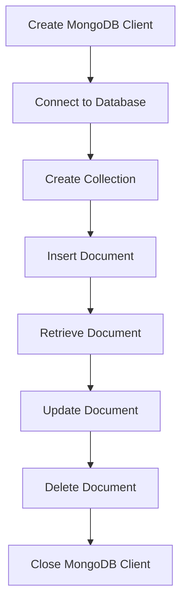

# MongoDB - Java

## Installation

Before you start using MongoDB in your Java programs, ensure that you have MongoDB CLIENT and Java set up on your machine. You can refer to Java tutorials for Java installation on your machine. Now, let's check how to set up MongoDB CLIENT.

1. **Download the necessary JAR files**:
    - `mongodb-driver-3.11.2.jar`
    - `mongodb-driver-core-3.11.2.jar`

   Make sure to download the latest release of these JAR files.

2. **Include the JAR files in your classpath**.
:::note
You can download the JAR files from the [MongoDB Java Driver](https://mongodb.github.io/mongo-java-driver/) website.
:::
## Connect to Database

To connect to a database, specify the database name. If the database doesn't exist, MongoDB creates it automatically.

```java
import com.mongodb.client.MongoDatabase; 
import com.mongodb.MongoClient; 
import com.mongodb.MongoCredential;  

public class ConnectToDB { 
   public static void main( String args[] ) {  
      // Creating a Mongo client 
      MongoClient mongo = new MongoClient( "localhost" , 27017 ); 
   
      // Creating Credentials 
      MongoCredential credential; 
      credential = MongoCredential.createCredential("sampleUser", "myDb", "password".toCharArray()); 
      System.out.println("Connected to the database successfully");  
      
      // Accessing the database 
      MongoDatabase database = mongo.getDatabase("myDb"); 
      System.out.println("Credentials ::"+ credential);     
   } 
}
```

**Compile and Run**:

```bash
$ javac ConnectToDB.java 
$ java ConnectToDB
```

**Output**:

```
Connected to the database successfully 
Credentials ::MongoCredential{mechanism = null, userName = 'sampleUser', source = 'myDb', password = <hidden>, mechanismProperties = {}}
```

## Create a Collection

To create a collection, use the `createCollection()` method of the `com.mongodb.client.MongoDatabase` class.

```java
import com.mongodb.client.MongoDatabase; 
import com.mongodb.MongoClient; 
import com.mongodb.MongoCredential;  

public class CreatingCollection { 
   public static void main( String args[] ) {  
      // Creating a Mongo client 
      MongoClient mongo = new MongoClient( "localhost" , 27017 ); 
     
      // Creating Credentials 
      MongoCredential credential; 
      credential = MongoCredential.createCredential("sampleUser", "myDb", "password".toCharArray()); 
      System.out.println("Connected to the database successfully");  
      
      // Accessing the database 
      MongoDatabase database = mongo.getDatabase("myDb");  
      
      // Creating a collection 
      database.createCollection("sampleCollection"); 
      System.out.println("Collection created successfully"); 
   } 
} 
```

**Compile and Run**:

```bash
$ javac CreatingCollection.java 
$ java CreatingCollection
```

**Output**:

```
Connected to the database successfully 
Collection created successfully
```

## Getting/Selecting a Collection

To get/select a collection from the database, use the `getCollection()` method of the `com.mongodb.client.MongoDatabase` class.

```java
import com.mongodb.client.MongoCollection; 
import com.mongodb.client.MongoDatabase; 
import org.bson.Document; 
import com.mongodb.MongoClient; 
import com.mongodb.MongoCredential;  

public class SelectingCollection { 
   public static void main( String args[] ) {  
      // Creating a Mongo client 
      MongoClient mongo = new MongoClient( "localhost" , 27017 ); 
     
      // Creating Credentials 
      MongoCredential credential; 
      credential = MongoCredential.createCredential("sampleUser", "myDb", "password".toCharArray()); 
      System.out.println("Connected to the database successfully");  
      
      // Accessing the database 
      MongoDatabase database = mongo.getDatabase("myDb");  
      
      // Retrieving a collection
      MongoCollection<Document> collection = database.getCollection("sampleCollection"); 
      System.out.println("Collection myCollection selected successfully"); 
   }
}
```

**Compile and Run**:

```bash
$ javac SelectingCollection.java 
$ java SelectingCollection
```

**Output**:

```
Connected to the database successfully 
Collection myCollection selected successfully
```

## Insert a Document

To insert a document into MongoDB, use the `insertOne()` method of the `com.mongodb.client.MongoCollection` class.

```java
import com.mongodb.client.MongoCollection;
import com.mongodb.client.MongoDatabase;
import org.bson.Document;
import com.mongodb.MongoClient;

public class InsertingDocument {
    public static void main( String args[] ) {
        // Creating a Mongo client
        MongoClient mongo = new MongoClient( "localhost" , 27017 );
        
        // Accessing the database
        MongoDatabase database = mongo.getDatabase("myDb");
        
        // Creating a collection
        database.createCollection("sampleCollection");
        System.out.println("Collection created successfully");
        
        // Retrieving a collection
        MongoCollection<Document> collection = database.getCollection("sampleCollection");
        System.out.println("Collection sampleCollection selected successfully");
        
        // Creating a document
        Document document = new Document("title", "MongoDB")
            .append("description", "database")
            .append("likes", 100)
            .append("url", "http://www.tutorialspoint.com/mongodb/")
            .append("by", "tutorials point");
        
        // Inserting document into the collection
        collection.insertOne(document);
        System.out.println("Document inserted successfully");
    }
}
```

**Compile and Run**:

```bash
$ javac InsertingDocument.java 
$ java InsertingDocument
```

**Output**:

```
Connected to the database successfully 
Collection sampleCollection selected successfully 
Document inserted successfully
```

## Retrieve All Documents

To select all documents from the collection, use the `find()` method of the `com.mongodb.client.MongoCollection` class. This method returns a cursor, so you need to iterate this cursor.

```java
import com.mongodb.client.FindIterable;
import com.mongodb.client.MongoCollection;
import com.mongodb.client.MongoDatabase;
import java.util.ArrayList;
import java.util.Iterator;
import java.util.List;
import org.bson.Document;
import com.mongodb.MongoClient;
import com.mongodb.MongoCredential;

public class RetrievingAllDocuments {
    public static void main( String args[] ) {
        // Creating a Mongo client
        MongoClient mongo = new MongoClient( "localhost" , 27017 );
        
        // Creating Credentials
        MongoCredential credential;
        credential = MongoCredential.createCredential("sampleUser", "myDb", "password".toCharArray());
        System.out.println("Connected to the database successfully");
        
        // Accessing the database
        MongoDatabase database = mongo.getDatabase("myDb");
        
        // Retrieving a collection
        MongoCollection<Document> collection = database.getCollection("sampleCollection");
        System.out.println("Collection sampleCollection selected successfully");
        
        // Creating documents
        Document document1 = new Document("title", "MongoDB")
            .append("description", "database")
            .append("likes", 100)
            .append("url", "http://www.tutorialspoint.com/mongodb/")
            .append("by", "tutorials point");
        Document document2 = new Document("title", "RethinkDB")
            .append("description", "database")
            .append("likes", 200)
            .append("url", "http://www.tutorialspoint.com/rethinkdb/")
            .append("by", "tutorials point");
        
        // Inserting documents into the collection
        List<Document> list = new ArrayList<Document>();
        list.add(document1);
        list.add(document2);
        collection.insertMany(list);
        
        // Getting the iterable object
        FindIterable<Document> iterDoc = collection.find();
        int i = 1;
        
        // Getting the iterator
        Iterator it = iterDoc.iterator();
        while (it.hasNext()) {
            System.out.println(it.next());
            i++;
        }
    }
}
```

**Compile and Run**:

```bash
$ javac RetrievingAllDocuments.java 
$ java RetrievingAllDocuments
```

**Output**:

```
Connected to the database successfully
Collection sampleCollection selected successfully
Document{{_id=5dce4e9ff68a9c2449e197b2, title=MongoDB, description=database, likes=100, url=http://www.tutorialspoint.com/mongodb/, by=tutorials point}}
Document{{_id=5dce4e9ff68a9c2449e197b3, title=RethinkDB, description=database, likes=200, url=http://www.tutorialspoint.com/rethinkdb/, by=tutorials point}}
```

## Update Document

To update a document in the collection, use the `updateOne()` method of the `com.mongodb.client.MongoCollection` class.

```java
import com.mongodb.client.FindIterable; 
import com.mongodb.client.MongoCollection; 
import com.mongodb.client.MongoDatabase; 
import com.mongodb.client.model.Filters; 
import com.mongodb.client.model.Updates; 
import java.util.Iterator; 
import org.bson.Document;  
import com.mongodb.MongoClient; 
import com.mongodb.MongoCredential;  

public class UpdatingDocuments { 
   public static void main( String args[] ) {  
      // Creating a Mongo client 
      MongoClient mongo = new Mongo

Client( "localhost" , 27017 ); 
     
      // Creating Credentials 
      MongoCredential credential; 
      credential = MongoCredential.createCredential("sampleUser", "myDb", "password".toCharArray()); 
      System.out.println("Connected to the database successfully");  
      
      // Accessing the database 
      MongoDatabase database = mongo.getDatabase("myDb");  
      
      // Retrieving a collection
      MongoCollection<Document> collection = database.getCollection("sampleCollection"); 
      System.out.println("Collection sampleCollection selected successfully"); 
      
      // Updating the document 
      collection.updateOne(Filters.eq("title", "MongoDB"), Updates.set("likes", 150));       
      System.out.println("Document updated successfully...");  
      
      // Retrieving the updated document
      FindIterable<Document> iterDoc = collection.find(); 
      int i = 1; 
      
      // Getting the iterator 
      Iterator it = iterDoc.iterator(); 
      while (it.hasNext()) {  
         System.out.println(it.next());  
         i++; 
      }       
   } 
}
```

**Compile and Run**:

```bash
$ javac UpdatingDocuments.java 
$ java UpdatingDocuments
```

**Output**:

```
Connected to the database successfully
Collection sampleCollection selected successfully
Document updated successfully...
Document{{_id=5dce4e9ff68a9c2449e197b2, title=MongoDB, description=database, likes=150, url=http://www.tutorialspoint.com/mongodb/, by=tutorials point}}
Document{{_id=5dce4e9ff68a9c2449e197b3, title=RethinkDB, description=database, likes=200, url=http://www.tutorialspoint.com/rethinkdb/, by=tutorials point}}
```

## Delete Document

To delete a document in the collection, use the `deleteOne()` method of the `com.mongodb.client.MongoCollection` class.

```java
import com.mongodb.client.FindIterable; 
import com.mongodb.client.MongoCollection; 
import com.mongodb.client.MongoDatabase; 
import com.mongodb.client.model.Filters; 
import java.util.Iterator; 
import org.bson.Document;  
import com.mongodb.MongoClient; 
import com.mongodb.MongoCredential;  

public class DeletingDocuments { 
   public static void main( String args[] ) {  
      // Creating a Mongo client 
      MongoClient mongo = new MongoClient( "localhost" , 27017 ); 
     
      // Creating Credentials 
      MongoCredential credential; 
      credential = MongoCredential.createCredential("sampleUser", "myDb", "password".toCharArray()); 
      System.out.println("Connected to the database successfully");  
      
      // Accessing the database 
      MongoDatabase database = mongo.getDatabase("myDb");  
      
      // Retrieving a collection
      MongoCollection<Document> collection = database.getCollection("sampleCollection"); 
      System.out.println("Collection sampleCollection selected successfully"); 
      
      // Deleting the document 
      collection.deleteOne(Filters.eq("title", "MongoDB")); 
      System.out.println("Document deleted successfully...");  
      
      // Retrieving the updated documents
      FindIterable<Document> iterDoc = collection.find(); 
      int i = 1; 
      
      // Getting the iterator 
      Iterator it = iterDoc.iterator(); 
      while (it.hasNext()) {  
         System.out.println(it.next());  
         i++; 
      }       
   } 
}
```

**Compile and Run**:

```bash
$ javac DeletingDocuments.java 
$ java DeletingDocuments
```

**Output**:

```
Connected to the database successfully
Collection sampleCollection selected successfully
Document deleted successfully...
Document{{_id=5dce4e9ff68a9c2449e197b3, title=RethinkDB, description=database, likes=200, url=http://www.tutorialspoint.com/rethinkdb/, by=tutorials point}}
```

## Conclusion

This tutorial covers basic operations with MongoDB using Java. With this knowledge, you can connect to a MongoDB database, create and retrieve collections, insert, update, and delete documents in your Java applications.

## Diagram

Below is a diagram illustrating the MongoDB Java process.



:::note

- Ensure MongoDB is running before executing the Java programs.
- Use appropriate exception handling in real-world applications to handle any database connection issues.
- For more advanced usage and configurations, refer to the [MongoDB Java Driver Documentation](https://mongodb.github.io/mongo-java-driver/).
:::

## Table of Methods

| Method                | Description                                                 |
|-----------------------|-------------------------------------------------------------|
| `createCollection`    | Creates a new collection in the database                    |
| `getCollection`       | Retrieves an existing collection from the database          |
| `insertOne`           | Inserts a single document into the collection               |
| `find`                | Retrieves documents from the collection                     |
| `updateOne`           | Updates a single document in the collection                 |
| `deleteOne`           | Deletes a single document from the collection               |
