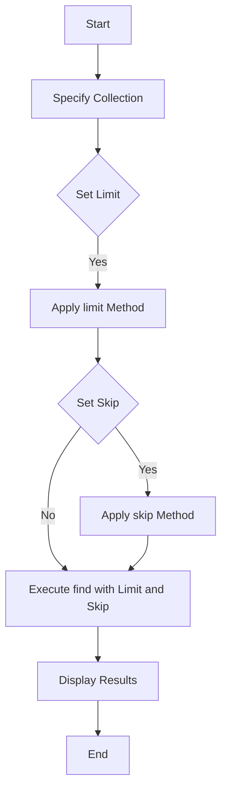

# MongoDB - Limit Records

In this chapter, we will learn how to limit records using MongoDB.

## The limit() Method

To limit the records in MongoDB, you need to use the `limit()` method. The method accepts one number type argument, which is the number of documents that you want to be displayed.

### Syntax

The basic syntax of the `limit()` method is as follows:

```bash
> db.COLLECTION_NAME.find().limit(NUMBER)
```

### Example

Consider the collection `mycol` has the following data:

```json
{ "_id" : ObjectId("507f191e810c19729de860e1"), "title": "MongoDB Overview" }
{ "_id" : ObjectId("507f191e810c19729de860e2"), "title": "NoSQL Overview" }
{ "_id" : ObjectId("507f191e810c19729de860e3"), "title": "Tutorials Point Overview" }
```

The following example will display only two documents while querying the document:

```bash
> db.mycol.find({},{"title":1,_id:0}).limit(2)
{"title":"MongoDB Overview"}
{"title":"NoSQL Overview"}
```

If you don't specify the number argument in the `limit()` method, it will display all documents from the collection.

## MongoDB skip() Method

Apart from the `limit()` method, there is one more method `skip()` which also accepts a number type argument and is used to skip the number of documents.

### Syntax

The basic syntax of the `skip()` method is as follows:

```bash
> db.COLLECTION_NAME.find().limit(NUMBER).skip(NUMBER)
```

### Example

The following example will display only the second document:

```bash
> db.mycol.find({},{"title":1,_id:0}).limit(1).skip(1)
{"title":"NoSQL Overview"}
```

Please note, the default value in the `skip()` method is 0.

## Diagram

### Limit and Skip Operation Flow


## Notes

> - The `limit()` method is used to restrict the number of documents returned in the query result.
> - The `skip()` method is used to skip a specified number of documents in the query result.
> - Combining `limit()` and `skip()` allows for pagination of results.
> - The default value for `skip()` is 0, meaning no documents are skipped.

## Table of Commands

| Command | Description |
| ------- | ----------- |
| `db.COLLECTION_NAME.find().limit(NUMBER)` | Limits the number of documents returned. |
| `db.COLLECTION_NAME.find().limit(NUMBER).skip(NUMBER)` | Limits and skips the number of documents returned. |
| `db.COLLECTION_NAME.find({}, {"title": 1, "_id": 0}).limit(2)` | Retrieves two documents with only the `title` field. |
| `db.COLLECTION_NAME.find({}, {"title": 1, "_id": 0}).limit(1).skip(1)` | Retrieves the second document with only the `title` field. |
